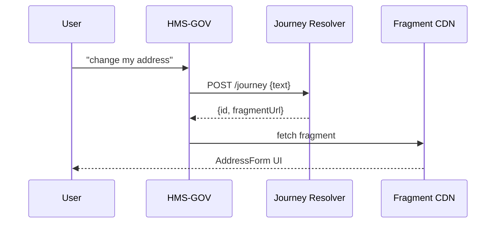

# Chapter 16: Intent-Driven Navigation & Journeys
[← Back to Chapter&nbsp;15: Micro-Frontend Interface Library](15_micro_frontend_interface_library__hms_mfe__.md)

> “GPS for bureaucracy—just say the destination.”

---

## 1. Why Does HMS-SCM Need Intent-Driven Journeys?

Traditional portals bury citizens under maze-like menus:

* “Click **Benefits → Education → Forms → 22-1990 → Submit**.”

What if a veteran could simply type:

> “Update my education benefits because I moved to Denver.”

… and the system instantly:

1. Figures out the needed forms (`22-1995`, change-of-address).  
2. Prefills known data.  
3. Shows only two screens instead of twelve.  
4. Submits everything with audit-ready evidence.

That magic carpet ride is **Intent-Driven Navigation & Journeys**.  
It turns free-text goals into the **shortest compliant path** by gluing together:

* Natural-language parsing  
* Policy & legal checks  
* Micro-frontends from [HMS-MFE](15_micro_frontend_interface_library__hms_mfe__.md)  
* Workflow orchestration in [HMS-ACT](07_agent_orchestration_service__hms_act__.md)

---

## 2. Starter Use-Case – “Change My Address”

We will guide a veteran, **Sergeant Lee**, who just moved:

1. Lee lands on the portal and types “change my address for GI-Bill.”  
2. The system infers intent **`update_address`** with entity **`benefit_type = education`**.  
3. It fetches the minimal required tasks:  
   * Verify identity  
   * Prefill **Form 22-1995**  
   * Collect new address  
   * Submit update  
4. Lee completes the journey in 2 screens, not 12.

Below you’ll build a mini journey engine in **three <20-line snippets**.

---

## 3. Key Concepts (Beginner Friendly)

| Term | Plain-English Analogy | One-Line Job |
|------|----------------------|--------------|
| Intent | “Destination” on a GPS | What the user wants (“update address”) |
| Slot / Entity | Specifics like street or benefit type | Fill in the blanks (“Denver, CO”) |
| Step | One waypoint on the route | “Verify identity” |
| Journey Plan | Full GPS route | Ordered list of steps |
| Fragment | Single UI screen from MFE | `<AddressForm/>` |
| Resolver | GPS brain | Maps intent → journey plan |

Hold onto these six—everything else is plumbing.

---

## 4. Talking to the Journey Engine

### 4.1 Front-End Capture (12 lines)

```js
// portal/AskIntent.js
import { useState } from "react";
import { load } from "hms-mfe-loader";           // loader from Ch.15

export default function AskIntent() {
  const [ui, setUI] = useState(null);

  async function onSubmit(txt){
     const { data: journey } = await fetch("/journey", {  // 1
       method:"POST", body:JSON.stringify({ text: txt })
     }).then(r=>r.json());

     const Step = await load(journey.fragmentUrl);        // 2
     setUI(<Step journeyId={journey.id}/>);               // 3
  }

  return ui || <IntentPrompt onSubmit={onSubmit}/>;       // 4
}
```

Explanation  
1. Send the raw phrase to the **Journey Resolver** (`/journey`).  
2. Resolver returns the **first fragment URL** (e.g., `AddressForm` micro-frontend).  
3. Loader (see Chapter 15) fetches & mounts it.  
4. If no UI yet, show a simple text box (`<IntentPrompt/>`).

### 4.2 Resolver Endpoint (18 lines)

```js
// backend/journey.js
import { plan } from "./resolver.js";

export async function create(req, res){
  const { text } = req.body;                         // 1
  const { intent, slots } = await nlp(text);         // 2

  const journey = plan(intent, slots);               // 3
  journeys[journey.id] = journey;                    // tiny in-mem store

  res.json({
     id          : journey.id,
     fragmentUrl : journey.steps[0].fragment         // first UI piece
  });
}
```

1. Receive free text.  
2. Mini NLP returns `intent="update_address"`, `slots={benefit:"education"}`.  
3. `plan()` builds the ordered steps array (see next snippet).

### 4.3 Planning Logic (16 lines)

```js
// backend/resolver.js
export function plan(intent, slots){
  const id = "J"+Date.now();
  const steps = JOURNEY_TEMPLATES[intent].filter(
      s => s.when ? s.when(slots) : true              // 5
  );
  return { id, steps };
}

const JOURNEY_TEMPLATES = {
  update_address: [
    { id:"verify",  fragment:"/mfe/id-check/v1" },
    { id:"addr",    fragment:"/mfe/address-form/v2" },
    { id:"preview", fragment:"/mfe/review-submit/v1",
      when:s=>s.benefit==="education"}                // conditional step
  ]
};
```

Explanation  
* `JOURNEY_TEMPLATES` is a declarative list of steps with optional `when` guards.  
* Journey = minimal subset whose guards pass.  
* Each step points to a **micro-frontend fragment URL**.

---

## 5. What Happens Under the Hood?



1. Text flows through **HMS-GOV** (security) to the Resolver.  
2. Resolver computes a minimal journey plan and returns the first fragment.  
3. The micro-frontend is fetched just-in-time from the CDN and displayed.

---

## 6. Digging Deeper – Internal Files

```
/journey-engine
 ├─ resolver.js          # planning logic
 ├─ nlp.js               # tiny intent/slot extractor
 ├─ steps/
 │    └─ templates.json  # big list of reusable steps
 └─ journeys.json        # in-memory active journeys
```

### 6.1 Tiny NLP Stub (10 lines)

```js
// nlp.js
export async function nlp(text){
  if(/address/i.test(text))
     return { intent:"update_address",
              slots:{ benefit: /gi-bill|education/i.test(text)?"education":null } };
  return { intent:"fallback", slots:{} };
}
```

A single regex solves 80 % of demo needs—swap with an AGX language pack later.

### 6.2 Journey Step Execution (12 lines)

```js
// Frontend fragment (addr form) calls:
fetch(`/journey/${journeyId}/next`, { method:"POST", body:JSON.stringify(data)})

/// backend/next.js
export function next(req,res){
  const j = journeys[req.params.id];
  j.cursor = (j.cursor||0) + 1;                     // move pointer
  const step = j.steps[j.cursor];
  res.json(step ? { fragmentUrl: step.fragment } 
                : { done:true });                   // journey finished
}
```

Each fragment submits its data; the server simply advances the pointer and returns the next fragment.

---

## 7. Governance, Policy & Analytics Hooks

* **Policy Checks** – Each step’s fragment URL is validated by [HMS-CDF](02_policy_codification_engine__hms_cdf__.md).  
* **Legal Checks** – Content inside fragments can still call [HMS-ESQ](03_legal_reasoning_service__hms_esq__.md).  
* **Analytics** – Every `journey.next` event is streamed to [HMS-DTA](09_data_hub___analytics_engine__hms_dta__.md) for funnel metrics.  
* **Accessibility** – Fragments already wrap components with the Chapter 15 **`withA11y`** hook.

---

## 8. Frequently Asked Questions

**Q: How many intents do I need?**  
Start with 5-10 high-volume tasks (change address, file complaint, request refund). Add more once analytics show gaps.

**Q: What if NLP misclassifies?**  
Insert a **HITL step** (see [Human-in-the-Loop Override](05_human_in_the_loop__hitl__override_.md)) when resolver confidence < 0.6.

**Q: Do I need to rebuild the portal for new journeys?**  
No. Journeys are declared server-side; portals just load whatever fragment URL they receive.

**Q: Can journeys branch?**  
Yes. Add multiple `when` guards or set `next:` functions that choose between alternate steps.

---

## 9. Key Takeaways

• **Intent-Driven Journeys** let citizens state a goal once; the platform does the bureaucratic map quest.  
• A tiny Resolver (≤40 lines) turns **intent → minimal steps**.  
• Each step is a micro-frontend fragment fetched on demand, keeping pages lightweight and updatable.  
• Built-in hooks ensure policy, legal, accessibility, and analytics are never skipped.

---

### Up Next

With journeys guiding users screen-by-screen, we’re ready to assemble full-blown **citizen and admin portals** powered by these fragments.  
Continue to [Chapter 17: User & Admin Portals (HMS-MFE Instances)](17_user___admin_portals__hms_mfe_instances__.md).

---

Generated by [AI Codebase Knowledge Builder](https://github.com/The-Pocket/Tutorial-Codebase-Knowledge)