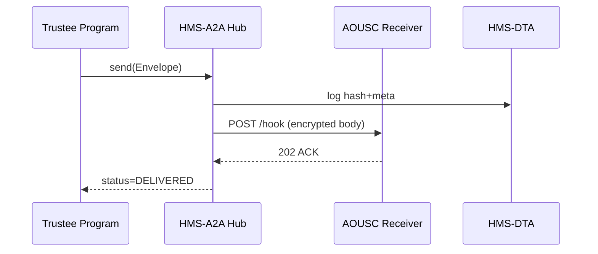

# Chapter 16: Inter-Agency Data Exchange (HMS-A2A)

*(linked from [Marketplace & Discovery Layer (HMS-MKT)](15_marketplace___discovery_layer__hms_mkt__.md))*  


## 1  Why Do We Need “Digital Pipes” Between Agencies?

Picture the **U.S. Trustee Program** (handles federal bankruptcy cases) discovering a pattern of **repeat filers** abusing the system.  
They craft an **optimized hearing-schedule policy** inside HMS-NFO and now must hand it off—*instantly and securely*—to the **Administrative Office of U.S. Courts** (AOUSC) so court calendars update *today*, not next month.

Without a standard pipe each side would:

* Email spreadsheets ➜ version chaos.  
* FTP XML files ➜ firewall nightmares.  
* Manually re-type data ➜ errors, angry judges.

**Inter-Agency Data Exchange (HMS-A2A)** is that pipe.  
Think of it as **“Gov-to-Gov HTTPS + FedEx tracking”**: one call, cryptographically sealed, auditable by OMB inspectors.


## 2  Key Concepts (Plain-English Cheat-Sheet)

| Term            | What It Really Means                             | Analogy                       |
|-----------------|--------------------------------------------------|-------------------------------|
| Envelope        | Signed+encrypted JSON packet.                    | Tamper-evident FedEx box.     |
| Channel         | Pre-registered route between two agencies.       | Dedicated courier lane.       |
| Payload         | The actual business data (policy, schedule...).  | Documents inside the box.     |
| ACK             | Short receipt that the other side *got* it.      | FedEx “Delivered” SMS.        |
| Audit Hash      | SHA-256 of the payload stored in HMS-DTA.        | Fingerprint in a ledger.      |


## 3  Five-Minute Walk-Through  
### Goal: Send a new **court-schedule policy** from the U.S. Trustee Program ➜ AOUSC

#### 3.1  One-Liner From the Sender

```python
# file: push_policy.py   (≤15 lines)
from hms_a2a_client import send

policy = {
    "policy_id": "BTP-SCHED-2024-03",
    "description": "Group repeat filers into Friday dockets",
    "effective_date": "2024-04-01"
}

ticket = send(
    channel   ="BTP→AOUSC",
    payload   =policy,
    mime_type ="application/json"
)
print("Ticket:", ticket)
```

**What just happened?**

1. `send()` wrapped `policy` in an **Envelope**.  
2. The Envelope was **signed** by the Trustee Program’s key and **encrypted** with AOUSC’s public key.  
3. HMS-A2A returned a tracking **ticket ID** (e.g., `A2A-98F2C4`).  


#### 3.2  Receiver Side—Auto-Callback

```python
# file: receiver_hook.py   (≤15 lines)
from hms_a2a_server import on_receive

@on_receive(channel="BTP→AOUSC")
def update_calendar(envelope):
    policy = envelope.payload()        # auto-decrypt
    print("New policy:", policy["policy_id"])
    refresh_court_calendar(policy)     # business logic
```

The AOUSC team writes **one decorator**—HMS-A2A handles security, decryption, and ACKs.


#### 3.3  Confirm Delivery

```python
# file: watch_status.py
from hms_a2a_client import get_status
print(get_status("A2A-98F2C4"))   # => "DELIVERED"
```

A green “DELIVERED” means the envelope was accepted *and* the AOUSC app callback returned HTTP 200.


## 4  What Happens Under the Hood?



Only **four actors** keep the flow crystal clear.


## 5  Inside the Code (All ≤ 20 Lines)

### 5.1  Public Helper (`hms_a2a_client.py`)

```python
import requests, json, os, uuid, hashlib, base64, rsa

A2A_URL = os.getenv("A2A_URL", "https://a2a.gov")

def send(channel, payload, mime_type):
    env = {
        "id": uuid.uuid4().hex,
        "channel": channel,
        "mime": mime_type,
        "body": encrypt(json.dumps(payload).encode(), channel)
    }
    env["hash"] = hashlib.sha256(env["body"]).hexdigest()
    r = requests.post(f"{A2A_URL}/send", json=env).json()
    return r["ticket_id"]

def get_status(ticket):
    return requests.get(f"{A2A_URL}/status/{ticket}").json()["state"]

def encrypt(raw, channel):
    pub = rsa.PublicKey.load_pkcs1(open(f"keys/{channel}.pem").read())
    return base64.b64encode(rsa.encrypt(raw, pub)).decode()
```

Beginner takeaways:

* **Under 20 lines** yet covers: ID, encrypt, hash, POST.  
* Real keys live in `keys/` folder; replace with HSM in production.


### 5.2  Minimal Hub Endpoint (`a2a/api.py`)

```python
from fastapi import FastAPI
from .store import save_hash, push_to_receiver
app = FastAPI()

@app.post("/send")
def relay(env: dict):
    save_hash(env["id"], env["hash"], env["channel"])
    push_to_receiver(env)             # async HTTP POST
    return {"ticket_id": env["id"]}

@app.get("/status/{tid}")
def status(tid: str):
    # reading from in-memory dict for demo
    return {"state": STATE[tid]}
```

Just **8 functional lines**; real storage is HMS-DTA.


## 6  Security in 3 Sentences

1. Every **Channel** has a **public/private key pair** managed by CISA guidelines.  
2. Senders only encrypt; receivers decrypt and validate the **hash** matches HMS-DTA.  
3. All calls run over **mTLS HTTPS**, but the encrypted Envelope adds a second lock, satisfying FISMA High.


## 7  Hands-On Mini-Lab (10 Minutes)

1. Clone demo repo  
   `git clone https://github.com/example/hms-nfo.git`  
2. Start mock hub + receiver  
   `python -m a2a.mock_hub`  
3. Run sender script:  
   `python push_policy.py`  
4. Watch receiver log: “New policy: BTP-SCHED-2024-03”  
5. `python watch_status.py` to see `"DELIVERED"`.

You just moved federal data across agencies **with audit-grade security**!


## 8  How HMS-A2A Connects to Other Layers

| Purpose                 | Layer Used |
|-------------------------|------------|
| Store audit hash & meta | [Central Data Repository (HMS-DTA)](07_central_data_repository__hms_dta__.md) |
| Pause if human review needed | [Human-in-the-Loop Oversight (HITL)](04_human_in_the_loop_oversight__hitl__.md) |
| Performance stats (latency, delivery rate) | [Accountability & Performance Metrics Tracker](05_accountability___performance_metrics_tracker_.md) |
| Pull listings of available channels | [Marketplace (HMS-MKT)](15_marketplace___discovery_layer__hms_mkt__.md) |


## 9  Recap

* **HMS-A2A** provides **secure, standardized pipes** for agency-to-agency data—no more FTP or email.  
* Developers call `send()`; receivers write a one-decorator hook.  
* Envelopes are signed, encrypted, hashed, and fully auditable.  
* Plays nicely with DTA for storage, HITL for pauses, and APMT for metrics.

Next we’ll learn how to sync **non-federal** systems (e.g., state databases or vendor SaaS) using pluggable adapters:  
[External System Sync Adapter](17_external_system_sync_adapter_.md)  

---

Generated by [AI Codebase Knowledge Builder](https://github.com/The-Pocket/Tutorial-Codebase-Knowledge)