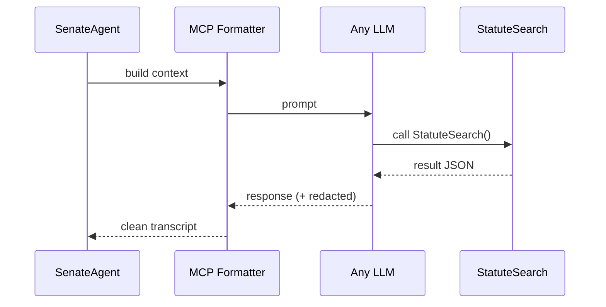

# Chapter 16: Model Context Protocol (HMS-MCP)

*(coming from [Marketplace & Discovery Service (HMS-MKT)](15_marketplace___discovery_service__hms_mkt__.md))*  

---

## 1 · Why Yet *Another* “Protocol”?

> Senate Commerce staffer **Ava** installs a brand-new AI model from HMS-MKT to
> draft broadband‐funding memos.  
> Minutes later the Judiciary Committee tries the *same* model to analyse
> antitrust emails—but it replies with garbled tool calls and leaks its private
> chain-of-thought.  
> Chaos ensues; IT yanks the model offline.

The root problem?  
Every model, agent, or rules engine invents its **own** way to:

1. Ask for a tool (`/search`, `/db.query`, …).  
2. Hide or reveal reasoning steps.  
3. Label user vs. system vs. model messages.

**Model Context Protocol (HMS-MCP)** is the **“Robert’s Rules of Order”** for
AI conversations.  
If an agent follows MCP, any other MCP-compliant model—or committee—can plug
in *without rewriting a single line*.

---

## 2 · Big Picture in One Sentence

MCP is a tiny **text grammar** + **JSON schema** that standardises:

* Roles (`user`, `assistant`, `system`, `tool`).  
* Tool calls & results (typed, self-describing).  
* Optional **redacted** sections that never leave the secure boundary.

---

## 3 · Key Concepts (Plain English)

| MCP Term | Beginner Analogy | Why It Matters |
|----------|------------------|----------------|
| Role Block | Name badge at a hearing | Shows who is speaking |
| Tool Call | Request slip handed to a clerk | Model asks external skill to run |
| Tool Result | Clerk’s stamped answer | Data comes back in a predictable wrapper |
| **`<redact>` tag** | Closed-door session | Chain-of-thought stays inside secure host |
| Transcript | Court reporter notes | Final, audit-ready record |

---

## 4 · Five-Minute Quick-Start

Below we draft a memo request, the model calls a “Statute Search” tool, then
returns a redacted thought + public answer—all in **MCP format**.

```text
### role:user
Draft a 2-paragraph memo on rural broadband grants in 2024.

### role:assistant
<tool_call name="StatuteSearch">
  {"query":"rural broadband grant 2024", "jurisdiction":"USC"}
</tool_call>

### role:tool name=StatuteSearch
{"top_hit":"47 U.S.C. §1305 (b)(3)"}

### role:assistant
<redact>
  Found §1305 (b)(3); will cite it then propose timeline.
</redact>
The 2024 rural broadband program is anchored in 47 U.S.C. §1305 (b)(3)…
```

**What just happened?**

1. `role:user`—Ava’s request.  
2. `role:assistant`—model asks the tool via `<tool_call>`.  
3. `role:tool`—tool result in JSON.  
4. Second `role:assistant`—model hides reasoning inside `<redact>` but shows
   the final memo.

---

## 5 · Using MCP in Code (≤ 20 lines)

```python
# draft_memo.py
from hms_mcp import Message, ToolCall, run

chat = [
    Message("user", "Draft a memo on rural broadband grants in 2024."),
    ToolCall("StatuteSearch",
             {"query":"rural broadband grant 2024","jurisdiction":"USC"})
]

reply = run(model="legal-llm-v3", context=chat)
print(reply.render())
```

Explanation  
– `Message` and `ToolCall` objects auto-serialise to the text format above.  
– `run()` sends the MCP context to **any** compliant LLM; no extra glue is
  needed when you swap models tomorrow.

---

## 6 · What Happens Internally?



Only **four** moving parts; swap `LLM` and nothing else breaks.

---

## 7 · Peeking Under the Hood

### 7.1  MCP Grammar (abridged)

```ebnf
document   ::= (block)* ;
block      ::= header newline body ;
header     ::= '### role:' role [name] ;
role       ::= 'user' | 'assistant' | 'system' | 'tool' ;
name       ::= ' name=' IDENT ;
body       ::= TEXT ;
```

*Under 10 lines of EBNF—easy to parse in any language.*

### 7.2  Tiny Parser (14 lines)

```python
# hms_mcp/parser.py
def parse(text):
    msgs = []
    cur = None
    for line in text.splitlines():
        if line.startswith("### role:"):
            if cur: msgs.append(cur)
            role, *rest = line[8:].split()
            name = rest[0][5:] if rest else None
            cur = {"role":role, "name":name, "body":""}
        else:
            cur["body"] += line+"\n"
    if cur: msgs.append(cur)
    return msgs
```

### 7.3  Redaction Filter (8 lines)

```python
# hms_mcp/redact.py
import re
def strip(text):
    return re.sub(r"<redact>.*?</redact>", "[internal-omitted]", text,
                  flags=re.S)
```

Keeps auditors happy while preserving privacy.

---

## 8 · Hands-On Exercise

1. `pip install hms-mcp`  
2. Save the “Quick-Start” transcript as `memo.mcp`.  
3. Run:

   ```bash
   python -m hms_mcp.view memo.mcp
   ```

   You should see the roles colour-coded, with chain-of-thought hidden.  
4. Swap in a different LLM via `run(model="gpt-gov-x")`—observe identical
   output structure.

---

## 9 · FAQ for Absolute Beginners

**Q: Is MCP the same as OpenAI’s JSON tool-call format?**  
A: Similar idea, but adds **role headers** and native **redaction tags** so
   auditors never see private thoughts.

**Q: Do I have to write the text headers by hand?**  
A: No—helper classes (`Message`, `ToolCall`) generate them for you.

**Q: Can a tool return large PDFs?**  
A: Yes—tool outputs may include a `file_id`; binary blobs travel via
   [Central Data Repository](19_central_data_repository__hms_dta__.md).

**Q: What if a legacy rules engine wants to speak MCP?**  
A: Wrap it with an adapter that converts its inputs/outputs into MCP blocks—
   usually <30 lines of code.

---

## 10 · How MCP Talks to Other HMS Parts

* **AI Agents** – Agents in
  [AI Agent Framework (HMS-AGT / HMS-AGX)](06_ai_agent_framework__hms_agt___hms_agx__.md)
  set `context_format="MCP"` so any hired model is drop-in.  
* **Marketplace Listings** – Skills published in
  [HMS-MKT](15_marketplace___discovery_service__hms_mkt__.md)
  mark `protocol: MCP` for instant compatibility.  
* **Oversight** – [HITL](07_human_in_the_loop_oversight__hitl__.md) viewers
  auto-strip `<redact>` before showing transcripts to managers.  
* **Audit Logs** – Clean transcripts are stored in
  [Central Data Repository](19_central_data_repository__hms_dta__.md) with
  SHA-256 hashes.

---

## 11 · Summary & What’s Next

You learned that **HMS-MCP** is the **common language** for models, agents,
and tools:

1. Standard role headers keep speakers straight.  
2. Built-in tool calls mean *zero* glue code when swapping models.  
3. `<redact>` tags protect chain-of-thought while preserving auditability.  
4. A 14-line parser proves the spec is intentionally small.

Ready to **play what-if** with entire agent teams and policies in a virtual
sandbox?  
Jump to [Simulation & Behavior Lab (HMS-ESR)](17_simulation___behavior_lab__hms_esr__.md) 🚀

---

Generated by [AI Codebase Knowledge Builder](https://github.com/The-Pocket/Tutorial-Codebase-Knowledge)