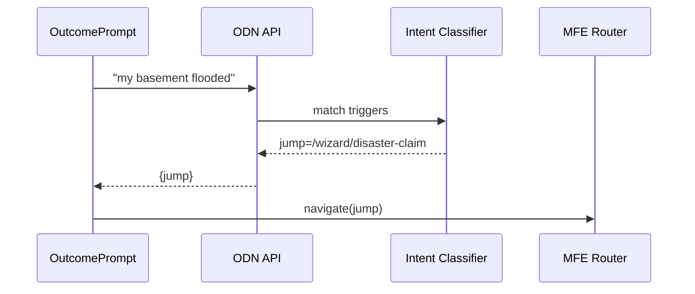

# Chapter 16: Outcome-Driven Navigation  
*(A friendly sequel to [Micro-Frontend Experience (HMS-MFE)](15_micro_frontend_experience__hms_mfe__.md))*  

---

## 1. Why Do We Need “Outcome-Driven Navigation”?

Imagine you are a resident of **Prince George’s County, MD** whose house just flooded.  
You pull out your phone and open the county portal:

* 200+ menu items  
* 17 different PDF forms  
* None visibly labeled “I had a flood—help!”

After three wrong clicks you give up and call 311.

**Outcome-Driven Navigation (ODN)** flips the story.  
On page load you see one friendly prompt:  

> **“Hi! What do you need today?”**

You type **“My basement flooded.”**  
The portal instantly opens the **Disaster Claim Wizard** (already built in Chapter 5’s workflow), skipping every irrelevant menu.

Result: happier citizens, fewer abandoned forms, and shorter 311 hold times.

---

## 2. Key Concepts in Plain English

| Term               | Friendly Analogy                    | Flood Example                        |
|--------------------|-------------------------------------|--------------------------------------|
| Intent             | What the user *really* wants        | “File a disaster claim”              |
| Outcome            | The end-page, wizard, or bot        | Disaster Claim Wizard                |
| Trigger Phrase     | Magic password that reveals door    | “basement flooded”, “house flooded”  |
| Shortcut (“Jump”)  | Secret hallway that skips the maze  | `/wizard/disaster-claim`             |
| Fallback           | Receptionist who says “Sorry?”      | Shows top 3 suggestions + 311 link   |

Five words—now you speak *ODN*.

---

## 3. A 3-Step “Hello Outcome” Tutorial

We will wire **one** new outcome: `disaster-claim`.  
Citizen types anything that smells like flooding → portal jumps straight to the wizard.

### 3.1 Describe Outcomes in a Tiny YAML (9 lines)

```yaml
# odn/outcomes.yml
- id: disaster-claim
  title: Disaster Claim Wizard
  jump:  /wizard/disaster-claim        # MFE tile route
  triggers:
    - basement flooded
    - house flooded
    - flood claim
```

*Drop the file; no deploy needed—HMS watches and hot-reloads.*

### 3.2 Ask the Question (Front-End, 19 lines)

```vue
<!-- components/OutcomePrompt.vue -->
<script setup>
import { ref } from 'vue'
const q = ref('')
async function go(){
  const res = await fetch('/api/odn', {
    method:'POST',
    body: JSON.stringify({ text:q.value })
  }).then(r=>r.json())
  if(res.jump) location.href = res.jump     // 🎯 jump!
  else alert(res.suggestions.join('\n'))    // fallback list
}
</script>

<template>
  <div>
    <input v-model="q" placeholder="What do you need?"/>
    <button @click="go">Go</button>
  </div>
</template>
```

**What it does**  
1. Sends the raw text to `/api/odn`.  
2. If API returns `jump`, browser navigates there.  
3. Otherwise shows 2-3 best suggestions.

### 3.3 Build the Tiny Intent Engine (Node, 18 lines)

```js
// routes/odn.js
import outcomes from '../odn/outcomes.yml' assert { type:'yaml' }
import express from 'express'
const router = express.Router()

router.post('/', express.json(), (req,res)=>{
  const txt = req.body.text.toLowerCase()
  for (const o of outcomes){
    if (o.triggers.some(t => txt.includes(t))){
      return res.json({ jump:o.jump })          // 🎯
    }
  }
  // fallback – show titles of top 3 outcomes
  res.json({ suggestions: outcomes.slice(0,3).map(o=>o.title) })
})
export default router
```

Beginners can read in seconds: loop triggers → first match wins.

---

## 4. What Happens Under the Hood?



*Four actors keep the flow crystal clear.*

---

## 5. Optional Fancy Upgrade: ML-Based Intents (But Still Tiny!)

Later you can swap the keyword loop for a **one-line** call to an agent skill (Chapter 7):

```js
// replace trigger loop with ML
const { intent } = await tools.intent.detect(txt)   // returns 'disaster-claim'
const o = outcomes.find(x => x.id === intent)
```

The rest of the code stays unchanged.

---

## 6. Plugging ODN into Other HMS Layers

| Layer | How It Helps |
|-------|--------------|
| [HMS-MFE](15_micro_frontend_experience__hms_mfe__.md) | `jump` points to any tile or page. |
| [Workflow Orchestrator (HMS-ACT)](05_workflow_orchestrator__hms_act__.md) | Outcomes can start a workflow directly via `/api/hms-act/events`. |
| [Agent Framework (HMS-AGT)](07_agent_framework__hms_agt___hms_agx__.md) | Agents can call `tools.odn.jump()` to guide users mid-chat. |
| [Compliance & Legal Reasoning (HMS-ESQ)](04_compliance___legal_reasoning__hms_esq__.md) | ESQ scans `outcomes.yml` for misleading labels. |

Everything **just works** because ODN is a thin routing veneer—no heavy coupling.

---

## 7. Frequently Asked Questions

**Q: What if two outcomes share a trigger phrase?**  
List more specific phrases first. The loop stops at the first match.

**Q: Can we A/B test different prompts?**  
Yes—serve `/components/OutcomePrompt_v2.vue` to 10 % of traffic. Metrics flow to [Observability & Operations (HMS-OPS)](17_observability___operations__hms_ops__.md).

**Q: How do we support Spanish?**  
Add a parallel YAML (`outcomes_es.yml`) and pick file based on `Accept-Language` header.

**Q: Is this ADA-compliant?**  
The prompt is a standard `<input>`; screen readers announce “What do you need?” ensuring WCAG AA compliance.

---

## 8. What You Learned

• **Outcome-Driven Navigation** asks a single question and teleports users to the correct wizard, bot, or page—no more scavenger hunts.  
• A 9-line YAML describes outcomes; a 19-line Vue prompt and an 18-line Express route power the entire feature.  
• The engine is pluggable: start with keyword triggers, graduate to ML intents with one extra line.  
• ODN ties neatly into MFE (front-end), ACT (workflows), AGT (agents), and ESQ (compliance).

---

Next we’ll watch how the platform measures **every jump, click, and error** to keep services healthy:  
[Observability & Operations (HMS-OPS)](17_observability___operations__hms_ops__.md)

---

Generated by [AI Codebase Knowledge Builder](https://github.com/The-Pocket/Tutorial-Codebase-Knowledge)