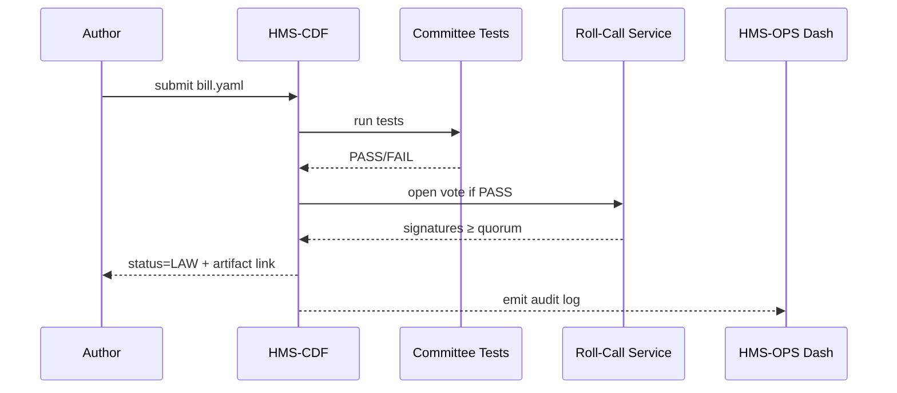

# Chapter 16: Policy Deployment Pipeline (HMS-CDF)

[← Back to Chapter 15: Observability & Operations Center](15_observability___operations_center__hms_ops__.md)
___

## 1 Why Another “Pipeline”?

Picture the **Pipeline and Hazardous Materials Safety Administration (PHMSA)**.  
Congress just passed a small amendment that **doubles fines for un-reported pipeline leaks**.  

If PHMSA engineers must:

* read the PDF law,
* hunt for every micro-service that enforces fines, and  
* hand-edit numbers in seven repos,

leaks will keep happening.  

**HMS-CDF** turns the whole *“bill → committee → floor vote → law”* flow into **code & CI**:

```
policy.yaml  ──▶  committee tests  ──▶  roll-call approval  ──▶  compiled “law.bin”  ──▶  live micro-services
```

Result: one `git merge` updates every fine—**without** late-night hot-fixes or legal panic.

---

## 2 Key Concepts (Plain English)

| CDF Word | What It Means | Capitol Hill Analogy |
|----------|---------------|----------------------|
| **Bill** | A new or amended rule written in YAML. | A draft introduced in Congress. |
| **Committee Test** | Unit test that checks logic & budget. | House committee markup session. |
| **Roll-Call** | Cryptographic approval vote by authorized reviewers. | Floor vote record in the Congressional Record. |
| **Law** | An immutable, signed bundle (`*.law.bin`). | The enrolled act signed by the President. |
| **Policy Compiler** | Turns a Law into runnable byte-code guardrails. | Office of the Federal Register printing the Statutes at Large. |

Hold these five ideas—everything else hangs on them.

---

## 3 End-to-End Walk-Through in < 20 Lines × 3

We will:

1. Draft a **Bill** that sets the fine to **$500 000**.  
2. Run it through the **Pipeline**.  
3. See the new limit live in a service.  

> Re-use `demo-sandbox-token` from earlier chapters.

### 3.1 Write the Bill (YAML, 14 lines)

```yaml
# bill_fine_increase.yaml
id:   PHMSA_FINE_2024_05
title: "Increase leak-reporting fine"
amends: "49CFR§190.223"
changes:
  fine_amount_usd: 500000
budget_impact: "zero"
effective: "2024-10-01"
sponsors:
  - rep: "Jane Smith (TX-07)"
    party: D
```

Beginner notes  
* `amends` points at the CFR citation.  
* Only strict keys allowed (`title`, `changes`, …)—lint fails otherwise.

---

### 3.2 Submit to the Pipeline (CLI, 9 lines)

```bash
pip install hms-cdf
cdf submit bill_fine_increase.yaml \
          --token $HMS_CDF_TOKEN
```

Pipeline output (truncated):

```
✔ Committee tests … PASS
✔ Fiscal score      … OK ($0)
✔ Impact analysis   … OK
ℹ Awaiting 2/3 majority roll-call … (link sent to reviewers)
```

Behind the scenes:

1. **Committee Tests** = GitHub Actions that import [HMS-ESQ](08_legal___compliance_reasoner__hms_esq__.md) and [GVP sensors](07_ai_governance_values_pipeline_.md).  
2. Reviewers click “Yea” or “Nay” in a web UI—their keys sign the **Roll-Call**.

---

### 3.3 Auto-Deploy After Roll-Call (5 lines)

```bash
# later, after votes pass
cdf status PHMSA_FINE_2024_05
```

Output:

```
STATUS: LAW
COMPILER: llvm-gov/1.2
artifact: s3://laws/PHMSA_FINE_2024_05.law.bin
```

Any micro-service that enforces pipeline fines (e.g., *governance* layer from [Chapter 9](09_three_layer_micro_service_stack__governance___management___interface__.md)) automatically fetches `*.law.bin` at the next deploy and reads:

```json
{ "fine_amount_usd": 500000 }
```

No human edits, no stale constants.

---

## 4 What Happens Inside CDF?



*Only* when tests pass **and** quorum signatures arrive does CDF call the **Policy Compiler**.

---

## 5 Tiny Source Peek (≤ 18 Lines)

_File: `cdf/core/pipeline.py`_

```python
class Pipeline:
    def submit(self, bill_path, author):
        bill = yaml.safe_load(open(bill_path))
        _lint(bill)                         # syntax
        if not _committee_tests(bill):      # legal & budget
            return "FAIL_TESTS"

        vote_id = _open_vote(bill)
        return {"vote_id": vote_id}

    def finalize(self, bill_id):
        if not _vote_passed(bill_id):
            return "PENDING_VOTE"
        binary = _compile(bill_id)          # LLVM or WASM
        hash_  = _store(binary)             # S3 + immut. log
        return {"status": "LAW", "artifact": hash_}
```

Explanations (one-liners):

1. `_lint` = YAML schema check.  
2. `_committee_tests` calls ESQ & GVP modules.  
3. `_open_vote` writes a record in PostgreSQL (`roll_call` table).  
4. `_compile` turns YAML into WASM byte-code guardrails.  
5. Checksums & links go to [HMS-OPS](15_observability___operations_center__hms_ops__.md).

---

## 6 How CDF Connects to Everything Else

| Module | Role in the Pipeline |
|--------|-----------------------|
| **Legal & Compliance Reasoner** | Committee tests for statutory conflicts. |
| **AI Governance Values Pipeline** | Blocks bills that violate truth / bias sensors. |
| **Human-in-the-Loop Console** | UI for reviewers to read diff & cast “Yea/Nay”. |
| **Backend Service Gateway** | Pulls latest `*.law.bin` and hot-swaps guardrails. |
| **Observability Center** | Records every roll-call & compiler hash for auditors. |

---

## 7 Common Troubleshooting

| Symptom | Likely Cause | Quick Fix |
|---------|--------------|-----------|
| `FAIL_TESTS: budget_exceeded` | `budget_impact` wrong | Update fiscal note + rerun. |
| Roll-call stuck at 50 % | Missing reviewer | Ask admin to add signer in HITL console. |
| `COMPILER_ERROR` | YAML typo in `changes:` | Run `cdf lint bill.yaml` locally. |
| Service still uses old rule | Cache delay | `svc-gateway --reload-policy` or wait next deploy cycle. |

---

## 8 Recap & Looking Ahead

You just:

1. Drafted a **Bill** in YAML.  
2. Watched Committee tests & cryptographic **Roll-Call** approvals.  
3. Saw the **Policy Compiler** spit out a runnable `law.bin`.  
4. Understood how every micro-service picks up new law **without code edits**.

Next you’ll explore how these freshly compiled laws appear in a public **Marketplace & Discovery Hub** so other agencies can reuse them.  
Continue to [Chapter 17: Marketplace & Discovery Hub (HMS-MKT)](17_marketplace___discovery_hub__hms_mkt__.md).

___

Happy legislating at “AI-speed”!

---

Generated by [AI Codebase Knowledge Builder](https://github.com/The-Pocket/Tutorial-Codebase-Knowledge)