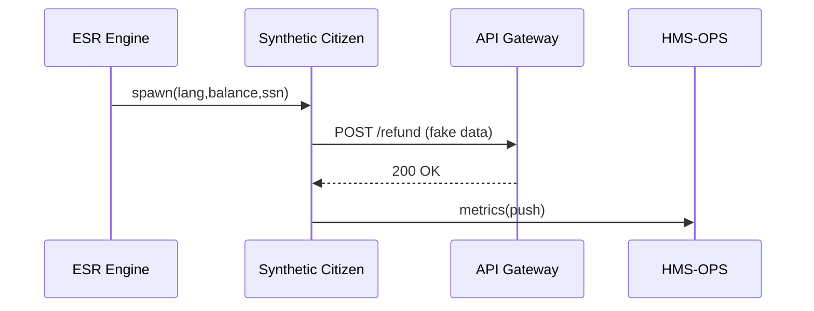

# Chapter 16: Simulation & Testing Environment (HMS-ESR)  

*(continuing from [Monitoring & Metrics (HMS-OPS)](15_monitoring___metrics__hms_ops__.md))*  


## 1. Why Do We Need a “Wind-Tunnel” for Government Software?

On the first business day of April the **Federal Deposit Insurance Corporation (FDIC)** launches an online **“Rapid-Refund Portal”** for citizens of a just-failed bank.  

The FDIC AI deputy (built with [HMS-AGT](09_ai_representative_agent_framework__hms_agt___hms_agx__.md)) is expected to:

1. Verify each claimant’s SSN & balance.  
2. Decide whether to **ACH** the refund or route to a human.  
3. Finish 98 % of cases within 5 minutes.

But nobody really knows how the deputy behaves when **20 000 panicked citizens** hit _Enter_ at 9 am.

Enter **HMS-ESR** – the flight-simulator for algorithms.  
It spins up _synthetic yet realistic_ citizens so teams can:

* **Stress-test** new queue logic or IAM throttles.  
* **Catch bias** (“Spanish-speaking callers wait longer?”).  
* **Validate alerts** in HMS-OPS _before_ real money and reputations are on the line.


---

## 2. Key Concepts (Beginner Cheat-Sheet)

| ESR Term              | Everyday Analogy                       | What It Means in Plain English |
|-----------------------|----------------------------------------|--------------------------------|
| Scenario File         | Screenplay                             | YAML recipe describing who the fake citizens are and what they do. |
| Synthetic Citizen     | Actor in the screenplay                | One fake user with traits (language, balance, device). |
| Event Generator       | Film director                          | Reads the scenario and fires HTTP / MCP / ACH calls. |
| Load Shape            | Crowd timetable (“200 people every min”) | When and how fast citizens appear. |
| Metrics Hook          | Film critic notebook                   | Pushes every synthetic call to [HMS-OPS](15_monitoring___metrics__hms_ops__.md). |
| Replay Fixture        | DVD                                    | Exact set of events you can rerun after bug-fixes. |


---

## 3. A 5-Minute “Hello Simulator” Walk-Through

Goal: hammer the FDIC refund API with **500 fake citizens** in 30 seconds and watch latency in Grafana _without touching production users_.

### 3.1 Write a Scenario (12 lines)

`scenarios/refund_burst.yaml`

```yaml
id: refund_burst
target: http://localhost:3000/refund
loadShape:
  arrivalRate: 500          # citizens total
  rampSeconds: 30           # appear over 30 s
citizens:
  template:
    lang:    [ "EN", "ES" ]
    balance: { min: 100, max: 250000 }
    ssn:     "###-##-####"  # auto-faker pattern
```

*What this says*  
– “Send up to \$250 000 claims, half in Spanish, over 30 s.”

### 3.2 Run the Simulator (CLI, 1 line)

```bash
npx hms-esr run scenarios/refund_burst.yaml
```

Console output (trimmed):

```
00:00  🚀 starting scenario refund_burst
00:05  →  100 calls sent | p95=180 ms
00:10  →  200 calls sent | p95=230 ms
00:30  ✅ finished | 500 ok, 0 error | max p95=260 ms
```

Latency never crossed our 300 ms SLO – good!

### 3.3 See It Live

Open Grafana → “Loan-Forgiveness API” (built in last chapter).  
The latency panel shows a **perfect spike** that later cools – proof alerts work.


---

## 4. How to Plug ESR Into Your Pipeline

1. **Pre-merge test** in CI:  
   ```yaml
   # .github/workflows/test.yml
   - name: Stress test
     run: npx hms-esr run scenarios/refund_burst.yaml --fail-slo
   ```
   The build fails if any p95 > 300 ms.

2. **Nightly regression**: schedule `hms-esr replay lastPassing.fixture`.

3. **Manual sandbox**: Business analysts can tweak YAML in a no-code UI and click “Simulate”.


---

## 5. What Happens Under the Hood?



Only **synthetic** data flows; IAM tokens are sandbox tokens; OPS still records everything.


---

## 6. Peeking Inside ESR (Gentle Code)

### 6.1 Citizen Generator (≤ 15 lines)

```js
// engine/citizen.js
import faker from '@faker-js/faker'

export function makeCitizen(tmpl){
  return {
    lang: faker.helpers.arrayElement(tmpl.lang),
    balance: faker.number.int(tmpl.balance),
    ssn: faker.helpers.replaceSymbolWithNumber(tmpl.ssn)
  }
}
```

### 6.2 Load Driver Loop (≤ 20 lines)

```js
// engine/driver.js
import fetch from 'node-fetch'
import { histogram } from '@hms/ops-lite'

export async function run(scn){           // scn = parsed YAML
  const lat = histogram(`${scn.id}_latency_ms`)
  const step = scn.loadShape.rampSeconds / scn.loadShape.arrivalRate

  for(let i=0;i<scn.loadShape.arrivalRate;i++){
    setTimeout(async ()=>{
      const user = makeCitizen(scn.citizens.template)
      const t0 = Date.now()
      await fetch(scn.target,{method:'POST',body:JSON.stringify(user)})
      lat.observe(Date.now()-t0)
    }, i*step*1000)
  }
}
```

• Spawns `arrivalRate` timers.  
• Each timer fires one POST, records latency.  
• Under 20 lines, yet good enough for most load tests.

### 6.3 Fixture Recorder (≤ 10 lines)

```js
// engine/recorder.js
const fs = require('fs')
export function saveFixture(events,file){
  fs.writeFileSync(file, JSON.stringify(events, null, 2))
}
```

Run with `--record out.fixture` to re-play the _exact_ same 500 citizens later.


---

## 7. ESR & the Rest of HMS

| Layer | Why It Cares |
|-------|--------------|
| [API Gateway](03_backend_api_gateway__hms_api___hms_svc__.md) | Receives heavy, yet _sandboxed_, traffic – perfect for rate-limit tuning. |
| [IAM](04_identity___access_management__iam__.md) | Issues **simulation tokens** so no real citizen data can leak. |
| [HMS-ESQ](05_security__privacy___legal_guardrails__hms_esq___platform_controls__.md) | Confirms synthetic payloads respect PII rules even in tests. |
| [HMS-AGT](09_ai_representative_agent_framework__hms_agt___hms_agx__.md) | Agents run in **shadow mode** against the same scenario to surface bias. |
| [HMS-OPS](15_monitoring___metrics__hms_ops__.md) | Consumes latency & error metrics to verify dashboards & alerts. |


---

## 8. Frequently Asked Beginner Questions

**Q: Can ESR hit multiple APIs at once?**  
A: Yes—use several `targets:` in YAML; load will be distributed.

**Q: Is it safe for production?**  
A: By default ESR injects `X-ESR-SIM: true`; gateways route those calls to a _clone_ of production services or to special “shadow endpoints”.

**Q: How do I simulate chat messages instead of HTTP?**  
A: Set `type: mcp` and ESR will fabricate [MCP envelopes](11_model_context_protocol__hms_mcp__.md).

**Q: Can I simulate mobile network latency?**  
A: Add `networkLagMs: { min:50, max:300 }` in the scenario; ESR delays each request accordingly.

**Q: What about long-running workflows?**  
A: Scenarios support `durationMinutes`; ESR keeps citizens alive, following redirects and HITL pauses, until done.


---

## 9. Recap & Next Steps

You just:

* Saw **why** a simulation wind-tunnel prevents Friday-morning outages.  
* Learned six key ESR concepts: Scenario, Synthetic Citizen, Generator, Load Shape, Metrics Hook, Fixture.  
* Ran a complete 500-user burst test in one command and watched metrics flow into HMS-OPS.  
* Peeked at the 20-line driver powering ESR.  

With safe testing in place, agencies will soon ask, **“Where can I find and share all these scenarios, components, and agent skills?”**  
That’s exactly what the next chapter covers: [Marketplace & Discovery Service (HMS-MKT)](17_marketplace___discovery_service__hms_mkt__.md).

---

Generated by [AI Codebase Knowledge Builder](https://github.com/The-Pocket/Tutorial-Codebase-Knowledge)