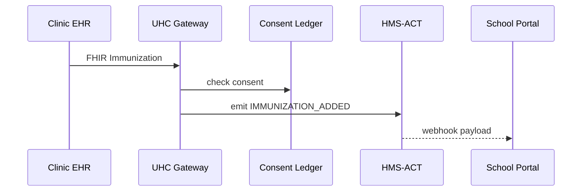

# Chapter 16: Universal Health Connector (HMS-UHC / HMS-MED)

*(Coming from the storefront of  
[Marketplace & Discovery Hub (HMS-MKT)](15_marketplace___discovery_hub__hms_mkt__.md)?  
Great!  You now know **where** to find reusable code.  
Today we’ll connect the most regulated data source of all—**medical records**—to the rest of your HMS world.)*  

---

## 1. Why Do We Need HMS-UHC?

### Story – “Can This Student Come to Class Tomorrow?”

1. A 6ᵗʰ-grader in Fairfax County just got a COVID booster at a CVS minute-clinic.  
2. Virginia law says the school district **must** know the student’s vaccination status by 7 AM next day.  
3. The clinic stores the shot in an *HL7/FHIR* electronic health record (EHR).  
4. The school portal speaks *plain JSON* and must **not** receive any extra health info (HIPAA!).  
5. Parents can withdraw consent at any time.

Without a secure bridge, three things happen:

* Clinics fax paper to the school nurse—slow and error-prone.  
* Developers re-write flaky one-off scrapers.  
* Privacy officers lose sleep.

**HMS-UHC** (a.k.a. **HMS-MED**) is that secure bridge.  
It speaks fluent HL7, FHIR, and public-health APIs **on one side** and friendly HMS envelopes **on the other**, while enforcing HIPAA & parental consent.

Result: schools, public-health dashboards, and parents stay in sync **overnight**—no fax machines, no leaks.

---

## 2. Key Concepts (Plain English)

| Term | What It Does | Analogy |
|------|--------------|---------|
| Health Gateway | OAuth-2 “front door” that hospitals & labs call back | TSA checkpoint |
| Translator | Converts HL7 / FHIR → HMS-MCP envelope (and back) | Real-time language interpreter |
| Consent Ledger | Immutable log of who allowed what & when | A signed permission slip |
| PHI Filter | Drops or masks Protected Health Info not in scope | Black marker on medical chart |
| Event Tap | Emits change events (`IMMUNIZATION_ADDED`) to HMS-ACT | Fire alarm pulling everyone into action |

Remember: **Gateway → Translator → Consent → PHI → Tap** and you already speak UHC.

---

## 3. First Walk-Through  
### Use Case: School Portal Receives Booster Status in <30 Lines

We will:

1. Register the clinic as a sender.  
2. Push a new immunization from the clinic.  
3. Watch it land—sanitized—in the school portal.

---

### 3.1 One-Time Setup (Agency Admin) – 12 lines

```python
# file: register_clinic.py
from hms_uhc import UhcAdmin

admin = UhcAdmin(token="STATE_HEALTH_OFFICER")

admin.register_sender(
    id="CVS-157",
    fhir_base="https://fhir.cvs.com",
    scopes=["immunization.read"],
    school_district="fairfax_k12"
)
```

Explanation  
`register_sender()` stores clinic metadata & creates OAuth credentials; UHC now trusts “CVS-157”.

---

### 3.2 Clinic Pushes New Shot – 18 lines

```python
# file: push_booster.py  (runs inside clinic EHR system)
from hms_uhc import UhcClient

cvs = UhcClient(sender_id="CVS-157", secret="TOPSECRET")

booster = {
  "resourceType": "Immunization",
  "patient": {"id": "stu-8841"},
  "vaccineCode": "91305",          # COVID Booster
  "occurrenceDateTime": "2025-09-01"
}

cvs.create("Immunization", booster)    # POST /fhir --> UHC gateway
print("📤 Booster sent!")
```

What happens automatically:

* The **Translator** converts FHIR to an MCP envelope:  
  `{"trace_id":..., "student_id":"stu-8841", "code":"91305", ...}`  
* The **PHI Filter** strips name, address, allergies.  
* The **Consent Ledger** confirms parents opted-in.  
* An **Event Tap** emits `IMMUNIZATION_ADDED` to [HMS-ACT](03_action_orchestrator__hms_act__.md).

---

### 3.3 School Portal Consumes the Event – 14 lines

```python
# file: school_listener.py
from hms_act_sdk import consume

@consume("IMMUNIZATION_ADDED")
def update_badge(env):
    if env.payload["code"] == "91305":   # booster
        api.post("/portal/badge", {
            "student_id": env.payload["student_id"],
            "badge": "BOOSTER ✅"
        })
```

The portal UI shows a green booster badge **before first bell**.

---

## 4. What Happens Under the Hood?



Five actors, zero HIPAA violations.

---

## 5. Peeking Inside the Source Tree

```
hms-uhc/
├── gateway/
│   ├── auth.py          # OAuth 2.0 front door
│   └── router.py        # /fhir/** endpoints
├── translate/
│   └── fhir_to_mcp.py   # 60-line converter
├── consent/
│   ├── ledger.py        # blockchain-lite CSV
│   └── api.py           # opt-in/out endpoints
├── phi/
│   └── filter.py        # drop / mask rules
└── tap/
    └── event.py         # push to HMS-ACT
```

### 5.1 Tiny FHIR → MCP Converter (≤15 lines)

```python
# translate/fhir_to_mcp.py
def immunization_to_mcp(fhir):
    return {
        "student_id": fhir["patient"]["id"],
        "code":       fhir["vaccineCode"],
        "date":       fhir["occurrenceDateTime"]
    }
```

### 5.2 Consent Check (≤12 lines)

```python
# consent/ledger.py
def has_consent(student_id, scope):
    row = DB.get("consent", id=student_id, scope=scope)
    return row and row["status"] == "allowed"
```

### 5.3 PHI Filter Rule (≤10 lines)

```python
# phi/filter.py
SAFE_FIELDS = {"student_id", "code", "date"}
def scrub(mcp):
    return {k:v for k,v in mcp.items() if k in SAFE_FIELDS}
```

Beginner takeaway: three simple helpers—real insecurity handled by envelope & TLS.

---

## 6. How UHC Connects to Other Layers

Layer | What Happens
------|--------------
[HMS-ESQ](10_compliance___legal_reasoner__hms_esq__.md) | UHC calls `esq.check()` before forwarding PHI outside healthcare boundary.
[HMS-ACT](03_action_orchestrator__hms_act__.md) | Receives `IMMUNIZATION_ADDED` events for downstream routing.
[HMS-OPS](12_activity___operations_monitoring__hms_ops___hms_oms__.md) | Gateway exports `uhc_latency_ms`, `uhc_hipaa_block_total`.
[HITL Control](11_human_in_the_loop__hitl__control_.md) | Can pause unusual bulk downloads for human review.
[HMS-MKT](15_marketplace___discovery_hub__hms_mkt__.md) | Clinics can publish de-identified datasets as **listings** once UHC certifies them.

---

## 7. Try It Yourself (5-Minute Lab)

```bash
git clone https://github.com/hms-example/hms-uhc
cd hms-uhc/examples
# 1. Start gateway + consent DB + mock ACT
docker compose up uhc
# 2. Register clinic & push booster
python register_clinic.py
python push_booster.py
# 3. Watch school portal update
python school_listener.py   # opens websocket; you'll see "BOOSTER ✅"
```

Check logs:

```
[GATE] consent OK, PHI filtered: 3 → 0 fields dropped
[TAP ] event IMMUNIZATION_ADDED → HMS-ACT trace 7b2e…
```

---

## 8. Cheat-Sheet Commands

| Task | Command |
|------|---------|
| List senders | `uhctl senders list` |
| Revoke consent | `uhctl consent revoke --student stu-8841` |
| View PHI blocks | `uhctl audit phi --since 7d` |
| Export de-identified analytics | `uhctl export immunizations --fields zip,date,count` |

---

## 9. Recap & What’s Next

Today you learned:

✓ HMS-UHC / HMS-MED is the **HIPAA-grade bridge** between hospitals, labs, and any HMS service.  
✓ One setup call + one FHIR POST = real-time, consent-respecting event for schools or agencies.  
✓ Key guardians—**Gateway, Translator, Consent Ledger, PHI Filter, Event Tap**—keep data legal and useful.  
✓ The connector plugs into ESQ for law, ACT for routing, and OPS for monitoring.

Next we’ll step into a **risk-free playground** to test these flows without touching real patient data:  
[Simulation & Training Sandbox (HMS-ESR)](17_simulation___training_sandbox__hms_esr__.md).

---

Generated by [AI Codebase Knowledge Builder](https://github.com/The-Pocket/Tutorial-Codebase-Knowledge)