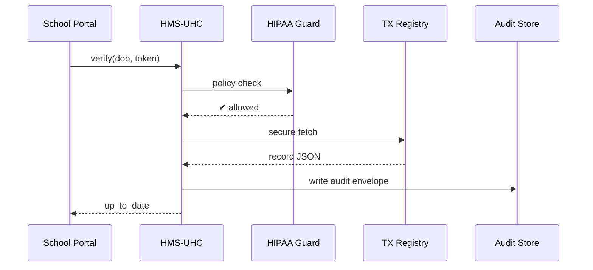

# Chapter 16: Universal Healthcare Integration (HMS-UHC / HMS-MED)

*Just finished wiring money in [Financial Transaction Hub (HMS-ACH)](15_financial_transaction_hub__hms_ach__.md)?  
Now we have to wire something even more delicate—**medical data**.*

---

## 1. Why Do We Need a “HIPAA-Safe Data Pipe”?

### Central use-case – “One-Click School Vaccine Check”

1. A parent in Texas enrolls 7-year-old Jamie in a public school.  
2. The school must **verify vaccinations** (DTaP, MMR, etc.).  
3. Today they fax forms to the pediatrician—slow, error-prone, not secure.  

With **HMS-UHC / HMS-MED** in place:

* The school’s portal clicks **“Verify”**.  
* An AI agent fetches Jamie’s record from the **Texas Immunization Registry**.  
* The pipe enforces **HIPAA**, strips extra PII, and logs consent.  
* The school sees “✅ All shots up-to-date” in under 2 seconds.

No faxes, no leaks, and everything is auditable.

---

## 2. Key Concepts (Plain-English Glossary)

| Term                 | Beginner-Friendly Meaning |
|----------------------|---------------------------|
| Connector            | Tiny adapter that knows how one state registry’s API works. |
| PHI Filter           | “Black marker” that removes fields we aren’t allowed to share. |
| Consent Token        | Proof that a patient (or guardian) said “yes, share my data.” |
| HIPAA Guard          | Rule-checker that blocks any request violating HIPAA / 42 CFR. |
| Audit Envelope       | Signed JSON row: who asked, what was shared, when. |
| Secure Channel       | Mutual-TLS tunnel that mimics CDC → state registry links. |

---

## 3. 5-Minute Walk-Through: Verify Jamie’s Shots

### 3.1 Client Request (11 lines)

```python
# client_verify.py
import requests, uuid
req = {
  "student_id": "TX-2024-JDOE-007",
  "dob": "2017-02-10",
  "consent_token": "tok-" + uuid.uuid4().hex
}
r = requests.post("http://127.0.0.1:9000/uhc/verify", json=req,
                  headers={"Authorization": "Bearer TX-School-123"})
print(r.json())
```

Possible output:

```json
{
  "status": "up_to_date",
  "shots_missing": [],
  "audit_id": "2c4e..."
}
```

### 3.2 What Happens Inside?



Only five participants—easy to follow!

---

## 4. Building It in Mini Code Blocks

### 4.1 Public API (18 lines)

```python
# uhc/api.py
from fastapi import FastAPI, HTTPException, Request
import hipaa, connector, audit
app = FastAPI()

@app.post("/uhc/verify")
async def verify(req: Request):
    data = await req.json()
    if not hipaa.allowed(data, req.headers):
        raise HTTPException(403, "HIPAA block")
    shots = connector.fetch_reg_shots(data["dob"], data["student_id"])
    status = "up_to_date" if connector.ok(shots) else "missing"
    audit_id = audit.write(req.headers["Authorization"], shots)
    return {"status": status, "shots_missing": connector.missing(shots),
            "audit_id": audit_id}
```

Explanation  
1. **hipaa.allowed** runs legal checks.  
2. **connector.fetch_reg_shots** talks to the state registry.  
3. Result + `audit_id` sent back.

### 4.2 HIPAA Guard Stub (12 lines)

```python
# hipaa.py
ALLOWED_ORGS = {"TX-School-123"}
def allowed(data, hdr):
    if hdr.get("Authorization").split()[1] not in ALLOWED_ORGS:
        return False
    return "consent_token" in data          # must have consent
```

### 4.3 State-Registry Connector (19 lines)

```python
# connector.py
import requests, os
URL = "https://api.tximmu.gov/v1/shots"

def fetch_reg_shots(dob, student_id):
    r = requests.get(URL, params={"dob": dob, "id": student_id},
                     cert=("client.crt","client.key"), timeout=3)
    return r.json()

def ok(shots):
    needed = {"DTaP", "MMR", "Polio", "Varicella"}
    return needed.issubset({s["code"] for s in shots})

def missing(shots):
    needed = {"DTaP", "MMR", "Polio", "Varicella"}
    return list(needed - {s["code"] for s in shots})
```

TLS certs mirror CDC practice; under 20 lines!

### 4.4 Audit Envelope (14 lines)

```python
# audit.py
import uuid, json, datetime, pathlib
PATH = pathlib.Path("audits"); PATH.mkdir(exist_ok=True)

def write(caller, shots):
    env = {
      "id": uuid.uuid4().hex,
      "caller": caller,
      "time": datetime.datetime.utcnow().isoformat(),
      "fields_shared": ["code","date"],   # PII stripped
      "count": len(shots)
    }
    (PATH / f"{env['id']}.json").write_text(json.dumps(env))
    return env["id"]
```

---

## 5. Folder Snapshot

```
hms-uhc/
 ├─ api.py
 ├─ hipaa.py
 ├─ connector.py
 ├─ audit.py
 └─ audits/
```

Everything fits on one screen.

---

## 6. How HMS-UHC Talks to Other Layers

| Layer | Interaction |
|-------|-------------|
| [Governance Layer](01_governance_layer__hms_gov__.md) | External schools enter through **HMS-GOV**; it forwards to UHC. |
| [Policy Engine (HMS-CDF)](02_policy_engine__hms_cdf__.md) | `hipaa.allowed` pings CDF for dynamic rules (e.g., new consent forms). |
| [Compliance & Legal Reasoning (HMS-ESQ)](03_compliance___legal_reasoning__hms_esq__.md) | ESQ validates HIPAA clauses and state laws. |
| [Secure Data Repository (HMS-DTA)](13_secure_data_repository__hms_dta__.md) | Final audit envelopes live here, immutable. |
| [Monitoring & Observability (HMS-OPS)](14_monitoring___observability__hms_ops__.md) | Tracks “verifications/min” and any HIPAA blocks. |

---

## 7. Hands-On Mini-Lab

1. Install deps & run:

```bash
pip install fastapi uvicorn requests
uvicorn uhc.api:app --reload
```

2. In another terminal:

```bash
python client_verify.py
```

3. Open `audits/`—a JSON file lists who saw what.  
4. Remove `consent_token` in the client script and retry—you should get `403 HIPAA block`.

---

## 8. FAQ

**Q: Do I need separate connectors for every state?**  
Yes, but each is tiny (~20 lines). Publish them to the [Marketplace (HMS-MKT)](09_marketplace_of_capabilities__hms_mkt__.md) so others can reuse.

**Q: How is PHI removed?**  
`PHI Filter` maps the registry JSON to only allowed fields before storage or return.

**Q: What about FHIR or HL7?**  
Future versions of UHC will auto-convert to FHIR bundles; connectors keep the code small today.

**Q: Can this fetch insurance eligibility too?**  
Absolutely—add another connector (`eligibility_checker.py`) and expose `/uhc/eligibility`.

---

## 9. What You Learned

* HMS-UHC / HMS-MED is the **HIPAA-safe data pipe** for AI and agencies.  
* Connectors talk to each registry; **HIPAA guards** and **PHI filters** keep us legal.  
* One 11-line request verified a child’s shots without a single fax.  
* Audit envelopes make future congressional hearings painless.

Next we’ll learn how to keep hundreds of external systems in sync—payments, registries, and more—in  
[External System Synchronization](17_external_system_synchronization_.md)

---

Generated by [AI Codebase Knowledge Builder](https://github.com/The-Pocket/Tutorial-Codebase-Knowledge)