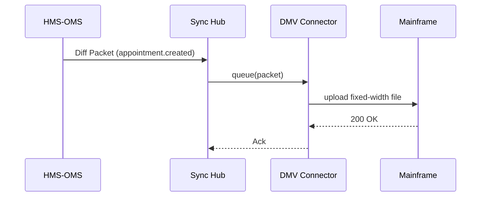

# Chapter 17: External System Sync Layer
*[← Back to Chapter&nbsp;16 – HMS-MKT (Marketplace & Capability Discovery)](16_hms_mkt__marketplace___capability_discovery__.md)*  

---

## 1. Why Do We Need Yet *Another* Layer?

The **State Department of Motor Vehicles (DMV)** just installed a shiny HMS-EHR front-end that lets citizens:

1. Pick a time slot  
2. Upload documents  
3. Pay the fee

…but the *real* appointment book still lives on a **COBOL mainframe** from 1987.  
If the HMS calendar says “9:00 AM open” while the mainframe says “9:00 AM TAKEN,” angry citizens will show up to a double-booked window.

**External System Sync Layer** is the **automatic courier & translator** that:

* Listens to every change inside HMS (new appointment, status update, payment)  
* Translates it into the dialect the old system understands (flat file, SOAP, CSV over FTP)  
* Pushes it out **within seconds**—no human re-keying, no Excel imports

Think of it as the **“Google Translate + FedEx”** for legacy and partner systems.

---

## 2. Key Concepts (Plain English)

| Concept        | Friendly Analogy | One-Sentence Meaning |
|----------------|------------------|----------------------|
| Connector      | Language tutor   | Plug-in that knows *how* to talk to one outside system (e.g., DMV mainframe). |
| Mapping        | Phrasebook       | Rules that say “`HMS.appointment.id → EXT.APPT_NUM`.” |
| Trigger        | Doorbell         | Event that starts a sync (“appointment.created”). |
| Diff Packet    | Postcard         | Small JSON describing *only* the fields that changed. |
| Ack            | Return receipt   | Outside system’s “Got it!” message (or an error). |
| Sync Hub       | Post office      | Central service that queues, retries, and logs every packet. |

---

## 3. The 5-Minute “Hello-Sync”

Goal: Every time **HMS-OMS** creates an appointment ticket, push it to the DMV mainframe.

### 3.1  Register a Connector (one-time)

```python
# file: dmv_connector.py  (18 lines)
from hms_sync import Connector, Mapping

dmv = Connector(
    id="dmv_mainframe",
    protocol="ftp",                 # could be soap, rest, sql, etc.
    endpoint="ftp://10.2.3.4/inbox",
)

dmv.add_mapping( Mapping(
    hms="ticket.id",           ext="APPT_NUM"
)).add_mapping( Mapping(
    hms="ticket.data.time",    ext="APPT_TIME"
)).add_mapping( Mapping(
    hms="ticket.data.customer_name", ext="CUST_NAME"
))

dmv.save()                     # Synchub now knows how to talk COBOLese
```

**What it does**  
1. Says *where* the mainframe lives (`ftp://…`).  
2. Maps three HMS fields to external column names.  
3. Registers the connector inside the **Sync Hub**.

---

### 3.2  Emit a Change

```python
# file: create_ticket.py  (<=15 lines)
from hms_oms import Ticket, Board
from hms_sync import trigger

b = Board("DMV Appointments")
t = b.add(Ticket(title="9 AM Slot", data={
    "time": "2024-04-02T09:00",
    "customer_name": "Anna Baker"
}))

trigger("appointment.created", payload=t)   # fire-and-forget
```

**What will happen?**

* `trigger()` builds a **Diff Packet** with the ticket data.  
* Sync Hub looks up any Connectors listening for `appointment.created`.  
* The DMV Connector converts the JSON to a fixed-width text row and drops it in the mainframe’s FTP folder.  
* The mainframe processes the row and sends back an **Ack**; Sync Hub marks the packet “delivered.”

---

## 4. How the Magic Works (High-Level)



1. **OMS** publishes the event.  
2. **Sync Hub** routes the packet to every matching **Connector**.  
3. **Connector** handles the ugly protocol details.  
4. **Ack** flows back; errors are retried or logged.

---

## 5. Peek Under the Hood

### 5.1  Tiny Diff Packet

```python
# file: hms_sync/models.py
class DiffPacket(BaseModel):
    id: str
    event: str
    fields: dict      # e.g., {"ticket.id": 42, "ticket.data.time": "..."}
```

Less than 10 lines—keeps payloads small and clear.

### 5.2  Minimum Connector Adapter

```python
# file: hms_sync/ftp_conn.py  (≤18 lines)
import ftplib, textwrap

class FTPConnector:
    def __init__(self, endpoint, mappings):
        host = endpoint.replace("ftp://", "")
        self.ftp = ftplib.FTP(host)
        self.mappings = mappings

    def send(self, packet):
        row = "".join(
            textwrap.shorten(str(packet.fields[h]), width=20, placeholder="") +
            "|"                          # crude field separator
            for h, _ in self.mappings
        )
        self.ftp.storbinary(f"STOR {packet.id}.txt", row.encode())
```

A few lines turn JSON into the flat file an old mainframe loves.

### 5.3  Auto-Retry Logic

```python
# file: hms_sync/hub.py  (≤15 lines)
def dispatch(packet):
    for conn in listeners(packet.event):
        try:
            conn.send(packet)
            log("delivered", packet.id, conn.id)
        except Exception as e:
            schedule_retry(packet, conn, delay=60)
```

If the FTP server is offline, Sync Hub retries in 60 seconds.

---

## 6. Handy Recipes

### 6.1  Batch Re-Sync Last 24 h

```python
from hms_sync import replay
replay(event="appointment.created", since="24h")
```

### 6.2  Filter Sensitive Fields

```python
dmv.add_mapping(Mapping(hms="ticket.data.ssn",
                        ext="NONE", action="drop"))
```

---

## 7. FAQ & Troubleshooting

| Symptom | Possible Cause | Quick Fix |
|---------|----------------|-----------|
| Packets stuck in “retrying” | Endpoint down or wrong creds | `dmv.test_connection()` to verify FTP works. |
| Mainframe has wrong time zone | Mapping missed conversion | Add `.transform(lambda v: v[:-3] + "-0500")` to the time field. |
| Duplicate rows in mainframe | OMS fired event twice | Enable `dedupe=True` on the Connector. |
| Need real-time <100 ms latency | Use `protocol="rest"` Webhook connector instead of FTP. |

---

## 8. What You Learned

You now can:

1. **Register a Connector** with only a few field mappings.  
2. **Trigger** a sync event from any HMS module (OMS, AGT, ACH…).  
3. Watch Sync Hub **translate, queue, retry, and log** every change—no manual re-keying.  

In the next chapter we’ll dive under the servers and see how HMS-EHR’s **containers, networks, and secrets** are wired together in the **System Infrastructure layer**.  

→ *Continue to* [HMS-SYS (System Infrastructure)](18_hms_sys__system_infrastructure__.md)

---

Generated by [AI Codebase Knowledge Builder](https://github.com/The-Pocket/Tutorial-Codebase-Knowledge)