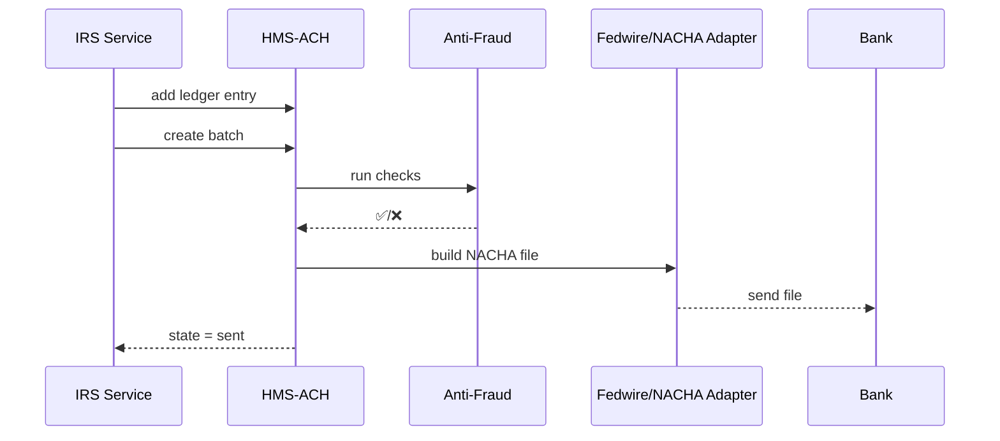

# Chapter 17: Financial Clearinghouse (HMS-ACH)

*(If you just arrived, peek at how agencies swap data in  
[Inter-Agency Exchange (HMS-A2A)](16_inter_agency_exchange__hms_a2a__.md); payments often ride on those same rails.)*  

---

## 1. Why Do We Need a “Treasury Checkbook”?

### Story — *The $300 Tax Refund*

1. **IRS** approves a $300 refund for **Maya**.  
2. The money must leave a Treasury account **only after**:  
   • the ledger shows a matching credit,  
   • anti-fraud rules pass, and  
   • the receiving bank can clear the file.  
3. The old way was a nightly main-frame job; any mismatch became a week-long manual chase.  
4. **HMS-ACH** acts like Treasury’s **checkbook app**:  
   it reconciles ledgers, applies anti-fraud checkpoints, and settles the payment through *Fedwire* or *NACHA*—all in near-real time.

Result: Maya sees *“Refund sent”* today, not next Friday, and auditors get a perfect paper trail.

---

## 2. Key Concepts (one-by-one)

| Analogy                | HMS-ACH Term          | What It Means |
|------------------------|-----------------------|---------------|
| Check stub             | **Ledger Entry**      | One row in the government’s books |
| Stack of checks        | **Batch**             | Group of entries sent together |
| Bank’s closing hour    | **Settlement Window** | Time slot when a batch is released |
| TSA checkpoint         | **Anti-Fraud Gate**   | Rule-set run before money leaves |
| FedEx label printer    | **Fedwire/NACHA Adapter** | Transforms a batch into wire or ACH format |
| Daily bank statement   | **Reconciliation Report** | JSON/CSV proving every debit = credit |

---

## 3. A 3-File “Hello ACH” Walk-Through

We will send Maya’s $300 refund from IRS to her bank.

### 3.1 File 1 — Create a Ledger Entry (≤ 18 lines)

```python
# create_entry.py
import httpx, uuid, os

entry = {
  "id":     str(uuid.uuid4()),
  "type":   "refund",
  "agency": "IRS",
  "amount": 300_00,                 # cents to avoid floats
  "to_routing": "021000021",        # JPMorgan test
  "to_account": "987654321"
}

httpx.post("http://ach/ledger/add",
           json=entry,
           headers={"Authorization":"Bearer "+os.getenv("IRS_BADGE")})
```

*Explanation*  
The **ledger** is updated but money has **not** moved yet.

---

### 3.2 File 2 — Release a Batch (≤ 14 lines)

```python
# release_batch.py
import httpx, json

batch = httpx.post("http://ach/batch/create",
                   json={"agency":"IRS"}).json()

print("Batch ID:", batch["id"])         # → BATCH-42
print("State:   ", batch["state"])      # → queued
```

Batch `BATCH-42` now waits in the **Settlement Window**.

---

### 3.3 File 3 — Watch Status (≤ 14 lines)

```python
# watch.py
import time, httpx

bid = "BATCH-42"
while True:
    st = httpx.get(f"http://ach/batch/{bid}/status").json()
    print(st["state"])           # queued → checking → sent
    if st["state"] in ("sent","rejected"): break
    time.sleep(5)
```

When state flips to **sent**, the NACHA file has already reached the bank.

---

## 4. What Happens Under the Hood?



Only **5** players keep the flow easy to memorize.

---

## 5. A Peek Inside HMS-ACH

### 5.1 Tiny Table Schemas (SQLite, ≤ 15 lines)

```sql
CREATE TABLE ledger (
  id        TEXT PRIMARY KEY,
  agency    TEXT,
  amount    INTEGER,     -- cents
  routing   TEXT, account TEXT,
  state     TEXT         -- pending/cleared
);

CREATE TABLE batches (
  id     TEXT PRIMARY KEY,
  agency TEXT,
  created_at DATETIME,
  state  TEXT             -- queued/checking/sent/rejected
);
```

### 5.2 Anti-Fraud Check (Python, 18 lines)

```python
# antifraud.py
from hms_cdf import rule  # see Chapter 2

MAX_REFUND = rule("IRS_MAX_REFUND").value()   # e.g., $10,00000 cents

def check(entry):
    if entry["amount"] > MAX_REFUND:
        return False, "exceeds_limit"
    # add more checks...
    return True, ""
```

*Rules live in [HMS-CDF](02_hms_cdf___policy_engine___codified_democracy_foundation__.md); no magic numbers in code.*

### 5.3 Fedwire/NACHA Adapter (excerpt, 15 lines)

```python
# adapter.py
def to_nacha(batch):
    rows = []
    for e in batch["entries"]:
        rows.append(f"6{e['routing']}{e['account']}{e['amount']:010d}IRSREF")
    rows.append("9" * 94)              # file trailer
    return "\n".join(rows).encode()
```

*Purposely simplified; real spec has more fields.*

---

## 6. Compliance & Observability Hooks

| Need | Where It Lives |
|------|----------------|
| **Audit trail** | Each ledger/batch row is also pushed to [HMS-ACT](08_activity_orchestration__hms_act___hms_oms__.md) as an immutable event. |
| **Security scans** | All code paths import rules from [HMS-ESQ](18_security__compliance___legal_reasoning__hms_esq__.md). |
| **Metrics** | `ach_batches_total`, `ach_failed_checks_total` go to [HMS-OPS](14_observability___ops__hms_ops__.md). |
| **Data retention** | NACHA files archived in [HMS-DTA](15_data_core___lake__hms_dta__.md) for 7 years. |

---

## 7. Common Beginner Questions

| Question | Quick Fix |
|----------|-----------|
| “Batch stuck in *checking*.” | Run `hms cdf rule list` – a new anti-fraud rule may be failing. |
| “Bank rejected the file.” | Compare our NACHA file hash (saved in HMS-DTA) with the bank’s error log; often the routing number is invalid. |
| “Need same-day wire.” | Call `/batch/create?mode=fedwire`; adapter switches format automatically. |

---

## 8. What You Learned

1. HMS-ACH is the **Treasury checkbook**: ledger, batch, settlement, anti-fraud.  
2. You sent a real refund in **three files**, each under 20 lines.  
3. Under the hood are tiny tables, a rule-driven fraud gate, and spec-compliant adapters.  
4. ACH hooks into CDF for rules, OPS for metrics, DTA for archives, and ESQ for audits.

---

### Up Next

Security and legal rules only grow stricter when real dollars move.  
The next chapter shows how HMS keeps every byte and penny within the law:  
[Security, Compliance & Legal Reasoning (HMS-ESQ)](18_security__compliance___legal_reasoning__hms_esq__.md)

---

Generated by [AI Codebase Knowledge Builder](https://github.com/The-Pocket/Tutorial-Codebase-Knowledge)