# Chapter 17: Intent-Driven Navigation & AI Journeys  

*(A gentle hop from [Micro-Frontend Interface Library (HMS-MFE)](16_micro_frontend_interface_library__hms_mfe__.md))*  

> “Citizens don’t wake up wanting to **click menus**;  
> they wake up wanting to **finish a task**.  
> HMS-Journey turns *‘I need a passport’* into an end-to-end plan—no scavenger hunt.” 
> —State Department UX lead  

---

## 1. Why Do We Need “Intent-Driven” Anything?

### 1.1 60-Second Story — “Renew My Passport Before Summer”

1. **María** types *“I need to renew my U.S. passport”* into a federal portal search box.  
2. The portal **recognises** the intent: *passport_renewal*.  
3. It **assembles** an *AI Journey*:  
   * show eligibility info  
   * fetch pre-filled DS-82 form  
   * collect payment via [HMS-ACH](12_financial_transactions___clearinghouse__hms_ach__.md)  
   * schedule photo validation with an [HMS-AGX](06_specialized_agent_extensions__hms_agx__.md) vision agent  
   * create UPS shipping label  
4. María never sees a menu—just a single progress bar that marches to “Done ✅”.

Without Intent-Driven Navigation  
• Citizens bounce between forms, phone numbers, and PDFs.  
• Agencies duplicate guidance pages.  
• Errors explode.

With Intent-Driven Navigation  
• One sentence → one orchestrated, auditable journey.

---

## 2. Five Key Concepts (Super-Simple Cheat-Sheet)

| # | Concept | Plain-English Nickname | Emoji |
|---|---------|-----------------------|-------|
| 1 | Intent | “What the user wants” | 🎯 |
| 2 | Slot | Key detail inside an intent (e.g., `passport_type=adult`) | 🔑 |
| 3 | Journey | Ordered list of steps to fulfill intent | 🗺️ |
| 4 | Step | One runnable activity (form, payment, etc.) | 👣 |
| 5 | Router | AI service that maps intent ➔ journey | 🚦 |

Remember **I-S-J-S-R** — Intent, Slot, Journey, Step, Router.

---

## 3. Declaring a Journey in ≤ 18 Lines

`passport_renewal.journey.yaml`

```yaml
id: Passport_Renewal_Adult
when_intent: passport_renewal
slots:
  passport_type: adult
steps:
  - name: precheck_eligibility
    uses: RuleBot@DS82_RULES         # AGT agent
  - name: fill_form
    uses: MFE:ds82-form@2.0          # UI brick
  - name: collect_payment
    uses: SVC:/payments/passport     # Backend route
  - name: photo_validation
    uses: AGX:vision.photo_check     # Extension
  - name: ship_label
    uses: ACT:UPS_LABEL_WORKFLOW     # Workflow
```

One YAML file = a **recipe**; the router picks the recipe that matches the intent + slots.

---

## 4. Using the Router — 15-Line Demo

```python
# portal.py
import journey_sdk as jy

utterance = "I need to renew my passport"
intent, slots = jy.detect(utterance)        # 🎯 + 🔑
journey      = jy.plan(intent, slots)       # 🗺️

for step in journey["steps"]:               # 👣 loop
    jy.run(step)                            # runs AGT, MFE, SVC, etc.
print("🎉 Journey finished")
```

### What happens?
1. `detect` uses a tiny language model (like ChatGPT-lite) to label the sentence.  
2. `plan` loads the YAML above.  
3. Each `run` call forwards to the right HMS layer (already learned in previous chapters).  

María sees a single page cycling through widgets—no manual navigation.

---

## 5. Inside the Router (Beginner-Friendly Walkthrough)

```mermaid
sequenceDiagram
    participant UI as User Portal
    participant R as 🚦 Router
    participant J as Journey Store
    participant A as HMS Layers (AGT/SVC/ACT)
    UI->>R: "renew my passport"
    R->>J: find_recipe(intent=passport_renewal)
    J-->>R: Passport_Renewal_Adult.yaml
    R->>A: run steps 1‒N
    A-->>UI: status updates
```



Only **four** moving parts—easy to reason about.

---

## 6. Tiny Internal Modules (≤ 18 Lines Each)

### 6.1 Intent Detector

```python
# journey/intent.py
import re
PATTERNS = {"passport_renewal": r"renew.*passport"}

def detect(text):
    for intent, pat in PATTERNS.items():
        if re.search(pat, text, re.I):
            return intent, {}
    return "unknown", {}
```

*Regex, not magic—good enough for a demo.*

---

### 6.2 Journey Planner

```python
# journey/planner.py
import yaml, glob

RECIPES = [yaml.safe_load(open(p)) for p in glob.glob("*.journey.yaml")]

def plan(intent, slots):
    for r in RECIPES:
        if r["when_intent"] == intent and all(
            slots.get(k) == v for k, v in r.get("slots", {}).items()):
            return r
    raise ValueError("No journey found")
```

Loads all YAMLs, picks the first that matches—simple.

---

### 6.3 Step Runner (Router)

```python
# journey/runner.py
import subprocess, requests, importlib

def run(step):
    target = step["uses"]
    if target.startswith("MFE:"):
        return  # UI brick auto-renders
    if target.startswith("SVC:"):
        url = target[4:]
        return requests.post(url).status_code
    if target.startswith("AGT:") or target.startswith("AGX:"):
        mod = importlib.import_module("agents." + target.split(":")[1])
        return mod.execute()
    if target.startswith("ACT:"):
        subprocess.run(["act","start",target[4:]])
```

Stubbed; real code swaps in full SDKs.

---

## 7. Linking With Other HMS Layers


* The Router is just an **air traffic controller**; actual work happens in layers you already know.  

---

## 8. Live Progress Bar in MFE

The brick `<hms-journey-progress>` is included automatically:

```html
<script src="https://mfe.gov/brick/journey-progress@1.0.js"></script>
<hms-journey-progress journey-id="Passport_Renewal_Adult"></hms-journey-progress>
```

It listens for events like `journey:step_complete` and updates UI—no code by you.

---

## 9. Edge-Cases & Safeguards

| Issue | Auto-Fix |
|-------|----------|
| Journey step blocked by ESQ | Router skips and logs “legal_block” |
| No recipe matches | Router shows MFE brick “I-Can-Help” (search & phone) |
| Partial completion | Journey stored in **HMS-DTA** so user can resume |

All ≤ 3 lines each in the router code.

---

## 10. Quick “Did I Do It Right?” Checklist

☐ A `.journey.yaml` exists and lists `when_intent` + `steps`  
☐ `jy.detect()` returns `passport_renewal` for the test sentence  
☐ `jy.plan()` picks the correct YAML  
☐ Running the loop executes at least one MFE/SVC step (watch logs)  
☐ Progress persists after page refresh (state saved in HMS-DTA)

If every box is green, congratulations—your site now **thinks in tasks, not menus**!

---

## 11. What’s Next?

Journeys are powerful, but we need a public **storefront** where agencies can *share* and *discover* intents, journeys, and UI bricks.  
That’s exactly what the next chapter delivers.

👉 Continue to: [Marketplace & Discoverability (HMS-MKT)](18_marketplace___discoverability__hms_mkt__.md)

Happy journeying!

---

Generated by [AI Codebase Knowledge Builder](https://github.com/The-Pocket/Tutorial-Codebase-Knowledge)