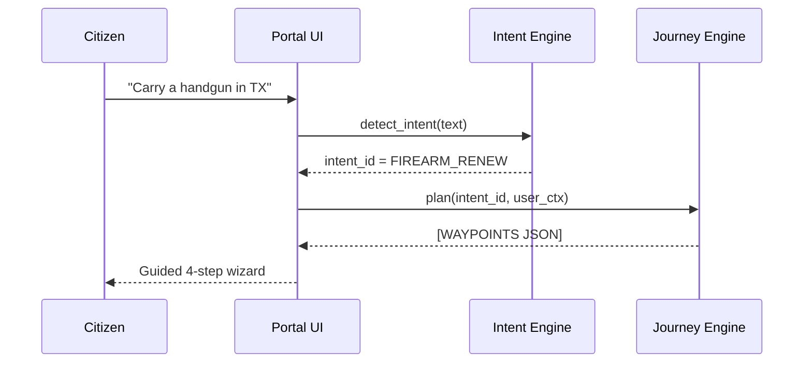
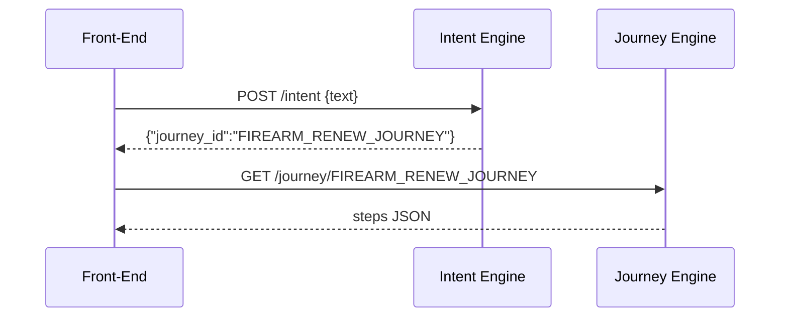

# Chapter 17: Intent-Driven Navigation
*[Link back to Chapter 16: User Portal (HMS-MFE)](16_user_portal__hms_mfe__.md)*  

---

## 1. Why Do We Need a “GPS for Bureaucracy”?

Central use-case (story in two sentences)  
• A military spouse logs into the portal and types “carry a handgun while moving to Texas.”  
• Instead of dumping her into menus (*ATF firearm-license renewal*, *Texas residency proof*, *military PCS waiver* …) the system simply replies, “Great, here’s your 4-step path—start with fingerprinting, end with payment—follow me.”

That magic is called **Intent-Driven Navigation**.  
It asks **“What do you want to achieve?”** then charts a *guided, cross-agency journey* so citizens never feel lost.

---

## 2. Key Concepts (Plain-English Cheat-Sheet)

| Road-Trip Analogy | Term | Beginner Take |
|-------------------|------|---------------|
| “I want to reach the Grand Canyon.” | **Intent** | Human-readable goal (“renew handgun permit”) |
| GPS route | **Journey Plan** | Ordered list of screens, forms, or APIs |
| Alternate routes | **Variants** | Different paths based on state, role, or data |
| Blue dot on map | **Waypoint** | One actionable step (“upload DD-214”) |
| Re-route when road closed | **Dynamic Adaptation** | Skip/add waypoints when data already known |
| Saved favorite trips | **Catalog** | YAML/JSON files describing intents |

Keep this table open—the rest of the chapter is just these six ideas in action!

---

## 3. 3-Minute Walk-Through (Citizen View)



Only **4 hops**—quick enough to feel instant.

---

## 4. Hands-On: Add an Intent in 3 Tiny Files

### 4.1 Describe the Intent (11 lines)

`intents/firearm_renew.yaml`
```yaml
id: FIREARM_RENEW
intent: "Renew my handgun license"
triggers:
  - "carry a handgun"
  - "renew firearm license"
journey_variants:
  default: "FIREARM_RENEW_JOURNEY"
  military: "FIREARM_RENEW_JOURNEY_PCS"
```

*What it does*  
• `triggers` are phrases the citizen might type.  
• Picks a **journey** based on user attributes (here, `military`).

---

### 4.2 Define the Journey (≤ 16 lines)

`journeys/firearm_renew_default.yaml`
```yaml
id: FIREARM_RENEW_JOURNEY
steps:
  - id: UPLOAD_FINGERPRINT
  - id: IDENTITY_PROOF
  - id: PAY_FEE
  - id: DOWNLOAD_PERMIT
prefill:
  IDENTITY_PROOF: "/profile"
policy: "ATF_RULE_V2024_09"
```

Exactly the same format you met in Chapter 16—re-use skills!

---

### 4.3 Minimal Intent Engine (18 lines, Python)

`intent_engine.py`
```python
import yaml, glob, re

INTENTS = []
for f in glob.glob("intents/*.yaml"):
    INTENTS.append(yaml.safe_load(open(f)))

def detect(text, user):
    for item in INTENTS:
        if any(re.search(t, text, re.I) for t in item["triggers"]):
            variant = ("military" if user.get("is_military") else "default")
            return item["journey_variants"][variant]
    return None  # fallback
```

Explanation  
1. Loads every YAML at start-up.  
2. Regex-matches citizen text to triggers.  
3. Returns the **journey id** appropriate for that user.

---

## 5. Wiring It Into the Portal (React, 13 lines)

```jsx
// IntentSelectorWithAI.jsx
import {useState} from "react";
export default function IntentSelector(){
  const [query,setQ]=useState("");
  async function go(){
    const r=await fetch("/intent",{
      method:"POST",
      body:JSON.stringify({text:query})
    }).then(x=>x.json());
    window.startJourney(r.journey_id);   // provided by Chapter16 code
  }
  return <>
    <input value={query} onChange={e=>setQ(e.target.value)}/>
    <button onClick={go}>Go</button>
  </>;
}
```

What happens?  
• Sends free-text to the `Intent Engine` endpoint.  
• Starts the returned journey—citizen never sees menus.

---

## 6. What Happens Under the Hood?

1. UI posts free text.  
2. Intent Engine picks a journey id.  
3. Journey Engine (Chapter 16) fetches YAML.  
4. Steps auto-prefill or skip if data already on file.  
5. Each completed waypoint emits `WAYPOINT_DONE` onto the [Event Bus](08_event_bus___streaming_layer_.md) for analytics.

---

## 7. Peek at the Request Flow (Sequence Diagram)



Three micro-calls—fast and cache-friendly.

---

## 8. Safety Rails You Already Know

| Layer | How It Enhances Intents |
|-------|-------------------------|
| [Governance](01_governance_layer__hms_gov__.md) | New intents & journeys need Change Tickets. |
| [Policy Engine](02_policy___process_engine_.md) | Ensures journey obeys current ATF rules. |
| [Security](04_security___compliance_framework_.md) | Intent Engine image carries a Seal ID. |
| [IAM](05_access___identity_management_.md) | Checks user role before showing restricted intents. |
| [Audit Log](11_observability___audit_log_.md) | Emits `INTENT_SELECTED` with trace id. |

---

## 9. Common Pitfalls & Quick Fixes

| “Oops!”                                    | Root Cause                | Fast Fix                           |
|--------------------------------------------|---------------------------|------------------------------------|
| Wrong journey picked                       | Over-generic trigger      | Add more specific trigger phrases. |
| User repeats known info (“address again?”) | Missing prefill endpoint  | Add `prefill` key to that step.    |
| Military spouse got civilian variant       | `is_military` attr absent | Enrich user profile during login.  |

---

## 10. Mini-Lab: Add a Brand-New Intent in 5 Minutes

1. Copy `sample_intent.yaml` → `intents/clinical_trial.yaml`.  
2. Edit:

```yaml
id: NIMH_TRIAL_MATCH
intent: "Join an NIMH clinical trial"
triggers: ["depression study", "clinical trial"]
journey_variants:
  default: "NIMH_TRIAL_JOURNEY"
```

3. Write the journey file (2-3 steps).  
4. Restart Intent Engine (`docker restart intent`).  
5. Type “depression study” in the portal—you get a guided path 🎉.

You just shipped a cross-agency journey without touching front-end code.

---

## 11. What You Learned

✓ The pain menus cause and how **Intent-Driven Navigation** fixes it.  
✓ Key terms: intent, journey plan, variant, waypoint, dynamic adaptation, catalog.  
✓ Declared an intent & journey in YAML, wrote an 18-line detection engine, and wired it into the portal.  
✓ Understood the internal 3-hop flow and how governance, security, and audit already protect you.  
✓ Added a new intent in a mini-lab—proving it’s really that easy.

Ready to see how administrators monitor, approve, and edit these intents across many agencies?  
Continue to [Admin/Gov Portal](18_admin_gov_portal_.md).

---

Generated by [AI Codebase Knowledge Builder](https://github.com/The-Pocket/Tutorial-Codebase-Knowledge)