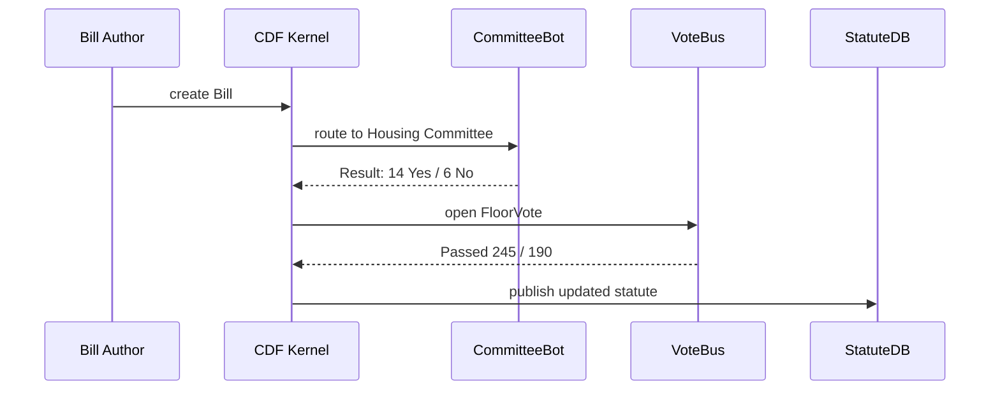

# Chapter 17: Legislative Workflow Engine (HMS-CDF Rust Kernel)

*(jumped in from [Legal Reasoning Service (HMS-ESQ)](16_legal_reasoning_service__hms_esq__.md))*  

---

## 1 — Why Do We Need a “School-House Rock” in Software?

Picture HUD lawyers discovering that the *Affordable Housing Act* **still** references lead-paint limits from 1978.  
Congress orders a quick amendment:

1. **Draft** the new text (“Use 2024 EPA limits”).  
2. **Send** it through Housing & Environment committees.  
3. **Vote** in both chambers.  
4. **Enroll & publish** so every HUD database updates automatically.

If each step is done by e-mail and Word docs, you get:

* Lost amendments (“Which file is final?”)  
* Missed deadlines (session ends before the vote)  
* Software drift (APIs still serve 1978 limits)

The **Legislative Workflow Engine (HMS-CDF)** is our *digital Capitol Hill*:

```
Bill Draft ➜ Committee Review ➜ Floor Vote ➜ Reconciliation ➜ Promulgation
```

It encodes that journey as a **Rust state-machine**.  
Change the bill text in code, hit **run**, and the kernel walks it through every parliamentary rule—no lobbyist required.

---

## 2 — Key Concepts in Plain English

| Kernel Word | Think of it as… |
|-------------|-----------------|
| Bill        | A Git branch holding proposed law text. |
| State       | Where the bill is in the journey (Draft, Committee, …). |
| Transition  | The arrow that moves the bill to the next state. |
| Guard       | A yes/no test (“Did it pass committee  ⬆  51%?”). |
| Effect      | Code that fires when a state is entered (update APIs, notify public). |
| Roll Call   | The list of members & their votes, stored immutably. |

Remember: **Bill → State → Guard → Transition → Effect**.

---

## 3 — 60-Second Code Tour  
“Move a bill from Draft ➜ Committee”

```rust
// src/lib.rs   (≤ 20 lines)
#[derive(Debug, Clone)]
pub enum State { Draft, Committee, FloorVote, Enrolled, Law }

pub struct Bill { pub id: u32, pub state: State }

impl Bill {
    pub fn advance(&mut self) -> Result<(), &'static str> {
        use State::*;
        self.state = match self.state {
            Draft     => Committee,
            Committee => FloorVote,
            FloorVote => Enrolled,
            Enrolled  => Law,
            Law       => return Err("Already law")
        };
        Ok(())
    }
}
```

**Explanation**

1. `State` enum lists the chambers of the journey.  
2. `advance()` bumps `state` one hop.  
3. Real code adds **guards** (e.g., “committee votes ≥ quorum”)—we’ll see that next.

---

### 3.1 — Add a Guard

```rust
// src/guards.rs (≤ 10 lines)
pub fn committee_passed(votes_for: u32, votes_against: u32) -> bool {
    votes_for > votes_against
}
```

Call it inside `advance()` **before** switching from `Committee ➜ FloorVote`.

---

## 4 — What Happens Under the Hood?



Five players, zero emails.

---

## 5 — File Tour

```
hms-cdf/
 ├─ src/
 │   ├─ lib.rs            # State machine core
 │   ├─ guards.rs         # vote & quorum checks
 │   ├─ effects.rs        # publish, notify, sync
 │   └─ rollcall.rs       # immutable vote logs
 └─ tests/
     └─ happy_path.rs
```

### 5.1 — Effect: Update HMS-API (≤ 15 lines)

```rust
// src/effects.rs
pub fn publish_law(bill_id: u32, text: &str) {
    let _ = reqwest::blocking::Client::new()
        .post("https://api.gov/v1/statutes")
        .json(&serde_json::json!({ "bill_id": bill_id, "text": text }))
        .send();
}
```

Fired when `state == Law`.

---

## 6 — Beginner Pitfalls

| Oops! | Cause | Fix |
|-------|-------|-----|
| Bill stuck in Committee | Guard never returns `true` (no votes recorded) | Call `record_vote()` then retry `advance()` |
| “Already law” error | Calling `advance()` too many times | Check `state` before calling |
| Missing roll-call details | Forgot `effects::log_vote()` | Always log *before* state change |
| Conflicting amendments | Two bills edit same statute section | CDF auto-merges; add `--reconcile` flag or rebase branch |

---

## 7 — Mini-Exercise

1. Clone the repo and run the happy-path test:  
   ```bash
   cargo test happy_path
   ```
2. Modify `tests/happy_path.rs` to fail committee vote (`votes_for = 3`).  
3. Re-run; test should **fail** at guard.  
4. Update the votes, watch it pass again.  

---

## 8 — Government Analogy Cheat-Sheet

CDF Item         | Capitol-Hill Equivalent
-----------------|-------------------------
`Bill`           | Printed House or Senate bill
`State::Draft`   | Bill dropped in the hopper
`Guard`          | Clerk checking quorum rules
`Effect`         | National Archives publishes Public Law
`rollcall.log`   | Congressional Record entry  

---

## 9 — Recap & What’s Next

You saw how the **HMS-CDF Rust Kernel** turns legislation into a **deterministic state machine**:

* **States & guards** bake parliamentary rules into code.  
* **Roll-calls** and **effects** give perfect audit trails and automatic API updates.  
* No more lost amendments or midnight vote confusion.

Ready to practice without crashing real laws? Jump into the sandbox in  
[Simulation & Training Sandbox (HMS-ESR)](18_simulation___training_sandbox__hms_esr__.md).

---

Generated by [AI Codebase Knowledge Builder](https://github.com/The-Pocket/Tutorial-Codebase-Knowledge)