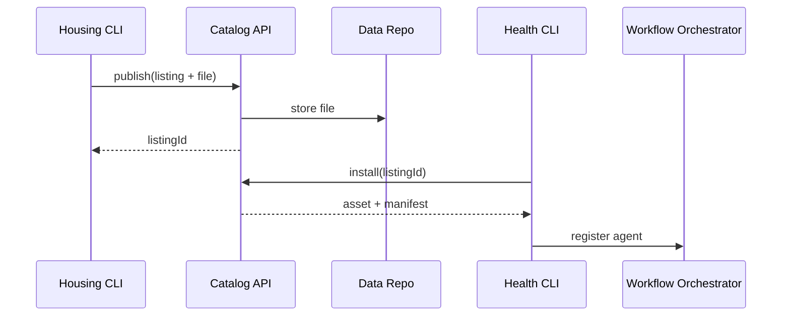

# Chapter 17: Marketplace & Discovery Service (HMS-MKT)

*(continuing from [Simulation & Testing Environment (HMS-ESR)](16_simulation___testing_environment__hms_esr__.md))*  

---

## 1. Why a “Government App Store”?

Picture two real agencies:

* **Housing Authority of Central City** trains an **Eviction-Prevention AI** that predicts tenants at risk and suggests rental-assistance programs.  
* **County Health Department** fights childhood asthma; evictions often spike ER visits, so the Health team would love that model.

Today the Housing data-science team would:

1. Zip the model.  
2. E-mail it.  
3. Hope the Health IT folks find the right Python, policies, and legal clearance.

That’s slow, error-prone, and non-auditable.

**Marketplace & Discovery Service (HMS-MKT)** is the **App Store for .gov data, AI models, workflows, and UI widgets**.  
It lets any authorized agency **publish → discover → license → install** reusable assets in minutes—with guardrails, audits, and one-click updates.

---

## 2. Key Concepts (plain-English cheatsheet)

| MKT Term   | Mall Analogy                 | One-sentence meaning |
|------------|-----------------------------|----------------------|
| Listing    | Product on a shelf           | Metadata + version for a dataset, agent, or UI micro-app. |
| Catalog    | Mall directory               | Searchable index of every listing—JSON API + web UI. |
| License    | Price tag + terms            | Specifies who can use it and under what rules (e.g., CC-BY 4.0, inter-agency MOU). |
| Install    | Shopper puts item in cart    | Script or UI button that fetches the asset and registers dependencies. |
| Rating     | Customer review              | 1–5-star + comments; helps others judge quality. |
| Dependency Graph | “Requires batteries” note | Shows which datasets or libraries a listing relies on. |

Remember these six; everything else is wiring.

---

## 3. 5-Minute “Hello Marketplace” Walk-Through

Goal: publish the **Eviction-Prevention AI** and let Health install it.

### 3.1 Housing Authority publishes a listing (16 lines)

```bash
# cli/publish.sh
mkt publish \
  --type agent \
  --file eviction_model_v1.onnx \
  --id city.housing.evictionAI \
  --title "Eviction-Prevention Agent" \
  --desc "Predicts eviction risk in 30 days." \
  --license "Inter-agency-MOU-123" \
  --tags "housing,health,ai" \
  --requires "dataset:city.housing.rent_history" \
  --author "housing-ai@city.gov"
```

What happened?  
1. The CLI uploaded the file to [Data Repository (HMS-DTA)](06_data_repository___governance__hms_dta__.md).  
2. A **listing document** was created in the Catalog.  
3. IAM recorded the Housing team as the **owner**.

### 3.2 Health Department discovers & installs (18 lines)

```bash
# cli/install.sh
mkt search "eviction"
# ➜ city.housing.evictionAI  ⭐4.8  license:Inter-agency-MOU-123

mkt install city.housing.evictionAI --env healthDept
```

Output:

```
✔ License checked (Inter-agency-MOU-123)
✔ Dependencies resolved: city.housing.rent_history
✔ Agent registered with AGT framework
🎉 Ready to use: call agent "evictionAI" in your workflow
```

The agent is now visible to the Health team’s **Workflow Orchestrator** ([HMS-ACT](07_workflow_orchestrator__hms_act___hms_oms__.md)).

---

## 4. What Happens Under the Hood?



*Guardrails*: ESQ scans uploads; IAM ensures only licensed agencies can install.

---

## 5. Inside a Listing Document (8 lines)

```json
{
  "id": "city.housing.evictionAI",
  "type": "agent",
  "version": "1.0.0",
  "requires": ["dataset:city.housing.rent_history>=2024-01"],
  "license": "Inter-agency-MOU-123",
  "checksum": "sha256:abc123...",
  "rating": 4.8
}
```

Stored in a simple Postgres table indexed for fast search.

---

## 6. Minimal Catalog API (Node, ≤ 20 lines)

```js
// svc/catalog.js
import express from 'express', db from './db.js'
const app = express(); app.use(express.json())

app.post('/publish', async (req,res)=>{
  const item = req.body
  await db('listings').insert(item)        // 5-line upsert in real code
  res.json({ok:true, id:item.id})
})

app.get('/search', async (req,res)=>{
  const q = req.query.q ?? ''
  const rows = await db('listings')
      .whereILike('title', `%${q}%`).limit(10)
  res.json(rows)
})

app.post('/install', async (req,res)=>{
  const { id, env } = req.body
  const item = await db('listings').where({id}).first()
  // TODO: license + dependency checks (see Section 7)
  res.json({ manifest: item })
})

app.listen(4100)
```

*Highlights*  
• **< 20 lines** but supports publish, search, install.  
• Real service adds ESQ scans & IAM checks.

---

## 7. Guardrails During Install

1. **License Check** – installer’s IAM role must match `license`.  
2. **Dependency Fetch** – required datasets auto-import via [HMS-DTA](06_data_repository___governance__hms_dta__.md).  
3. **Policy Check** – proposed agent actions are pre-checked by [HMS-CDF](08_policy___legislative_engine__hms_cdf__.md).  
4. **Budget Check** – ESQ denies installs whose cloud cost exceeds agency budgets.

These run inside the Catalog API before returning the manifest.

---

## 8. Rating & Feedback Loop (10 lines)

```js
// cli/rate.sh
mkt rate city.housing.evictionAI 5 "Helped cut ER visits by 7%!"

// svc/catalog.js (add)
app.post('/rate', async (req,res)=>{
  const { id, stars, comment } = req.body
  await db('ratings').insert({ id, stars, comment })
  const avg = await db('ratings').avg('stars as s').where({id})
  await db('listings').where({id}).update({rating:avg[0].s})
  res.json({ok:true})
})
```

Ratings appear in search results, encouraging a community of quality improvement.

---

## 9. Where MKT Touches Other HMS Layers

| Layer | Interaction |
|-------|-------------|
| [HMS-MFE](01_micro_frontend__hms_mfe__.md) | The Marketplace web UI is a micro-frontend plug-in. |
| [HMS-DTA](06_data_repository___governance__hms_dta__.md) | Stores dataset and model binaries. |
| [HMS-AGT](09_ai_representative_agent_framework__hms_agt___hms_agx__.md) | Agents installed via MKT auto-register as skills. |
| [HMS-ESQ](05_security__privacy___legal_guardrails__hms_esq___platform_controls__.md) | Scans every upload for PII, malware, and legal compliance. |
| [HITL Oversight](10_human_in_the_loop__hitl__oversight_.md) | High-risk listings trigger a human approval ticket before publishing. |
| [OPS](15_monitoring___metrics__hms_ops__.md) | Publishes `install_count`, `error_rate` metrics for each listing. |

---

## 10. Frequently Asked Beginner Questions

**Q: Can private vendors publish assets?**  
A: Yes, but they must hold a vendor IAM role; agencies still control licensing.

**Q: What about paid listings?**  
A: HMS-MKT integrates with [HMS-ACH](14_financial_transaction_engine__hms_ach__.md); the install flow includes a payment step when `price > 0`.

**Q: How are updates handled?**  
A: Publisher calls `mkt publish --version 1.1.0 …`; install CLI shows **update available** and runs `install --upgrade`.

**Q: Is source code required?**  
A: Optional. You can publish a binary with reproducible-build checksum; ratings and ESQ scans enforce trust.

---

## 11. Recap

You learned that HMS-MKT:

• Turns models, datasets, agents, and UI widgets into **one-click, audited products**.  
• Handles licenses, dependencies, ratings, and guardrails **out-of-the-box**.  
• Lets agencies reuse innovation instantly—no zip files, no email, no guesswork.

Next we’ll see how knowledge about these assets—and everything else in HMS—is documented and shared in the **Education & Knowledge Base (HMS-EDU)**.

👉 Continue to [Education & Knowledge Base (HMS-EDU)](18_education___knowledge_base__hms_edu__.md)

---

Generated by [AI Codebase Knowledge Builder](https://github.com/The-Pocket/Tutorial-Codebase-Knowledge)