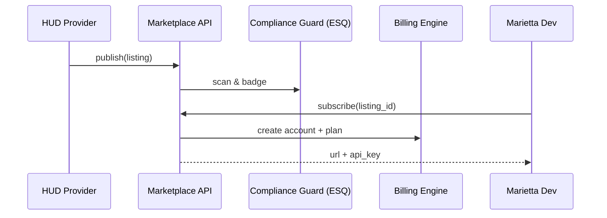

# Chapter 17: Marketplace Registry (HMS-MKT)
*(“The App Store for Government Micro-Services, Data Sets, and AI Models”)*  

[← Back to Chapter 16: Backend Service Mesh (HMS-SVC & APIs)](16_backend_service_mesh__hms_svc___apis__.md)

---

## 1. Why Bother With a Marketplace?

Picture the **City of Marietta, Ohio**.  
A single developer, **TJ**, has to launch a grants portal in 30 days:

* Needs a **grant-scoring model** (HUD already built one).  
* Wants a **payments micro-service** (Treasury publishes one).  
* Must comply with **state cybersecurity law** (ODoT provides scans).

Finding, vetting, purchasing, and wiring these pieces usually takes **months of e-mails**.

**Marketplace Registry (HMS-MKT)** is a one-stop shop:

1. Agencies **list** services, data sets, or ML models.  
2. Each listing includes **SLA, price, version, compliance score**.  
3. Counties, towns, or sister agencies **subscribe with one click**.  
4. Billing, access keys, and audit logs are issued automatically.

_Think “App Store” but every app follows federal law and passes a compliance scan._

---

## 2. Central Use-Case – “TJ Finds a Grant-Scoring Model”

1. TJ opens HMS-MKT and searches *“grant scoring model”*.  
2. Result: **`hud/grant_score_v3`** — SLA 99.9 %, \$0.02 per request, **FedRAMP Moderate**.  
3. One click → HMS-MKT  
   * checks Marietta’s UIA token,  
   * spins up a scoped API key,  
   * inserts the model’s URL into TJ’s **Service Mesh** config (`grant-score.svc`).  
4. TJ’s app calls the model in under 5 minutes—no procurement red tape.

---

## 3. Key Concepts (Beginner Friendly)

| Marketplace Term | Friendly Analogy | 1-Sentence Job |
|------------------|------------------|----------------|
| Listing          | App Store page   | Metadata + price + docs for one asset. |
| Tier             | Free / Pro / GovCloud | Bundle of limits & price (10 k calls/day, 24×7 SLA, etc.). |
| Badge            | Nutrition label  | Shows compliance level (HIPAA, FedRAMP, CJIS). |
| Subscription     | Receipt + key    | Grants a consumer scoped access + billing plan. |
| Rating & Review  | Yelp stars       | Peers leave 1-5 ⭐ with comments (auditable). |

---

## 4. A 15-Line “Hello Marketplace” Demo

```python
# file: quick_demo.py      (≤15 lines)
from hms_mkt import MKT

mkt = MKT()                       # local sandbox

# 1️⃣ Provider publishes a model
mkt.publish(id="hud/grant_score_v3",
            title="HUD Grant Scoring Model",
            price=0.02, unit="req",
            badge="FedRAMP Moderate")

# 2️⃣ Consumer searches & subscribes
result = mkt.search("grant scoring")[0]
sub = mkt.subscribe(result["id"], consumer="city-marietta")

print("Endpoint :", sub["url"])
print("API-Key  :", sub["key"][:8], "…")
```

Expected output:

```
Endpoint : https://grant-score.svc/predict
API-Key  : CA7B91E2 …
```

TJ now owns a live, metered API key without talking to Sales.

---

## 5. What Happens Behind the Curtain?



1. **Publish** → Compliance scan tags the badge.  
2. **Subscribe** → Billing plan + scoped key are auto-created.  
3. All steps go into an audit log visible in [System OPS](19_system_observability___ops_center__hms_ops__.md).

---

## 6. Peek Inside HMS-MKT (All Snippets ≤ 20 Lines)

### 6.1 In-Memory Registry

```python
# hms_mkt/core.py
import uuid, time

LISTINGS, SUBS = {}, {}

def publish(id, title, price, unit, badge):
    LISTINGS[id] = {"id": id, "title": title, "price": price,
                    "unit": unit, "badge": badge,
                    "url": f"https://{id.split('/')[1]}.svc"}
    return LISTINGS[id]

def search(q):
    return [l for l in LISTINGS.values() if q.lower() in l["title"].lower()]
```

### 6.2 Subscribe & Key Issuance

```python
def subscribe(listing_id, consumer):
    l = LISTINGS[listing_id]
    key = uuid.uuid4().hex
    SUBS[key] = {"listing": l, "consumer": consumer,
                 "key": key, "ts": time.time()}
    return {"url": l["url"], "key": key}
```

### 6.3 Simple Usage Meter

```python
USAGE = {}
def record_call(key):
    USAGE[key] = USAGE.get(key, 0) + 1
    # bill nightly: cost = USAGE[key] * SUBS[key]["listing"]["price"]
```

Minimal, but shows **publish → search → subscribe → meter** flow.

---

## 7. How HMS-MKT Plays With Other Layers

| Layer | Interaction |
|-------|-------------|
| [Backend Service Mesh (HMS-SVC)](16_backend_service_mesh__hms_svc___apis__.md) | After subscription, the listing’s DNS name auto-appears in the consumer’s mesh. |
| [Compliance Guardrail Framework (HMS-ESQ)](05_compliance_guardrail_framework__hms_esq__.md) | Scans every listing for policy violations before publication. |
| [Universal Identity & Access](12_universal_identity___access__account___authn__.md) | Subscriptions and API keys are bound to the consumer’s UIA token. |
| [Financial Clearinghouse (HMS-ACH)](07_financial_clearinghouse__hms_ach__.md) | Monthly invoices flow through ACH for inter-agency payments. |
| [System Observability & Ops Center](19_system_observability___ops_center__hms_ops__.md) | Usage, SLA breaches, and ratings stream to dashboards. |

---

## 8. 60-Second Try-It-Yourself Lab

1. Copy `hms_mkt/core.py` and `quick_demo.py`.  
2. Add a fake second listing:

```python
mkt.publish(id="treasury/pay_v1", title="Treasury Payment API",
            price=0.001, unit="tx", badge="FISMA High")
```

3. Rerun the search; you’ll see both listings.  
4. Call `record_call(key)` ten times, then print `USAGE[key]`—your bill is automatically \$0.20.

---

## 9. Recap & Next Step

You learned:

1. HMS-MKT lets agencies **publish** and **subscribe** to services in minutes.  
2. Listings carry built-in **badges**, **prices**, and **SLAs**.  
3. Subscription returns an **endpoint + API key** instantly; billing and audits happen behind the scenes.  
4. Marketplace plugs into Service Mesh, Compliance, Identity, Payments, and Ops—so nothing slips through the cracks.

Next, we’ll secure the **data** those services share by wrapping it in a protective Trust Layer.  
Continue to → [Data Trust Layer (HMS-DTA)](18_data_trust_layer__hms_dta__.md)

---


---

Generated by [AI Codebase Knowledge Builder](https://github.com/The-Pocket/Tutorial-Codebase-Knowledge)