# Chapter 17: Observability & Operations (HMS-OPS)

*A friendly sequel to [Outcome-Driven Navigation](16_outcome_driven_navigation_.md)*  

---

## 1. Why Do We Need HMS-OPS?

Picture FEMA’s brand-new **“Disaster Claim Wizard”** (built in Chapters 5, 15 and 16) going live on a stormy Friday night.  

Two hours in:

* Page loads crawl from **300 ms → 4 s**  
* 17 % of API calls return **HTTP 500**  
* Citizens start venting on Twitter

Without an “eye in the sky” nobody even notices until Monday.  
**HMS-OPS is the 24/7 mission-control room** that spots these blips in real time, pin-points the failing micro-service, and sounds the alarm **before** the newspapers do.

---

## 2. Key Ideas in Plain English

| OPS Term | Friendly Analogy | Disaster-Claim Example |
|----------|------------------|------------------------|
| Log      | Diary entry      | `POST /claims 500 "DB timeout"` |
| Metric   | Speedometer      | `latency_p99 = 4020 ms` |
| Trace    | Breadcrumb trail | UI → Mesh → DB (who was slow?) |
| Dashboard| Control panel    | Big red graph spikes at 23:07 |
| Alert    | Smoke detector   | PagerDuty call when errors > 5 % |
| Canary   | Taste-tester     | Route 5 % traffic to v2, watch OPS first |

Keep these six words in mind; 95 % of OPS boils down to them.

---

## 3. A 3-Minute Walk-Through: Instrumenting the Claim API

### 3.1 Emit a Log (4 lines)

```js
// api/claim.js (excerpt)
log.info('claim_start', { user:req.user.id })
const claim = await saveClaim(req.body).catch(err => {
  log.error('claim_fail', { err })
  throw err                  // hits Express error handler
})
```

**What it does:** writes a **JSON log** for every start & failure.

### 3.2 Record a Metric (6 lines)

```js
import { metric } from 'hms-ops'

const t0 = Date.now()
await saveClaim(...)
metric.timing('claim_latency_ms', Date.now()-t0)   // e.g. 380
metric.count('claim_total')
```

`hms-ops.metric.*` needs **no config**—it auto-discovers the service name.

### 3.3 Add a Trace Header (8 lines)

```js
// mesh/sidecar.js (simplified)
export function proxy(req, res){
  const traceId = req.headers['x-trace'] || crypto.randomUUID()
  res.setHeader('x-trace', traceId)            // forward to next hop
  log.info('trace_link', { traceId, url:req.url })
  forward(req, res, { headers:{ 'x-trace': traceId } })
}
```

Now every hop (UI → Mesh → API → DB) shares the same **`traceId`**.

---

## 4. What Happens Behind the Curtain?

```mermaid
sequenceDiagram
  participant API  as Claim API
  participant SVC  as Mesh Sidecar
  participant OPS  as HMS-OPS Ingest
  participant DS   as Dashboard
  API->>OPS: log + metric
  SVC->>OPS: trace_link
  OPS->>DS: stream(latency,errors)
  DS-->>User: spike at 23:07 🔴
```



1. **Logs / metrics / traces** flow over HTTPS to **OPS Ingest**.  
2. Ingest streams live numbers to the **Dashboard**.  
3. A spike crosses the red line → OPS fires an **alert** to on-call.

---

## 5. Inside HMS-OPS (Mini Implementation)

### 5.1 Ingest API (18 lines)

```js
// ops/ingest.js
import express from 'express'
const app = express(); app.use(express.json())

app.post('/ingest', (req,res)=>{
  const { type, payload } = req.body           // log | metric | trace
  switch(type){
    case 'log':    db.logs.insert(payload);        break
    case 'metric': agg.update(payload);            break
    case 'trace':  db.traces.upsert(payload);      break
  }
  res.sendStatus(202)     // Accepted
})

app.listen(9090)
```

*Under 20 lines to accept **everything**.*

### 5.2 Live Aggregator (≤ 12 lines)

```js
// ops/agg.js
const gauges = {}          // {name:value}
export function update({ name, value }){
  gauges[name] = (gauges[name]||0) + value
  if (name==='error_total' && gauges[name] % 50 === 0)
      alert('High error rate!')
}
```

Console alert triggers PagerDuty in real deployments.

### 5.3 Simple Dashboard Widget (Vue, 14 lines)

```vue
<script setup>
import { ref,onMounted } from 'vue'
const pts = ref([])
onMounted(() => {
  const s = new EventSource('/ops/stream')
  s.onmessage = e => pts.value.push(JSON.parse(e.data))
})
</script>

<template>
  <Chart :data="pts" title="Claim Latency (p95 ms)"/>
</template>
```

Live Server-Sent-Events feed the chart—no fancy libraries needed.

---

## 6. Connecting OPS to Other Chapters

| Layer | What It Sends to OPS | Why It Matters |
|-------|----------------------|----------------|
| [HMS-SVC](09_core_service_mesh__hms_svc__.md) | Per-route latency & error metrics | See network bottlenecks |
| [HMS-ACT](05_workflow_orchestrator__hms_act__.md) | Workflow success / fail counts | Track policy roll-out health |
| [HMS-ACH](13_financial_clearinghouse__hms_ach__.md) | Settled vs. failed payments | Alert on money stuck in limbo |
| [HITL Control](08_human_in_the_loop__hitl__control_.md) | Pending task backlog | Warn if humans can’t keep up |
| [HMS-DTA](10_data_lake___repository__hms_dta__.md) | Stores cold logs for audits | Long-term compliance proof |

OPS is the *glue* that keeps every layer honest and healthy.

---

## 7. Frequently Asked Questions

**Q: How much code do I add to a service to get metrics?**  
Usually **one import and two lines** (`metric.count`, `metric.timing`).

**Q: Does OPS store logs forever?**  
Hot data (last 30 days) in a fast DB; older logs are rolled into [HMS-DTA](10_data_lake___repository__hms_dta__.md) nightly.

**Q: Can I view a single trace end-to-end?**  
Yes—search by `traceId` in the dashboard; every hop is stitched automatically.

**Q: What about security events?**  
Tag any log with `severity:"security"`—OPS pipes it to the SOC channel and raises critical alerts regardless of thresholds.

---

## 8. What You Learned

• **HMS-OPS** collects logs, metrics, and traces from *every* service, draws real-time dashboards, and fires alerts before citizens notice trouble.  
• Instrumentation is **tiny**—usually well under 20 lines per service.  
• OPS data feeds audits (via DTA), payment safety (ACH), human workload (HITL), and traffic routing (SVC).  

Ready to practice what you’ve learned **without risking production**?  
Jump into [Simulation & Training Sandbox (HMS-ESR)](18_simulation___training_sandbox__hms_esr__.md).

---

Generated by [AI Codebase Knowledge Builder](https://github.com/The-Pocket/Tutorial-Codebase-Knowledge)