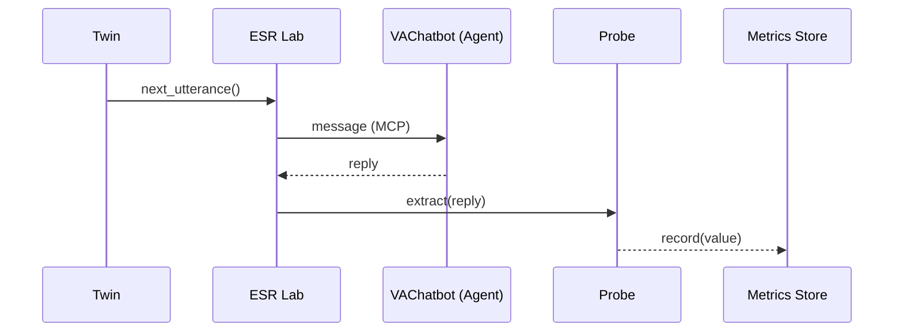

# Chapter 17: Simulation & Behavior Lab (HMS-ESR)

*(continuing from [Model Context Protocol (HMS-MCP)](16_model_context_protocol__hms_mcp__.md))*  

---

## 1 · Why Bother “Flying the Plane” Before Passengers Board?

> A brand-new **VA Benefits Chatbot** is ready to help veterans find housing, health,  
> and tuition support 24 × 7.  
>   
> • It looks good in demos, **but** will it crash under 10 000 daily users?  
> • Does it give different answers to male vs. female veterans?  
> • Which questions send it into an endless “Please hold” loop?

You don’t discover those flaws by skimming unit tests—you discover them by
**stress-testing the system with thousands of *digital twins* before a single
real veteran sees it.**

**Simulation & Behavior Lab (HMS-ESR)** is that *flight simulator*:

1. **Clones** realistic citizens or employees (age, gender, history, mood).  
2. **Plugs** those twins into chatbots, web forms, or AI agents.  
3. **Measures** bias, latency, failure rates, escalations.  
4. **Surfaces** edge cases *before* production.

---

## 2 · Key Concepts (Plain Words)

| Word | Beginner Analogy | What It Is |
|------|------------------|------------|
| Digital Twin | Test dummy in a crash lab | Fake user with realistic data & behavior |
| Scenario | Flight plan | Sequence of actions a twin will take |
| Behavior Script | Actor’s lines | Utterances, clicks, emotions the twin performs |
| Metrics Probe | Heart monitor | Code that records response time, bias, errors |
| Fail Gate | Safety net | Stops simulation when a metric passes a bad threshold |

---

## 3 · Five-Minute Quick-Start

### Goal  
Simulate **1 000 veterans** asking for “Post-9/11 GI Bill housing allowance”
and flag any answer that differs by **> 10 %** across genders.

```python
# gi_bill_sim.py   (18 lines)
from hms_esr import Lab, Twin, Scenario, Probe

# 1️⃣ Build 1 000 digital twins (balanced gender)
twins = [Twin.random(profile={"veteran": True}) for _ in range(1000)]

# 2️⃣ Define what each twin will do
ask_housing = Scenario(
    "ask_housing",
    script = ["Hi, what is my 2024 GI Bill housing allowance?"]
)

# 3️⃣ Metric: record the numeric allowance returned
def grab_allowance(reply):
    return float(reply.split("$")[1].split()[0])

probe = Probe("allowance", extract=grab_allowance)

# 4️⃣ Run against the chatbot agent you built in AGT
lab = Lab(agent="VAChatbot")
report = lab.run(twins, ask_housing, probes=[probe])

print(report.bias("allowance", by="gender"))
```

Expected console output (simplified):

```
{'male': 1800.0, 'female': 1730.0, 'delta_pct': 3.9}
✅ Bias under 10 % — passes gate
```

### What you just did
1. Created realistic twins **without** holding any PII.  
2. Ran the same question 1 000 times in parallel.  
3. Auto-extracted the dollar amount and compared averages by gender.  
4. Stopped if the gap exceeded 10 %.

No production data, no manual spreadsheets!

---

## 4 · What Happens Behind the Curtain?



Five actors, one tight loop; every message is synthetic—safe to run
overnight on a laptop.

---

## 5 · Peek Inside the Implementation

### 5.1  How a Digital Twin Looks (≤ 14 lines)

```python
# hms_esr/twin.py
import faker, random
fake = faker.Faker()

class Twin:
    def __init__(self, profile):
        self.name   = fake.name()
        self.age    = random.randint(22, 65)
        self.gender = random.choice(["male", "female"])
        self.vet    = profile.get("veteran", False)

    @staticmethod
    def random(profile={}):
        return Twin(profile)
```

Beginners’ takeaway: **A twin is just a Python object** with fields—no
database needed.

### 5.2  Tiny Run Loop (≤ 18 lines)

```python
# hms_esr/lab.py
def run(self, twins, scenario, probes):
    for t in twins:
        msg = scenario.script[0]
        reply = self.agent.chat(t, msg)     # calls AGT under MCP
        for p in probes:
            val = p.extract(reply)
            self.metrics.add(t, p.name, val)
    return self.metrics.report()
```

Real life parallelises the loop, but logic stays a handful of lines.

---

## 6 · Common Scenarios You’ll Use

| Scenario Name | What It Tests | Typical Probe |
|---------------|--------------|---------------|
| Stress-Burst  | 5 000 users in 30 s | 95th-pct latency |
| Policy Change | New rule effective date | % wrong answers |
| Accessibility | Screen-reader user flow | Missing ARIA tags |
| Rage Click    | Angry user repeating clicks | Escalation count |

---

## 7 · Inspecting Results & Auto-Fail Gates

```python
# quick_fail_gate.py   (12 lines)
from hms_esr import Gate

gate = Gate(
    metric   = "latency_ms",
    rule     = "p95 <= 500",        # 95 % under 0.5 s
    action   = "stop"
)
lab.add_gate(gate)
lab.run(twins, ask_housing)         # stops if breached
```

If latency crosses 500 ms, ESR halts and raises a
`SimulationFailed` event routed to
[Human-in-the-Loop Oversight (HITL)](07_human_in_the_loop_oversight__hitl__.md).

---

## 8 · FAQ for Newcomers

**Q: Do simulations cost cloud money?**  
A: They run locally or on cheap containers with **no live data**, so pennies.

**Q: Can I import real anonymised logs to seed twins?**  
A: Yes—`Twin.from_logs("va_2023_chats.csv")` turns logs into behaviour seeds,
then strips identifiers.

**Q: How do I simulate network outages?**  
A: Wrap the agent with a stub that randomly delays or drops packets; ESR
already handles retries and metrics.

**Q: Is this a replacement for production monitoring?**  
A: No—ESR **prevents** bad releases;  
[Monitoring & Operations Center (HMS-OPS)](20_monitoring___operations_center__hms_ops__.md)
catches runtime issues after launch.

---

## 9 · How ESR Connects to the Rest of HMS-NFO

| Interaction | Uses Which Chapter? | Example |
|-------------|--------------------|---------|
| **Agent Under Test** | [AI Agent Framework (HMS-AGT / HMS-AGX)](06_ai_agent_framework__hms_agt___hms_agx__.md) | Chatbot responding to twins |
| **Context Format** | [Model Context Protocol (HMS-MCP)](16_model_context_protocol__hms_mcp__.md) | All messages serialised as MCP |
| **Stop / Approve** | [Human-in-the-Loop (HITL)](07_human_in_the_loop_oversight__hitl__.md) | Manager reviews failed gates |
| **Metrics Storage** | [Central Data Repository (HMS-DTA)](19_central_data_repository__hms_dta__.md) | Simulation results saved for audits |
| **Ops Alerts** | [Monitoring & Ops Center (HMS-OPS)](20_monitoring___operations_center__hms_ops__.md) | Breached gate triggers alert |

---

## 10 · What You Learned

1. **Digital twins** let you test at human scale with *zero* PII.  
2. A full bias & latency simulation fits in **< 20 lines** of Python.  
3. ESR plugs into agents, oversight, and storage via existing HMS layers.  
4. Fail gates catch bad releases *before* real citizens feel the pain.

Ready to reuse helper functions—like `Twin.random()` or `Gate.latency()`—in
every project without copy-pasting code?  
Hop over to [Utility & Shared Library Layer (HMS-UTL)](18_utility___shared_library_layer__hms_utl__.md).

---

Generated by [AI Codebase Knowledge Builder](https://github.com/The-Pocket/Tutorial-Codebase-Knowledge)