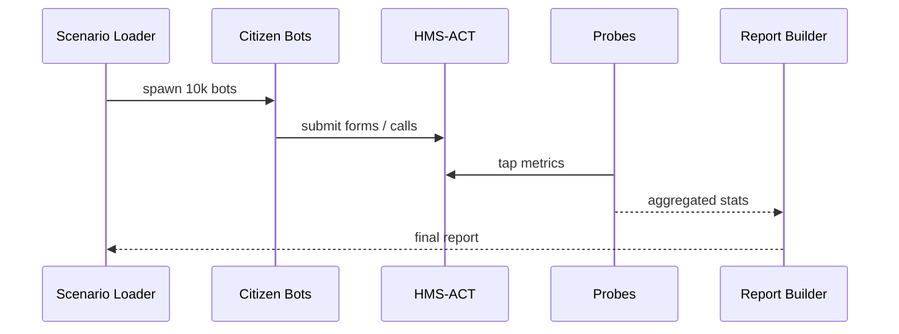

# Chapter 17: Simulation & Training Sandbox (HMS-ESR)

*(Just joined from [Universal Health Connector (HMS-UHC / HMS-MED)](16_universal_health_connector__hms_uhc___hms_med__.md)?  
Great! You can now move real-world data.  
Before we unleash that power on live citizens, let’s **test** our ideas in a safe playground.)*  

---

## 1. Why Do We Need HMS-ESR?

### Story – “Avoid Another Website Meltdown”

1. HUD wants to launch a new **“Apply for Rental Assistance”** form next month.  
2. They’ve drafted routes in [HMS-ACT](03_action_orchestrator__hms_act__.md), built an *eligibility* agent in [HMS-AGT](04_agent_framework__hms_agt___hms_agx__.md), and set payment rules in [HMS-ACH](09_financial_transaction_engine__hms_ach__.md).  
3. Memories of the 2013 Healthcare.gov crash haunt everyone.  
4. Two big questions must be answered **before** launch:  

   • “Will 50,000 simultaneous applicants overload anything?”  
   • “Do our rules accidentally reject seniors or veterans?”  

**HMS-ESR** is a **flight simulator for policy**.  
It spins up thousands of **synthetic citizens** (bots) who fill forms, call APIs, complain on 311, etc.  
Within one coffee break you see:

* Throughput & latency at every hop.  
* Where bottlenecks or legal blocks appear.  
* How many citizens finish happy vs. frustrated.

---

## 2. Key Concepts (Plain English)

| Word | What It Means | Analogy |
|------|---------------|---------|
| Scenario | YAML file that describes who the synthetic citizens are & what they will do. | Movie script |
| Citizen Bot | One simulated person with traits (age, income, veteran=yes). | Actor in the movie |
| Load Profile | Shape of traffic (e.g., 1k bots/min for 30 min). | Audience rushing into a theater |
| Probe | A metric collector that records success, latency, or errors. | Camera filming each scene |
| Report Card | Auto-generated PDF/HTML summarizing results. | Test score handed to teachers |

Keep these five terms handy—90 % of ESR is just combining them.

---

## 3. First Walk-Through  
### Goal: Rehearse the Rental-Assistance Launch

We will:

1. Write a **Scenario** that sends 10,000 low-income citizens through the form.  
2. Run the simulation.  
3. Read the **Report Card** to spot issues.

---

### 3.1 Describe the Scenario (10 lines)

```yaml
# file: rental_stress.yml
scenario: "HUD Rental Stress"
citizens:
  template: low_income
  count: 10000
load_profile:
  ramp_up: "5m"        # reach full load in 5 minutes
  sustain: "25m"       # then hold
probes: [ latency, errors, act_route ]
```

Explanation  
* `template` pulls ready-made demographics (age, income, veteran flag).  
* `latency`, `errors`, and `act_route` probes will graph response times, error codes, and ACT routing decisions.

---

### 3.2 Launch the Simulation (7 lines)

```python
# file: run_sim.py
from hms_esr import EsrClient

esr = EsrClient(token="HUD_TESTER")
job = esr.run("rental_stress.yml")
print("🔄 Simulation ID:", job.id)
esr.watch(job.id)        # streams live stats to console
```

What you’ll see:

```
00:02  citizens started: 2,000/s
00:05  p95 latency: 680 ms
00:08  ERROR spikes on /eligibility  → 14 %
```

---

### 3.3 Generate the Report Card (4 lines)

```python
report = esr.report(job.id, format="html")
print("📊 Report at:", report.url)
```

Open the URL and skim:

* Overall pass/fail for your **Service-Level Objective** (SLO).  
* Heat-map of slow endpoints.  
* Table of rejected citizens by **age** and **veteran status** (pulled from probes + [HMS-ESQ](10_compliance___legal_reasoner__hms_esq__.md) verdicts).

---

## 4. What Happens Under the Hood?



Five actors, one feedback loop.

---

## 5. Peeking Inside the Code

```
hms-esr/
├── core/
│   ├── loader.py         # reads YAML
│   ├── bot.py            # citizen behavior
│   ├── probe.py          # metrics
│   └── report.py         # HTML/PDF generator
└── templates/
    └── low_income.yml
```

### 5.1 Minimal Citizen Bot (18 lines)

```python
# core/bot.py
import random, requests, time

class CitizenBot:
    def __init__(self, traits):
        self.traits = traits

    def run(self):
        data = {
            "name":  fake_name(),
            "age":   self.traits["age"],
            "income": self.traits["income"],
            "veteran": self.traits["veteran"]
        }
        t0 = time.time()
        r = requests.post("http://localhost:8080/apply", json=data)
        latency = (time.time() - t0)*1000
        probe("latency", latency)
        if r.status_code != 200:
            probe("errors", r.status_code)
```

Beginner takeaway: a bot is just a loop that **acts** and **probes**.

---

### 5.2 Probe Helper (12 lines)

```python
# core/probe.py
from collections import defaultdict
METRICS = defaultdict(list)

def probe(name, value):
    METRICS[name].append(value)

def snapshot():
    return {k: list(v) for k,v in METRICS.items()}
```

These snapshots feed the HTML graphs later.

---

### 5.3 Report Builder Snippet (≤15 lines)

```python
# core/report.py
import statistics, json
from jinja2 import Template

def build(metrics):
    tpl = Template(open("report.html.j2").read())
    data = {k: {
        "p95": statistics.quantiles(v, n=20)[18],
        "avg": sum(v)/len(v)
    } for k,v in metrics.items()}
    html = tpl.render(metrics=json.dumps(data))
    path = f"reports/{uuid4().hex}.html"
    open(path, "w").write(html)
    return path
```

A few lines convert raw arrays into a pretty dashboard.

---

## 6. Common Scenario Tricks

Need it? | YAML Snippet
---------|-------------
Mix demographics | `citizens: [{template:seniors,count:3000},{template:veterans,count:2000}]`
Spike load at minute 10 | `spike_at: "10m" spike_size: 8000`
Random network lag | `network_jitter_ms: 50`
Fail a backend on purpose | `chaos: kill_pod svc-fee after: "12m"`
Gate against ESQ | `track_legal_blocks: true` (includes HIPAA/FERPA block counts)

Drop the snippet—no code edits required.

---

## 7. Relationship to Other Layers

Layer | How ESR Uses It
------|-----------------
[HMS-ACT](03_action_orchestrator__hms_act__.md) | Bots send real ACT events; bottlenecks appear instantly.
[HMS-ESQ](10_compliance___legal_reasoner__hms_esq__.md) | Probes log **why** a citizen was blocked.
[HMS-OPS](12_activity___operations_monitoring__hms_ops___hms_oms__.md) | ESR pushes synthetic load labels so real dashboards stay readable.
[HITL Control](11_human_in_the_loop__hitl__control_.md) | Optional flag `hitl_skip: true` bypasses human checkpoints during tests.

---

## 8. Try It Yourself (5-Minute Lab)

```bash
git clone https://github.com/hms-example/hms-esr
cd hms-esr/examples
# 1. Fire up local services (ACT, SVC, etc.)
docker compose up all
# 2. Run the scenario
python run_sim.py
# 3. View report
open $(python - <<'PY'
from hms_esr import EsrClient, Path
print(Path("reports").glob("*.html")[-1])
PY )
```

Scan for red rows—fix them *before* the real citizens arrive.

---

## 9. Recap & What’s Next

You learned:

✓ HMS-ESR is a **flight simulator** that stress-tests policies with thousands of synthetic citizens.  
✓ A **10-line YAML** scenario + **8-line Python** runner gives instant insights.  
✓ Built-in probes surface latency, errors, ESQ blocks, and HITL pauses.  
✓ Fix issues in staging, not in tomorrow’s newspaper.

Ready to DRY up helper functions you keep copy-pasting across chapters?  
Head over to the final toolbox: [Shared Utilities Library (HMS-UTL)](18_shared_utilities_library__hms_utl__.md).

---

Generated by [AI Codebase Knowledge Builder](https://github.com/The-Pocket/Tutorial-Codebase-Knowledge)