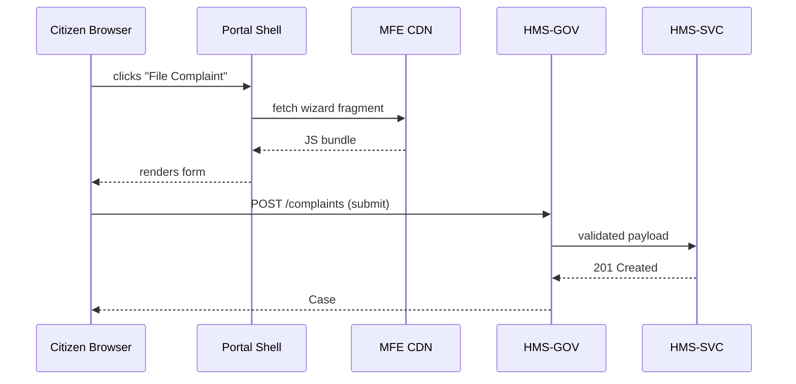

# Chapter 17: User & Admin Portals (HMS-MFE Instances)

[← Back to Chapter 16: Intent-Driven Navigation & Journeys](16_intent_driven_navigation___journeys_.md)

---

> “Two doors to the same building—one for citizens, one for officials.”

---

## 1. Why Split Portals?

Picture a simple scenario:

* **Citizen Lee** visits `public.gov` to report a broken street-light.  
* **Program Manager Diaz** opens `admin.gov` to see if the city’s “repair-within-48-hours” KPI is on track.

Both actions touch the *same* back-end services:

* The complaint is stored by [HMS-SVC](08_core_backend_api_layer__hms_svc__.md).  
* Data rolls into [HMS-DTA](09_data_hub___analytics_engine__hms_dta__.md).  
* Policy checks run via [HMS-CDF](02_policy_codification_engine__hms_cdf__.md).

So why maintain two entire front-end codebases?  
**Answer: we don’t.**  
We build one library of micro-frontend bricks (see [HMS-MFE](15_micro_frontend_interface_library__hms_mfe__.md)) and assemble them into two *role-aware* **portal shells**:

| Portal | Audience | Example Screen |
|--------|----------|----------------|
| User Portal | Citizens | “Report Issue” wizard |
| Admin Portal | Officials | KPI dashboard, override button |

The rest of this chapter shows exactly how to do that in beginner-friendly steps.

---

## 2. Key Concepts (Quick Glossary)

| Term                 | “City-Hall” Analogy          | One-Line Job                                   |
|----------------------|------------------------------|------------------------------------------------|
| Portal Shell         | Building blueprint           | Holds nav bar, auth logic, loads micro-apps    |
| Role Config          | Badge scanner at entrance    | Decides which bricks a visitor may see         |
| Micro-App            | Individual office in City Hall | Self-contained feature (e.g., KPI chart) |
| Privilege Scope      | Key to locked filing cabinet | Limits which APIs a screen can call            |
| Layout Slot          | Empty room ready for furniture | Placeholder where a micro-app mounts      |

Keep these five in mind—the rest is copy-paste.

---

## 3. Building the User Portal (Wizard-First)

### 3.1 Minimal Shell (18 lines)

```jsx
// userPortal/src/Shell.js
import { lazy, Suspense } from "react";
import { getRole } from "./auth.js";

export default function Shell() {
  const role = getRole();                 // "citizen"
  const Home = lazy(() => import("./pages/Home.js"));
  const Journey = lazy(() => import("journey/Start")); // from Ch.16

  return (
    <Suspense fallback="⌛">
      {role === "citizen" ? <Journey/> : <Home/>}
    </Suspense>
  );
}
```

What happens?

1. `getRole()` returns `"citizen"` as soon as an anonymous user logs in with **Login.gov**.  
2. Shell lazily loads the **Journey micro-app** (file-a-complaint wizard).  
3. Only two React imports—super small.

### 3.2 Role Config (≤ 12 lines)

```js
// userPortal/roles.json
{
  "citizen": {
    "menu": ["Home", "File Complaint", "My Cases"],
    "allowedFragments": [
      "/mfe/wizard-complaint/v1",
      "/mfe/case-status/v1"
    ]
  }
}
```

The shell consults this JSON before it requests a fragment from the CDN.  
If a link isn’t listed, it never appears—security by absence.

---

## 4. Building the Admin Portal (Dashboard-First)

### 4.1 Minimal Shell (18 lines)

```jsx
// adminPortal/src/Shell.js
import { lazy, Suspense } from "react";
import { getRole } from "./auth.js";

export default function Shell() {
  const role = getRole();                // e.g., "manager"
  const Dash = lazy(() => import("kpi/Dashboard"));  // MFE brick
  const Cases= lazy(() => import("cases/Table"));

  return (
    <Suspense fallback="⌛">
      {role === "manager" ? <Dash/> : <Cases/>}
    </Suspense>
  );
}
```

### 4.2 Role Config (≤ 12 lines)

```js
// adminPortal/roles.json
{
  "manager": {
    "menu": ["Dashboard", "All Cases", "Overrides"],
    "allowedFragments": [
      "/mfe/kpi-dashboard/v2",
      "/mfe/override-button/v1"
    ],
    "privilegeScope": ["read:kpi", "write:override"]
  }
}
```

Notice the extra `privilegeScope`.  
The shell sticks this array into every [MCP envelope](06_model_context_protocol__hms_mcp__.md) so back-end services know the caller has override rights.

---

## 5. One Library, Two Instances

Both shells pull bricks from the **same CDN**:

```
https://cdn.gov/mfe/
  ├─ wizard-complaint/v1/remoteEntry.js
  ├─ kpi-dashboard/v2/remoteEntry.js
  └─ override-button/v1/remoteEntry.js
```

The difference is **which URLs the shell is allowed to request**, entirely driven by the small `roles.json` files.

---

## 6. Life-Cycle of a Click (Step-By-Step)



Only five actors—easy to memorise.

---

## 7. Under-the-Hood Files

```
/portals
 ├─ userPortal/
 │    ├─ src/Shell.js
 │    ├─ roles.json
 │    └─ webpack.config.js
 └─ adminPortal/
      ├─ src/Shell.js
      ├─ roles.json
      └─ webpack.config.js
```

Both `webpack.config.js` files differ by just one line—the `name` (`user` vs `admin`).  
Everything else (Module Federation, design tokens, a11y hooks) is shared.

---

## 8. Security & Governance Hooks

1. **Role Verification** – `getRole()` token is issued by [HMS-GOV](01_governance_layer__hms_gov__.md) after login.  
2. **Fragment Allow-List** – Shell checks `roles.json` before fetching—blocks spoofed URLs.  
3. **Privilege Propagation** – Shell injects `privilegeScope` into every MCP envelope so downstream APIs can enforce fine-grained rules.  
4. **Audit Trail** – Each fragment mount emits `portal.view` events to [Activity Logging & Audit Trail](21_activity_logging___audit_trail_.md).

---

## 9. Frequently Asked Questions

**Q: Could one site just hide admin links with CSS?**  
No. Links are removed *and* fragments are never fetched if the role doesn’t allow them, preventing hidden DOM attacks.

**Q: Is the code duplicated?**  
Only the tiny 18-line shells differ; all heavy components live in the shared CDN.

**Q: Can a citizen accidentally hit `/admin`?**  
Route guard in `userPortal/router.js` checks `role !== 'manager'` and redirects to `/403`.

**Q: Mobile App?**  
Wrap the same shells in a Capacitor/WebView container—nothing extra to learn.

---

## 10. Key Takeaways

• **User & Admin portals are just two lightweight shells** pointing at the same micro-frontend warehouse.  
• Role configs (`roles.json`) decide menus, allowed fragments, and privilege scopes—no code recompile needed.  
• Governance, policy, accessibility, and audit hooks flow automatically because each fragment already follows HMS-MFE rules.  
• Beginners can clone & run both portals in minutes; experts can add roles or screens without touching the other site.

---

### Up Next

Citizens and officials can now work side-by-side.  
In the next chapter we’ll plug our platform into national health-care data feeds:  
[Chapter 18: Universal Health Care Integration (HMS-UHC)](18_universal_health_care_integration__hms_uhc__.md)

---

Generated by [AI Codebase Knowledge Builder](https://github.com/The-Pocket/Tutorial-Codebase-Knowledge)