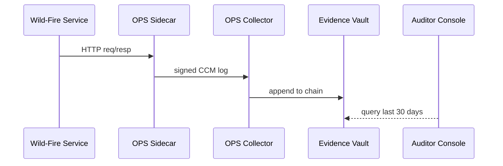

# Chapter 18: Compliance & Auditing Framework (HMS-OPS + HMS-ESQ)

*(Follow-up to [Data Governance & Privacy Framework (HMS-DTA + HMS-ESQ)](17_data_governance___privacy_framework__hms_dta___hms_esq__.md))*  

---

## 1  Why Bother With Yet *Another* Log?

A real night at the Government Accountability Office (**GAO**)…

> “Show me—*within 48 hours*—every time the Department of Interior’s **Wild-Fire Drone Service** touched citizen GPS data in the last month, prove the micro-services were patched, and explain **why** FedRAMP rules were not violated.”

Without airtight evidence you risk losing an Authority-to-Operate (ATO).  
Copy-pasting CloudWatch logs or grepping K8s events won’t survive a GAO grilling.

**The Compliance & Auditing Framework** gives you:

* **HMS-OPS** – black-box “flight recorders” that capture every request, response, config hash, and container bill of materials (SBOM).  
* **HMS-ESQ** – the same guard we met in Chapter 17, now upgraded to chain, seal, and query those records.  

Think of OPS as the **aircraft’s black box** and ESQ as the **NTSB lab** that replays the tape.

---

## 2  Key Ideas in One Table

| Term                      | Beginner-friendly meaning |
|---------------------------|---------------------------|
| Flight Recorder           | Sidecar container that records all in/out traffic & config. |
| CCM Log                   | Continuous Control Monitoring JSON line (`who / what / when / result`). |
| Evidence Chain            | Hash-linked list of CCM logs—tamper obvious. |
| Drift Detector            | Bot that compares *running* config hash to the *baseline* ATO hash. |
| Attestor                  | Tiny signer that stamps each log line with the pod’s key. |
| Auditor Console           | A read-only dashboard for GAO, OIG, FedRAMP auditors. |

Remember: *Recorder* writes → *ESQ* seals → *Auditor Console* replays.

---

## 3  Quick-Start: Recording One API Call

Below 18 lines show how **any** micro-service auto-logs through HMS-OPS.

```bash
# 1) Add the sidecar to your Deployment
kubectl patch deploy wildfire-drone-svc \
  --patch '
spec:
  template:
    spec:
      containers:
      - name: ops-sidecar           # <-- HMS-OPS recorder
        image: hms/ops-sidecar:1.2
        env:
        - name: OPS_SERVICE_NAME
          value: wildfire-drone-svc'
```

```javascript
// 2) Inside your service you do *nothing* new.
app.get('/locate', (req,res)=>{
  // domain logic...
  res.json({ ok:true })
})
```

What happens?

1. The sidecar sees `/locate`, captures headers, body size, latency, plus a SHA-256 of `config.yaml`.  
2. Signs the JSON with the pod key.  
3. Streams it to **OPS Collector**, which forwards to **ESQ Evidence Vault**.

---

### 3.1 What Does a CCM Log Look Like?

```json
{
  "ts":"2025-03-14T02:12:34Z",
  "svc":"wildfire-drone-svc",
  "req":"GET /locate",
  "user":"drone-operator@doi.gov",
  "status":200,
  "latency_ms":82,
  "config_hash":"9f3c…",
  "sig":"MEUCIQD…"
}
```

---

## 4  What Auditors See

```
┌───────────────────────────────────────────────┐
│ Compliance Console – Wild-Fire Drone Service  │
├─────────┬────────────┬────────┬───────────────┤
│ Time    │ Actor      │ Action │ Status        │
├─────────┼────────────┼────────┼───────────────┤
│ 02:12   │ operator   │ /locate│ 200 (82 ms)   │
│ 02:15   │ patch-bot  │ helm up│ DRIFT⚠ hash ≠ │
└─────────┴────────────┴────────┴───────────────┘
Drill-down → full payload • SBOM • k8s pod spec • diff
```

One click downloads a **FISMA-ready PDF** with chain-of-custody hashes.

---

## 5  Step-By-Step Under the Hood



*If a config drift is detected*, the Drift Detector raises a ticket in [HITL](14_human_in_the_loop__hitl__oversight_mechanism_.md).

---

## 6  Inside the Code (All ≤ 20 Lines)

### 6.1 Sidecar Hook (recorder.js – 17 lines)

```javascript
const crypto = require('crypto')
module.exports = function record(req,res,next){
  const start = Date.now()
  res.on('finish', ()=>{
    const log = {
      ts: new Date().toISOString(),
      svc: process.env.OPS_SERVICE_NAME,
      req: `${req.method} ${req.path}`,
      user: req.header('x-user') || 'anon',
      status: res.statusCode,
      latency_ms: Date.now() - start,
      config_hash: process.env.OPS_CFG_HASH
    }
    log.sig = sign(JSON.stringify(log))
    sendToCollector(log)      // UDP 5140 < 5 ms
  })
  next()
}
```

### 6.2 Evidence Chain Append (collector.py – 14 lines)

```python
def append(log):
    last = db.get('tail_hash') or ''
    link = sha256(last + json.dumps(log))
    db.insert('evidence', { **log, 'prev': last, 'link': link })
    db.set('tail_hash', link)
```

Tampering with any record breaks the chain hash instantly.

### 6.3 Drift Detector (detector.sh – 10 lines)

```bash
#!/usr/bin/env bash
for pod in $(kubectl get pods -l ops-watch | awk '{print $1}')
do
  hash=$(kubectl exec $pod -- sha256sum /app/config.yaml | cut -d' ' -f1)
  baseline=$(opsctl baseline $pod)   # stored on ATO day
  if [ "$hash" != "$baseline" ]; then
     opsctl alert "$pod drift $hash ≠ $baseline"
  fi
done
```

---

## 7  Querying Evidence (Auditor API Example)

```bash
curl /api/ops/query \
  -d '{ "svc":"wildfire-drone-svc",
       "from":"2025-03-01", "to":"2025-03-31",
       "where":{"user":"drone-operator@doi.gov"} }'
```

Returns a paginated JSON list, already vetted by **ESQ** against the auditor’s scopes (see MCP in [Chapter 12](12_model_context_protocol__hms_mcp__.md)).

---

## 8  Writing a Control Check in YAML

```yaml
# controls/fedramp_cm-6.yaml
id: CM-6
description: "Least privilege: admin calls < 2 %"
query:
  svc: wildfire-drone-svc
  from: 24h
  groupBy: user
assert:
  maxPercent: 2
actionOnFail: hitl_ticket
```

The nightly **Control Runner** executes each rule; failures create a HITL ticket and Slack DM the security team.

---

## 9  Safety Rails You Get “For Free”

1. **WORM Storage** – Evidence bucket uses S3 Object-Lock (`Governance` mode).  
2. **Clock Authority** – Timestamps come from NIST time servers; skew > 3 s triggers alert.  
3. **Key Rotation** – Sidecar keys auto-rotate every 30 days; old signatures stay verifiable.  
4. **Zero-Trust Access** – Auditor tokens wrapped in [MCP envelopes](12_model_context_protocol__hms_mcp__.md); no raw SQL access.  
5. **One-Click GAO Export** – Console exports `.zip` with logs, hashes, and control results.

---

## 10  Beginner FAQ

| Question | Short Answer |
|----------|--------------|
| Do I need to add logging code? | No—the sidecar captures automatically. |
| How big are logs? | ~1 kB per request; sidecar gzips before shipping. |
| What about *internal* service-to-service calls? | Captured at *both* ends; correlation ID links them. |
| Can I mute noisy health-checks? | Yes—add `ops.ignore: /health` annotation in K8s. |
| How long are logs kept? | Default 7 years; change with `retentionDays` in ESQ config. |

---

## 11  Wrapping Up

• HMS-OPS records every micro-service hop; HMS-ESQ seals, verifies, and answers auditor questions.  
• Continuous Control Monitoring rules turn raw logs into *pass / fail* badges (FISMA, FedRAMP, HIPAA, CJIS…).  
• Drift Detector spots forbidden config changes in minutes, not months.  
• All plumbing is automatic—**you** only patch the Deployment with one sidecar.

Next we’ll enter the virtual classroom where these logs power **realistic drills and red-team exercises**: [Simulation & Training Environment (HMS-ESR)](19_simulation___training_environment__hms_esr__.md)  

---

---

Generated by [AI Codebase Knowledge Builder](https://github.com/The-Pocket/Tutorial-Codebase-Knowledge)