# Chapter 18: Data Trust Layer (HMS-DTA)
*(“Every byte tells a verifiable story.”)*  

[← Back to Chapter 17: Marketplace Registry (HMS-MKT)](17_marketplace_registry__hms_mkt__.md)

---

## 1. Why Do We Need a Data “Vault + National Archives”?

Imagine HUD runs the **Housing Choice Voucher** program.  
Three different teams touch the same data:

1. *Field inspectors* photograph apartment conditions.  
2. *Analysts* predict which landlords might overcharge tenants.  
3. *Auditors* must prove **who edited which record—and when**—to Congress.

If photos sit on thumb-drives, CSVs float in e-mails, and analysts copy data to their laptops…

* evidence disappears,  
* privacy is broken,  
* and trust in the program erodes.

**Data Trust Layer (HMS-DTA)** fixes this by acting as:

* a **vault** (encrypted storage),  
* a **national archives** (immutable provenance), and  
* a **traffic cop** (row-level access policies),  

all wrapped behind two tiny API calls: `dta.put()` and `dta.get()`.

---

## 2. Central Use-Case – “Storing an Inspection Photo”

> Inspector Alice uploads photo **IMG_4411.jpg** for Unit #730.  
> Analyst Bob later runs a model using only photos he is cleared to see.  
> Auditor Carol proves the file was **never modified** since the upload.

We will solve this start-to-finish with fewer than **40 lines of code**.

---

## 3. Key Concepts (Beginner Friendly)

| Building Block        | Friendly Analogy                    | 1-Sentence Job |
|-----------------------|-------------------------------------|----------------|
| Data Vault            | Bank safe-deposit box              | Encrypts & stores raw/processed bytes. |
| Provenance Ledger     | Library checkout card               | Records *who / when / why* for every change. |
| Data Contract         | Ingredients label                   | Schema + tags (`PII`, `PHI`, `Public`) attached to each asset. |
| Fine-Grained Policy   | Museum access wristband             | Allows “Bob can SELECT `image_hash`, not raw bytes.” |
| Lineage Graph         | Family tree                         | Shows raw-photo → resized thumbnail → model training set. |

Keep these five terms in mind; every API call touches them under the hood.

---

## 4. Storing & Retrieving Data in 2×18 Lines

### 4.1 Inspector Uploads the Photo

```python
# inspector_upload.py      (18 lines)
from dta import Vault, Contract

vault = Vault()
photo_path = "IMG_4411.jpg"

contract = Contract(
    dataset="voucher_photos",
    tags=["PII"],                 # faces may appear
    lineage={"source": "camera"},
    reason="annual inspection",
)

asset_id = vault.put(photo_path, contract, user="alice@hud.gov")
print("Stored as:", asset_id)     # e.g. PHTO-6F4A
```

**What happened?**  
1. File encrypted → stored.  
2. Contract + checksum written to the **Provenance Ledger**.  
3. `asset_id` is a public-safe handle; the raw path is hidden.

---

### 4.2 Analyst Reads a Redacted Version

```python
# analyst_read.py          (18 lines)
from dta import Vault, Policy

vault = Vault()
policy = Policy(user="bob@hud.gov",
                allow_tags=["Public", "De-Identified"])

try:
    img = vault.get(asset_id="PHTO-6F4A", policy=policy)
except PermissionError as e:
    print("🚫 Access blocked:", e)
```

Bob is denied because the asset is tagged `PII`.  
If a de-identified thumbnail exists in the **Lineage Graph**, Bob can safely fetch that instead.

---

## 5. What Happens Behind the Curtain?

```mermaid
sequenceDiagram
    participant User as Alice/Bob
    participant API as DTA API
    participant VAULT as Encrypted Store
    participant PV as Provenance Ledger
    participant PL as Policy Engine

    User->>API: put/get(...)
    API->>PL: check(policy, tags)
    PL-->>API: ✔️ / ❌
    API->>VAULT: encrypt | decrypt
    API-->>PV: write ledger entry
    VAULT-->>API: data / ack
    API-->>User: result
```



Only five actors—easy to audit; impossible to bypass.

---

## 6. Peek Inside HMS-DTA (All Snippets ≤ 20 Lines)

### 6.1 Vault Skeleton

```python
# dta/vault.py
import uuid, json, hashlib, time, secrets, os

KEY = secrets.token_bytes(32)

def _enc(raw): return bytes([b ^ KEY[i%32] for i,b in enumerate(raw)])
def _dec(raw): return _enc(raw)            # XOR ↔ XOR  (demo only)

class Vault:
    def put(self, path, contract, user):
        data = open(path,'rb').read()
        cid  = hashlib.sha256(data).hexdigest()[:8]
        asset_id = f"PHTO-{cid.upper()}"
        open(f"vault/{asset_id}.bin","wb").write(_enc(data))
        _ledger("PUT", asset_id, user, contract.__dict__)
        return asset_id

    def get(self, asset_id, policy):
        meta = _ledger_lookup(asset_id)
        if not policy.allows(meta["tags"]):
            raise PermissionError("Tag blocked by policy")
        raw = open(f"vault/{asset_id}.bin","rb").read()
        return _dec(raw)
```

### 6.2 Contract & Policy Helpers

```python
# dta/contract.py
class Contract:
    def __init__(self, dataset, tags, lineage, reason):
        self.dataset, self.tags = dataset, tags
        self.lineage, self.reason = lineage, reason
```

```python
# dta/policy.py
class Policy:
    def __init__(self, user, allow_tags):
        self.user, self.allow_tags = user, set(allow_tags)
    def allows(self, asset_tags): return bool(self.allow_tags & set(asset_tags))
```

### 6.3 Provenance Ledger (tiny)

```python
# dta/ledger.py
LEDGER=[]
def _ledger(action, aid, user, meta):
    LEDGER.append({"ts":time.time(),
                   "action":action,
                   "asset":aid,
                   "user":user,
                   "meta":meta})
def _ledger_lookup(aid):
    return next(e["meta"] for e in reversed(LEDGER) if e["asset"]==aid)
```

Real deployments stream these entries to [System Observability & Ops Center](19_system_observability___ops_center__hms_ops__.md).

---

## 7. Interactions with Other HMS Layers

| Layer | How They Talk |
|-------|---------------|
| [Governance Layer](01_governance_layer__ai_governance_model__.md) | Blocks any deployment that skips HMS-DTA and tries raw DB access. |
| [Compliance Guardrail Framework](05_compliance_guardrail_framework__hms_esq__.md) | Reads *tags + lineage* to enforce HIPAA / FOIA constraints. |
| [Human-in-the-Loop](02_human_in_the_loop__hitl__oversight_mechanism_.md) | Reviewers can grant temporary overrides (e.g., disaster response). |
| [Backend Service Mesh](16_backend_service_mesh__hms_svc___apis__.md) | Services reach HMS-DTA over mTLS; trace IDs flow into OPS. |
| [System Observability & Ops Center](19_system_observability___ops_center__hms_ops__.md) | Renders dashboards: “Top datasets by access”, “Blocked attempts”. |

---

## 8. 60-Second Mini-Lab

1. Create folders `dta/` and `vault/`; add the four Python files above.  
2. Place a sample image `IMG_4411.jpg` in the same directory.  
3. Run `python inspector_upload.py` then `python analyst_read.py`.  
4. Inspect `dta/ledger.py LEDGER`—each access is permanently logged.

Congrats 🎉—you stored a photo, enforced policy, and proved lineage with **< 80 lines** across all files.

---

## 9. Recap & What’s Next

* HMS-DTA is your **vault + national archives**: encryption, provenance, and row-level policy in two API calls.  
* Every asset carries a **Data Contract**; every action lands in the **Provenance Ledger**.  
* Other layers (Governance, Compliance, Mesh, OPS) hook into DTA automatically.

With data now trustworthy, the next chapter shows how to **observe and operate** the entire HMS-CDF stack in real time.  
Continue to → [System Observability & Ops Center (HMS-OPS)](19_system_observability___ops_center__hms_ops__.md)

---

---

Generated by [AI Codebase Knowledge Builder](https://github.com/The-Pocket/Tutorial-Codebase-Knowledge)