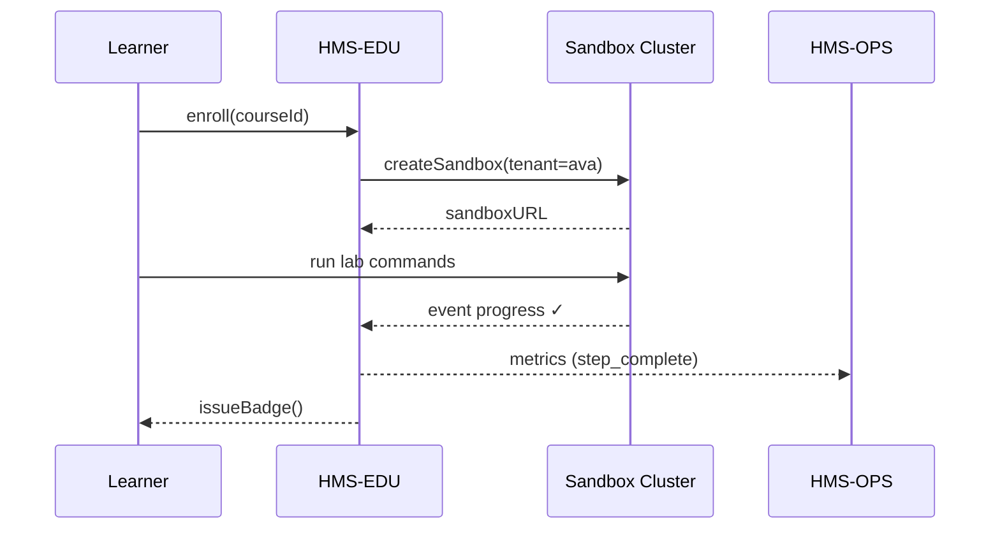

# Chapter 18: Education & Knowledge Base (HMS-EDU)

*(continuing from [Marketplace & Discovery Service (HMS-MKT)](17_marketplace___discovery_service__hms_mkt__.md))*  

---

## 1 .  Why Does HMS Need a “Boot Camp”?

Your agency just hired **Ava**, a data-analyst fresh out of grad school.  
On day 1 she must:

1. Learn how to call the **API Gateway** without touching production data.  
2. Run a safe, isolated **ACH payment demo**.  
3. Prove to her supervisor (and later to an external auditor) that she finished “Federal Data 101.”

If Ava waits weeks for accounts, she burns payroll dollars doing nothing.  
**HMS-EDU** is the *boot camp* that gets every new staffer or auditor from *zero* to *productive* in hours—not weeks.

---

## 2 .  Key Concepts (zero-jargon cheat-sheet)

| EDU Term          | Real-World Analogy              | What It Really Means                              |
|-------------------|---------------------------------|---------------------------------------------------|
| Course            | Classroom                       | A set of lessons, quizzes, and sandbox labs.      |
| Sandbox           | Practice driving range          | Pre-seeded HMS environment that **cannot** harm prod. |
| Walk-through      | Driving instructor’s voice      | Step-by-step overlay that points at UI buttons.   |
| Progress Badge    | Certificate on the wall         | Cryptographically signed proof you passed.        |
| Version Pinning   | “Teach from 2024 rulebook”      | Course sticks to specific HMS versions so docs never drift. |
| Feedback Loop     | Course-evaluation card          | Quick survey that opens a GitHub issue for fixes. |

Remember these six; the rest is just wiring.

---

## 3 .  Guided Use-Case: “Federal Data 101” in 10 Minutes

### 3.1  Ava Enters the Academy

1. Visits `edu.gov/login` → signs in with her **IAM** badge.  
2. Sees the **“Federal Data 101”** course card: *8 steps, 25 min*.  
3. Clicks **Start** → a *sandbox tenant* spins up behind the scenes.

### 3.2  She Runs Her First Safe API Call

```bash
# Terminal inside web IDE (already authenticated for sandbox)
curl https://sandbox.api.gov/permits/status/123
```

Expected output:

```json
{ "id": "123", "step": "Review (sandbox)", "officer": "J. Doe" }
```

Explanation:  
• Same endpoint shape as production, but data is fake—no FOIA risk.  
• IAM scopes restrict her token to `tenant:sandbox-only`.

### 3.3  Walk-through Overlay (Micro-Frontend)

A translucent pop-up (built with [HMS-MFE](01_micro_frontend__hms_mfe__.md)) points at the **Run** button:

> “Great! Now open the response in the Design-System viewer.”

She clicks → overlay disappears → badge progress +10 %.

### 3.4  Graduation Badge

On final step, EDU signs a **JSON Web Badge**:

```json
{
  "user":"ava.sanders",
  "course":"Federal Data 101",
  "completed":"2024-04-18T16:05Z",
  "hash":"sha256:7a9c..."
}
```

This badge is stored in HMS-EDU and visible to the **Marketplace** so Ava can install restricted assets (Chapter 17) that require the course as a prerequisite.

---

## 4 .  Creating Your Own Course (author view)

You can publish a course with **one Markdown file** and a tiny manifest.

`courses/banking101/manifest.yaml`  *(16 lines)*

```yaml
id: banking101
title: "Bank Examiner Basics"
version: "2024-04"
hours: 1
prereqs: ["Federal Data 101"]
steps:
  - type: markdown
    file: intro.md
  - type: lab
    sandbox: ach-demo        # pre-built image
    instruction: "./labs/ach.md"
  - type: quiz
    questions: "./quiz.yaml"
onSuccess:
  badge: "Bank Examiner ‑ Level 1"
```

Publish it:

```bash
edu publish courses/banking101
```

EDU automatically:

1. Seeds a **sandbox** (`ach-demo`).  
2. Parses `intro.md` into the walk-through UI.  
3. Registers the badge with IAM so other services can check it.

---

## 5 .  What Happens Under the Hood?



*Five* actors keep it clear.

---

## 6 .  Peeking at the EDU Code (gentle dive)

### 6.1  Minimal Course Loader (Node ≤ 15 lines)

```js
// svc/courseLoader.js
import fs from 'fs/promises'
export async function getCourse(id){
  const yml = await fs.readFile(`courses/${id}/manifest.yaml`, 'utf8')
  const spec = yaml.parse(yml)
  spec.steps = await Promise.all(spec.steps.map(async s=>{
    if(s.type==='markdown') s.html = marked.parse(await fs.readFile(`courses/${id}/${s.file}`,'utf8'))
    return s
  }))
  return spec
}
```

• Reads YAML, converts Markdown to HTML, injects into MFE overlay.  
• **< 15 lines** yet supports any number of steps.

### 6.2  Sandbox Provision Stub (≤ 18 lines)

```js
// svc/sandbox.js
import k8s from '@kubernetes/client-node'
const kc = new k8s.KubeConfig(); kc.loadFromDefault()
const k8sApi = kc.makeApiClient(k8s.CoreV1Api)

export async function createSandbox(user, image){
  const podName = `edu-${user}-${Date.now()}`
  await k8sApi.createNamespacedPod('edu-sandboxes',{
    metadata:{ name: podName, labels:{user} },
    spec:{ containers:[{name:'lab',image,tty:true}], restartPolicy:'Never' }
  })
  return `https://sandbox.edu.gov/pod/${podName}/terminal`
}
```

Spawns a container per learner; IAM routes their browser straight to it.

---

## 7 .  How EDU Integrates with Other HMS Layers

| Layer | Interaction |
|-------|-------------|
| [IAM](04_identity___access_management__iam__.md) | Issues **sandbox-scoped tokens** & records course badges. |
| [ESQ](05_security__privacy___legal_guardrails__hms_esq___platform_controls__.md) | Scans course content so demos never leak real PII. |
| [OPS](15_monitoring___metrics__hms_ops__.md) | Exposes `edu_completion_total` & step-latency metrics. |
| [Marketplace](17_marketplace___discovery_service__hms_mkt__.md) | Listings can require a badge (`requiresCourse:`). |
| [Simulation (ESR)](16_simulation___testing_environment__hms_esr__.md) | Courses may embed live ESR scenarios for learners. |

---

## 8 .  FAQ – New-Starter Edition

**Q: Can auditors access EDU without full HMS accounts?**  
A: Yes—issue them a temporary **“auditor”** IAM role; EDU automatically wires a read-only sandbox.

**Q: How do I update a course without breaking badges?**  
A: Publish `version: "2024-05"`; old badges stay valid, and learners enrolled mid-course finish on their original version.

**Q: Are quizzes auto-graded?**  
A: Yup. Multiple-choice quizzes are YAML files; scoring logic (5 lines) runs in the browser and posts the result.

**Q: Can I embed videos?**  
A: Markdown supports `[](video.mp4)` links; videos stream from a CDN, never the sandbox.

---

## 9 .  Recap

You learned that **HMS-EDU**:

• Onboards staff and auditors in an **isolated, risk-free sandbox**.  
• Issues **cryptographic badges** that other HMS layers can trust.  
• Lets any agency author a course with just Markdown + YAML.  
• Feeds progress and metrics into HMS-OPS for compliance reporting.

With EDU in place, the HMS platform now covers the full lifecycle—**from idea to training, deployment, monitoring, and audit**.  
Welcome aboard, and happy learning! 🎓

*(End of tutorial series — circle back to any chapter as needed or explore the Marketplace for more community-authored content.)*

---

Generated by [AI Codebase Knowledge Builder](https://github.com/The-Pocket/Tutorial-Codebase-Knowledge)