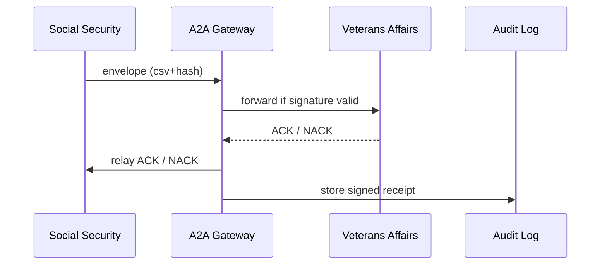

# Chapter 18: Inter-Agency Communication Protocols (HMS-A2A)

*Coming from the “keep-everyone-in-sync” layer we built in [External System Synchronization](17_external_system_synchronization_.md).*

---

## 1  Why Do We Need A2A?

### Central use-case – “Send Disability Status From Social Security → Veterans Affairs”

1. Every night the **Social Security Administration (SSA)** produces a file:  
   `new_disability_awards_2024-06-10.csv`.
2. The **Department of Veterans Affairs (VA)** must ingest it before 06:00 so disabled vets automatically see benefit increases.
3. If the file is tampered with—or even just chopped in half—40 000 veterans may get the wrong check.

**HMS-A2A** is the *sealed diplomatic pouch* between agencies:

* Ensures the file is **signed, encrypted, and schema-validated**.
* Delivers an automatic **acknowledgment (ACK)** or **negative acknowledgment (NACK)**.
* Stores a **tamper-proof receipt** for auditors (“SSA sent v3, VA accepted at 05:02, hash abc123…”).

No more lost CDs, no more “Did you get my e-mail?” phone calls.

---

## 2  Key Concepts (Plain-English Glossary)

| A2A Term           | Beginner-Friendly Meaning                                                |
|--------------------|---------------------------------------------------------------------------|
| Secure Envelope    | JSON wrapper that holds the payload plus a SHA-256 hash and signature.    |
| Schema Registry    | Central folder of `.json` files that define the shape of each message.    |
| ACK / NACK         | One-line reply: **ACK** = “I got it & it’s valid”, **NACK** = “bad schema”.|
| Retry Token        | UUID that lets the sender safely re-send the same envelope once.          |
| Audit Receipt      | Signed proof, stored in DTA, that both sides can show Congress later.     |

---

## 3  Sending Tonight’s Disability File – 15 Lines Each Side

### 3.1 Sender (SSA) – `ssa_send.py`

```python
import json, gzip, base64, uuid, requests, hashlib

raw = open("new_disability_awards.csv","rb").read()
payload = base64.b64encode(gzip.compress(raw)).decode()
env = {
  "id": uuid.uuid4().hex,
  "type": "ssa.disability_award.v3",
  "payload": payload,
  "sha256": hashlib.sha256(raw).hexdigest()
}
r = requests.post("https://a2a.gov/send", json=env,
                  headers={"X-Agency":"SSA"})
print(r.json())                 # ➜ {'ack':'accepted'}
```

• Compresses & base-64s the file.  
• Adds `sha256` so the receiver can verify integrity.  
• One POST, done.

### 3.2 Receiver (VA) – `va_server.py` (18 lines)

```python
from fastapi import FastAPI, HTTPException, Request
import json, gzip, base64, hashlib, pathlib, uuid

app = FastAPI(); PATH = pathlib.Path("inbox"); PATH.mkdir(exist_ok=True)

@app.post("/send")
async def receive(req: Request):
    env = await req.json()
    schema_ok = env["type"] == "ssa.disability_award.v3"
    if not schema_ok:
        return {"ack":"NACK","reason":"wrong schema"}

    raw = gzip.decompress(base64.b64decode(env["payload"]))
    if hashlib.sha256(raw).hexdigest() != env["sha256"]:
        return {"ack":"NACK","reason":"hash mismatch"}

    fn = PATH / f"{env['id']}.csv"
    fn.write_bytes(raw)
    log_receipt(env, "accepted")        # see below
    return {"ack":"accepted"}
```

The VA server:

1. Checks the **schema id**.  
2. Verifies the **hash**.  
3. Saves the CSV and writes a receipt.

*(`log_receipt` is 3 lines: append JSON to `receipts.jsonl`.)*

---

## 4  Under the Hood – What Actually Happens?



Only **four** moving parts—easy to reason about.

---

## 5  Inside A2A Gateway (Folder Peek)

```
hms-a2a/
 ├─ gateway.py
 ├─ schemas/
 │   └─ ssa.disability_award.v3.json
 ├─ receipts/
 └─ keys/
```

### 5.1 Gateway Core (19 Lines)

```python
# gateway.py
from fastapi import FastAPI, Request
import jsonschema, json, uuid, pathlib, requests

app = FastAPI(); R = pathlib.Path("receipts"); R.mkdir(exist_ok=True)
SCHEMAS = {p.stem: json.load(open(p)) for p in pathlib.Path("schemas").glob("*.json")}

@app.post("/send")
async def route(req: Request):
    env = await req.json()
    typ = env["type"]
    if typ not in SCHEMAS:
        return {"ack":"NACK","reason":"unknown type"}
    try:
        jsonschema.validate(env, SCHEMAS[typ])
    except jsonschema.ValidationError as e:
        return {"ack":"NACK","reason":"schema fail"}

    dest = "https://va.gov/send" if typ.startswith("ssa.") else None
    ack = requests.post(dest, json=env, timeout=5).json()
    receipt = {**env, **ack, "gateway_id": uuid.uuid4().hex}
    (R/f"{receipt['gateway_id']}.json").write_text(json.dumps(receipt))
    return ack
```

• Validates against the **Schema Registry**.  
• Forwards to the correct agency URL.  
• Saves a **receipt** no matter what.

---

## 6  How A2A Fits With Other Layers

| Layer | Interaction |
|-------|-------------|
| [Governance Layer](01_governance_layer__hms_gov__.md) | External callers hit **HMS-GOV** ➜ it proxies to A2A if the target is another agency. |
| [Policy Engine (HMS-CDF)](02_policy_engine__hms_cdf__.md) | Decides which schema versions are allowed and enforces size limits. |
| [Secure Data Repository (HMS-DTA)](13_secure_data_repository__hms_dta__.md) | Stores the **receipts** folder immutably. |
| [Monitoring & Observability](14_monitoring___observability__hms_ops__.md) | Tracks “a2a_latency_ms” and “nack_rate”. |
| [External System Sync](17_external_system_synchronization_.md) | Uses A2A to broadcast large event files across agencies. |

---

## 7  Hands-On Mini Lab

1. Run the VA receiver:

```bash
uvicorn va_server:app --port 9001 --reload
```

2. Run the A2A gateway:

```bash
uvicorn gateway:app --port 9000 --reload
```

3. Send the file (`python ssa_send.py`).  
4. Open `receipts/`—you’ll see a JSON proof like:

```json
{"id":"a1b2","type":"ssa.disability_award.v3","ack":"accepted", ...}
```

5. Corrupt the hash in `ssa_send.py` and resend—observe the **NACK** reply and matching receipt.

---

## 8  Frequently Asked Questions

**Q: How do I roll out a new schema version?**  
Publish `ssa.disability_award.v4.json` to the **Schema Registry**; the Policy Engine can run both v3 and v4 in parallel during migration.

**Q: What if the receiver is down?**  
The gateway queues the envelope and retries. After N failures it returns `NACK: destination unreachable` and alerts OPS.

**Q: Is the data encrypted?**  
Yes—in production the “payload” field is already PGP-encrypted with the receiver’s public key before base-64 encoding.

---

## 9  What You Learned

* HMS-A2A is the *sealed diplomatic pouch* between agencies.  
* Every envelope carries its own **schema id**, **hash**, and **signature**.  
* A two-line **ACK/NACK** protocol gives instant feedback; receipts make audits painless.  
* Less than 20 lines per component are enough to grasp the whole flow.

---

### 🎉 Congratulations—You’ve Reached the End of the Core HMS-CUR Layers!

You now have:

1. A front door (HMS-GOV).  
2. Guardrails (policy & legal).  
3. Agents, workflows, data vaults, monitoring, payments…  
4. And finally, a secure **inter-agency courier**.

Go forth and build public-sector software that citizens actually **trust**!

---

Generated by [AI Codebase Knowledge Builder](https://github.com/The-Pocket/Tutorial-Codebase-Knowledge)