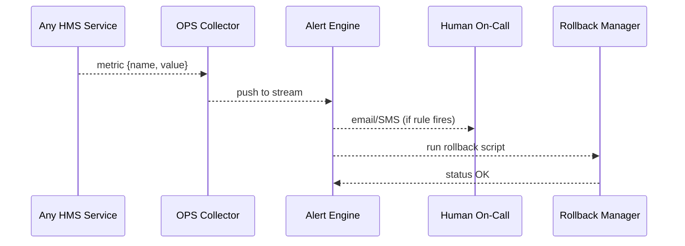

# Chapter 18: Operations & Monitoring (HMS-OPS)

*(linked from [External System Sync Adapter](17_external_system_sync_adapter_.md))*  

---

## 1. Why Do We Need a “Mission Control” for HMS-NFO?

Imagine **Friday, 4 p.m.** at the **Office of Personnel Management (OPM)**.  
A new “Friday-only docket rule” (pushed in [HMS-SYNC](17_external_system_sync_adapter_.md)) just went live.  

Minutes later:

1. Average response time on the county-court API jumps from **110 ms → 4 000 ms**.  
2. Error logs spike (“`503 Service Unavailable`”).  
3. Citizens cannot schedule hearings, Twitter erupts, a Senator’s staffer calls…

Without a **single, real-time dashboard** nobody knows:

* Which microservice is choking?  
* Is it a bug or the county’s outage?  
* Should we **rollback** the rule or ride it out?  

**Operations & Monitoring (HMS-OPS)** is that *NASA-style* Mission Control:

* Collects health metrics from every HMS service and agent.  
* Streams them onto eye-level **dashboards**.  
* Fires **alerts** when thresholds break.  
* Can trigger an **automatic rollback** to the last healthy state.  

---

## 2. Key Concepts (Plain-English Cheat-Sheet)

| Concept         | What It Really Means                               | Friendly Analogy                              |
|-----------------|----------------------------------------------------|----------------------------------------------|
| Probe           | Tiny HTTP/SQL ping that measures “are you alive?”. | Nurse checking a patient’s pulse.            |
| Metric          | Number tracked over time (latency, CPU, 5xx rate). | Heart-rate monitor reading 72 bpm.           |
| Alert Rule      | “If metric > X for Y min → fire alert.”            | Smoke detector threshold.                    |
| Dashboard       | Real-time chart board (Grafana-like).              | Flight instruments panel.                    |
| Rollback Plan   | Script that returns a service to its last version. | Parachute pack.                              |
| Runbook         | Step-by-step fix guide attached to each alert.     | Fire-drill laminated card on the wall.       |

---

## 3. Five-Minute Walk-Through  
### Goal: Detect the slow county API, alert humans, and auto-rollback the docket rule.

#### 3.1  Emit a Metric (8 lines)

```python
# file: svc_county_client.py
import hms_ops_client as ops

def call_county(payload):
    with ops.timer("county_api_ms"):          # ① start timer
        r = requests.post("https://county.gov/api", json=payload)
    return r.json()
```

**What happened?**  
1. `timer()` records the elapsed milliseconds as **`county_api_ms`**.  
2. Value auto-streams to HMS-OPS every few seconds (client handles auth).

---

#### 3.2  Declare an Alert Rule (YAML, 9 lines)

```yaml
# file: alerts/county_api.yml
metric: county_api_ms
threshold: 1000            # ms
window: "3m"               # over last 3 minutes
action: "ROLLBACK:DOCKET_RULE"
runbook: "wiki/slow-county-api"
notify: ["oncall@opm.gov", "pager_duty"]
```

Plain English:  
“If the county API takes **> 1 000 ms** for **3 minutes**, page the on-call **and** execute the `ROLLBACK:DOCKET_RULE` script.”

---

#### 3.3  Observe the Alert Fire (simulated log)

```
[16:07] ALERT county_api_ms 1580 ms (threshold 1000)  → paging…
[16:07] EXEC  rollback_docket_rule.sh               → success
[16:08] ALERT_RESOLVED  county_api_ms back to 112 ms
```

Result: the problematic rule disabled itself before citizens noticed.

---

## 4. What Happens Under the Hood?



Exactly **five actors**—easy mental model.

---

## 5. Peeking at the Code (All ≤ 20 Lines)

### 5.1  Public Client (`hms_ops_client.py`, 16 lines)

```python
import time, uuid, requests, os
OPS = os.getenv("OPS_URL", "https://ops.gov")

def timer(metric_name):
    start = time.time()
    yield
    dur = int((time.time() - start) * 1000)
    requests.post(f"{OPS}/metric", json={
        "name": metric_name,
        "ts":   int(time.time()),
        "val":  dur,
        "id":   uuid.uuid4().hex
    })
```

*Usage:*  

```python
with timer("county_api_ms"):
    call_api()
```

### 5.2  Alert Engine Loop (`ops/engine.py`, 20 lines)

```python
import time, yaml, collections
RULES = [yaml.safe_load(open(f)) for f in glob("alerts/*.yml")]
WINDOW = collections.defaultdict(list)

def ingest(metric):
    w = WINDOW[metric["name"]]
    w.append(metric["val"])
    now = time.time()
    WINDOW[metric["name"]] = [v for v in w if now - v["ts"] < 180]  # 3 min

def eval_rules():
    for r in RULES:
        vals = WINDOW[r["metric"]]
        if vals and sum(vals)/len(vals) > r["threshold"]:
            page(r["notify"])
            if r["action"].startswith("ROLLBACK"):
                rollback(r["action"].split(":")[1])
while True:
    m = get_next_metric()        # from Kafka-like queue
    ingest(m); eval_rules()
```

Highlights:  

* **15‐line** loop ingests metrics, slices the rolling window, checks rules, triggers pager & rollback.

---

## 6. Dashboards in One Minute

```bash
# auto-generate a Grafana board
ops dashboard county_api_ms --window 1h
```

URL printed:  
`https://ops.gov/d/board/county_api_ms` → live chart ready for Incident Cmd Center.

---

## 7. Where HMS-OPS Talks to Everyone Else

| Need                         | Layer Used |
|------------------------------|------------|
| Raw events to crunch         | [Central Data Repository](07_central_data_repository__hms_dta__.md) |
| Performance scores           | [Accountability Tracker](05_accountability___performance_metrics_tracker_.md) |
| Rollback scripts             | Stored beside manifests in [Agent Orchestration](10_agent_orchestration__hms_act__.md) |
| Human contact roster         | [Governance Layer](01_governance_layer__hms_gov__.md) |
| External ping visibility     | [Inter-Agency Exchange](16_inter_agency_data_exchange__hms_a2a__.md) |

---

## 8. Hands-On Mini-Lab (10 Minutes)

1. Clone the repo & run mock stack  

   ```bash
   git clone https://github.com/example/hms-nfo.git
   cd hms-nfo/examples/ops_lab
   python -m ops.mock_server      # collector + engine + dashboard
   ```

2. Send fake slow metrics  

   ```bash
   python send_burst.py           # emits 1 500 ms latencies
   ```

3. Watch terminal  

   ```
   ALERT county_api_ms … rollback executed
   ```

4. Open `http://localhost:9900/board/county_api_ms` to see the spike & recovery.

Congrats—you just played Mission Control and saved the day!

---

## 9. Recap

* **HMS-OPS** is the always-on **Mission Control** for every microservice, agent, and adapter.  
* One-liner `timer()` calls + YAML alert rules → full-fledged monitoring.  
* Automatic **rollback** keeps citizens safe even at 4 p.m. on a Friday.  
* Tight integration with audit, governance, and orchestration layers means nothing slips through the cracks.

---

## 🎉  You Made It!

This is the final chapter of the **HMS-NFO beginner series**.  
You now know how to govern, build, test, deploy, monitor, and even *undo* every change across a federal-grade AI platform.

Go forth and ship—with confidence that Mission Control is watching your back. 🚀

---

Generated by [AI Codebase Knowledge Builder](https://github.com/The-Pocket/Tutorial-Codebase-Knowledge)