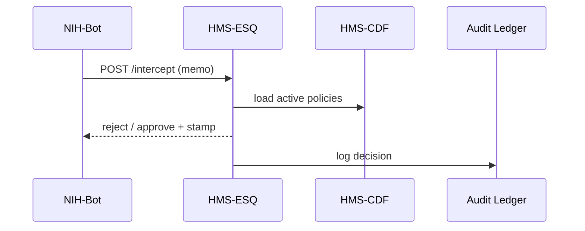

# Chapter 18: Security, Compliance & Legal Reasoning (HMS-ESQ)

*→ If you just finished wiring real money in [Financial Clearinghouse (HMS-ACH)](17_financial_clearinghouse__hms_ach__.md) you probably felt a small chill: “What if this new refund e-mail violates HIPAA or FOIA?”  **HMS-ESQ** is the in-house counsel that checks every outgoing “memo” before it leaves the building.*

---

## 1. Why Do We Need a Digital Counsel?

### Tiny Story — *The Over-Sharing PDF*

1. **NIH-Bot** prepares to e-mail a *clinical-trial PDF* to an external researcher.  
2. The draft accidentally still contains **patients’ SSNs** in an appendix.  
3. Before the e-mail is sent, **HMS-ESQ** intercepts it:  
   *“❌ Redacted content conflicts with HIPAA §164.514.”*  
4. NIH-Bot receives a **red-lined** version; only anonymised data leaves.  
5. An auditor later proves the block with a cryptographic log.

No engineer had to memorize HIPAA; ESQ applied the rule automatically.

---

## 2. Key Concepts (one-by-one)

| Friendly Nickname   | HMS-ESQ Term          | One-Sentence Meaning |
|---------------------|-----------------------|----------------------|
| Law Book            | **Policy Module**     | Machine-readable file describing a statute or executive order. |
| Highlighter Pen     | **Red-Line Engine**   | Flags or removes content that violates a policy. |
| Counsel’s Stamp     | **Compliance Stamp**  | JSON note (“approved / rejected”) attached to every outgoing memo. |
| Court Record        | **Audit Ledger**      | Append-only table storing who, what, and why. |
| Double Check        | **HITL Escalation**   | Optional human review if an AI disagrees with ESQ (ties into [HITL Oversight](12_human_in_the_loop__hitl__oversight_.md)). |

---

## 3. Using HMS-ESQ in 3 Mini Files

We will ① write a HIPAA rule, ② send a memo, ③ see ESQ block it.

### 3.1 Write the Rule (≤ 12 lines)

```yaml
# hipaa_phi.yml
id: HIPAA-PHI
description: "Block Social Security Numbers in medical exports"
pattern: "\\b\\d{3}-\\d{2}-\\d{4}\\b"   # simple SSN regex
action: reject
law_ref: "HIPAA §164.514"
```

*Explanation:* A tiny YAML **Policy Module**—no code.

### 3.2 Register the Rule (CLI, 1 line)

```bash
hms esq policy add hipaa_phi.yml   # ESQ replies: ✔ policy live v1
```

### 3.3 Send a Memo (≤ 18 lines)

```python
# send_pdf.py
import httpx, base64, os, json
PDF = open("trial.pdf","rb").read()
payload = {
  "to": "researcher@uni.edu",
  "subject": "Trial Data",
  "body": base64.b64encode(PDF).decode()
}
resp = httpx.post("http://esq/intercept",
                  json=payload,
                  headers={"Authorization":"Bearer "+os.environ["NIH_BADGE"]})
print(resp.json())
```

Possible output:

```json
{
  "status": "rejected",
  "reason": "HIPAA-PHI match on page 12",
  "redline_url": "/redlines/abc123.pdf"
}
```

*NIH-Bot downloads the red-lined file and re-sends safely.*

---

## 4. What Happens Under the Hood?



Only **4 participants**—easy to remember.

---

## 5. A Glimpse Into the Implementation

### 5.1 Policy Table (SQLite, 8 lines)

```sql
CREATE TABLE policies (
  id    TEXT PRIMARY KEY,
  regex TEXT,
  action TEXT,
  law   TEXT,
  ver   INTEGER
);
```

### 5.2 Intercept Handler (≤ 18 lines)

```python
# esq/intercept.py
import re, sqlite3, base64, json, datetime
db = sqlite3.connect("esq.db")

def scan(content):
    for pid, regex, action in db.execute("SELECT id,regex,action FROM policies"):
        if re.search(regex, content):
            return False, pid
    return True, ""

def intercept(memo):
    pdf = base64.b64decode(memo["body"])
    ok, pid = scan(pdf.decode(errors="ignore"))
    stamp = {
      "ts": datetime.datetime.utcnow().isoformat(),
      "result": "approved" if ok else "rejected",
      "policy": pid
    }
    ledger.write(memo, stamp)     # call helper (not shown)
    return stamp
```

*Under 20 lines: regex scan + audit stamp.*

### 5.3 Audit Ledger Entry (JSON, 6 lines)

```json
{
  "memo_id": "MSG-556",
  "policy": "HIPAA-PHI",
  "result": "rejected",
  "ts": "2025-05-01T12:00Z",
  "hash": "0xABCDEF..."
}
```

Ledger lives in [Data Lake (HMS-DTA)](15_data_core___lake__hms_dta__.md) for 10-year retention.

---

## 6. How ESQ Collaborates with Other HMS Pieces

```mermaid
graph TD
  ESQ["🛡️ HMS-ESQ"] --> CDF["🏛️ HMS-CDF"]   %% loads rules
  ESQ --> API["🌐 HMS-API"]                 %% gateway plugin
  ESQ --> HITL["🙋‍♀️ HITL"]                 %% escalations
  ESQ --> OPS["🔭 HMS-OPS"]                 %% metrics & alerts
  ESQ --> DTA["🗄️ HMS-DTA"]                 %% audit logs
```

* API Gateway (see [Backend API Layer](04_backend_api_layer__hms_svc___hms_api__.md)) can call ESQ as a **plug-in** to block illegal REST payloads.  
* Human reviewers step in via [HITL Oversight](12_human_in_the_loop__hitl__oversight_.md) if ESQ raises “needs human judgment.”  
* Violations raise `esq_policy_hits_total` metrics visible in [OPS dashboards](14_observability___ops__hms_ops__.md).

---

## 7. Common Beginner Questions

| Question | Quick Answer |
|----------|--------------|
| “My message passes even though it contains SSNs.” | Check that the policy regex is correct and **enabled** (`hms esq policy list`). |
| “ESQ blocks legitimate data.” | Mark the policy `action: warn` instead of `reject`, or add a narrower regex. |
| “How do I encode complex rules?” | Write them as executable Rust & push to [HMS-CDF](02_hms_cdf___policy_engine___codified_democracy_foundation__.md); ESQ can call compiled policies too. |
| “Need emergency override?” | Trigger a HITL escalation; a supervisor may issue a one-time **override token** logged in the ledger. |

---

## 8. Recap

You learned:

1. **Why** a digital counsel is essential to stop accidental law-breaking e-mails, APIs, or payments.  
2. The five core pieces: Policy Module, Red-Line Engine, Compliance Stamp, Audit Ledger, HITL Escalation.  
3. How to block an SSN leak with three tiny files: a YAML rule, a CLI command, and a 18-line memo sender.  
4. Under-the-hood tables & handlers that fit inside a coffee break.  
5. How ESQ plugs into CDF, API Gateway, HITL, OPS, and the Data Lake.

---

Next we’ll see how HMS keeps external partners (vendors, state portals, legacy mainframes) in sync **without** opening security holes.

[Next Chapter → External System Synchronization](19_external_system_synchronization_.md)

---

Generated by [AI Codebase Knowledge Builder](https://github.com/The-Pocket/Tutorial-Codebase-Knowledge)