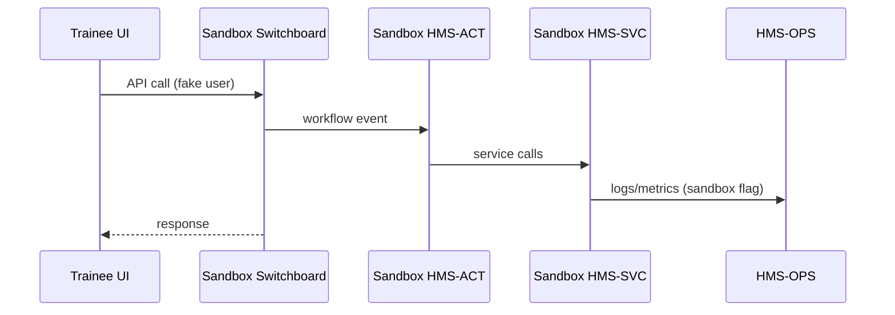

# Chapter 18: Simulation & Training Sandbox (HMS-ESR)

*A friendly sequel to [Observability & Operations (HMS-OPS)](17_observability___operations__hms_ops__.md)*  

---

## 1. Why Do We Need HMS-ESR?

Picture the **Centers for Medicare & Medicaid Services (CMS)** two weeks before open-enrollment:

* Half the call-center staff are brand-new.  
* The IT team is terrified of another traffic surge like 2020, when hold times hit 4 hours.  
* Testing in production is **not** an option—real citizens would get knocked offline.

**HMS-ESR is the flight-simulator for human staff *and* software agents.**  
It spins up a **parallel, sandboxed copy** of your services, then floods it with *synthetic but realistic* user traffic so you can:

* Train rookies without risking live data.  
* Re-play historic spikes (e.g., pandemic surges).  
* Throw “edge-case storms” at your workflows to see what breaks *before* it breaks.

---

## 2. Key Concepts in Plain English

| ESR Term         | Friendly Analogy                     | CMS Example                               |
|------------------|--------------------------------------|-------------------------------------------|
| Scenario         | Movie script                         | “2020 Stimulus Surge”                     |
| Synthetic User   | Paid actor                           | 50 000 fake applicants with random names  |
| Playback         | DVR rewind                           | Re-run real logs from 15 Mar 2020         |
| Switchboard      | Big red toggle                       | Route *all* calls → sandbox, not prod     |
| Scorecard        | Report card                          | Avg wait time, error %, trainee accuracy  |

Remember these five words—90 % of ESR is just mixing and matching them.

---

## 3. 3-Minute Guided Tour – Re-playing the 2020 Stimulus Surge

We’ll:

1. Define a scenario  
2. Start the sandbox  
3. Watch a live scorecard

### 3.1 Describe a Scenario (9-line YAML)

```yaml
# esr/scenarios/stimulus_2020.yml
id: stimulus_2020
source: replay_logs          # or "synthetic"
log_path: /lake/raw/events/2020/03/15/
speed: 2x                    # play twice as fast
users: 50000
duration: 30m
```

*Drop the file; ESR notices it within seconds.*

### 3.2 Start the Sandbox (one-liner CLI)

```bash
hms-esr start stimulus_2020 --target staging
```

What happens?  
* ESR spins isolated copies of **HMS-SVC**, **HMS-ACT**, and **HMS-MFE** using Docker-Compose.  
* The **switchboard** rewires traffic so only the sandbox sees the surge.

### 3.3 Watch the Scorecard (tiny Vue widget, 14 lines)

```vue
<script setup>
import { ref,onMounted } from 'vue'
const stats = ref({})
onMounted(()=> new EventSource('/api/esr/score').onmessage = e =>
   stats.value = JSON.parse(e.data))
</script>

<template>
  <h2>Stimulus 2020 (Sandbox)</h2>
  <ul>
    <li>Users       : {{ stats.users }}</li>
    <li>Avg Wait (s): {{ stats.avg_wait }}</li>
    <li>Error %     : {{ stats.error_pct }}</li>
  </ul>
</template>
```

Instant feedback lets trainers pause, tweak, and resume on the fly.

---

## 4. What Happens Under the Hood?



*Only five actors—easy to trace.*

---

## 5. Peeking Inside HMS-ESR (All Tiny Code!)

### 5.1 Scenario Loader (Node, 12 lines)

```js
// esr/loader.js
import fs from 'fs/promises'
import YAML from 'yaml'
export async function load(id){
  const y = await fs.readFile(`esr/scenarios/${id}.yml`, 'utf8')
  return YAML.parse(y)
}
```

### 5.2 Traffic Generator (≤ 18 lines)

```js
// esr/generate.js
import { load } from './loader.js'
import fetch     from 'node-fetch'

export async function play(id){
  const sc = await load(id)
  const logs = await fs.readdir(sc.log_path)
  for (const file of logs){
    const evt = JSON.parse(await fs.readFile(sc.log_path+file))
    await fetch(`http://sandbox-svc${evt.url}`, { // rewired URL
      method: evt.method, body: JSON.stringify(evt.body)
    })
    await sleep(evt.delay / sc.speed)
  }
}
```

*Reads saved logs → re-fires each HTTP call into sandbox URLs.*

### 5.3 Switchboard Toggle (Express, 14 lines)

```js
// esr/switch.js
let live = true           // default = production
export function route(req, res, next){
  if(!live) req.url = `/sandbox${req.url}`   // prefix swap
  next()
}
export function set(mode){ live = mode==='live' }
```

Attach `route` as the first middleware in **HMS-SVC**; flip `set('sandbox')` when ESR starts.

### 5.4 Scorecard Aggregator (≤ 15 lines)

```js
// esr/score.js
const score = { users:0, avg_wait:0, error_pct:0 }
export function record(evt){
  score.users++
  score.avg_wait = (score.avg_wait*(score.users-1)+evt.wait)/score.users
  if(evt.status>=400) score.error_pct = 
      ((score.error_pct*(score.users-1))+100)/score.users
}
export function stream(req,res){
  res.writeHead(200, {'Content-Type':'text/event-stream'})
  setInterval(()=> res.write(`data:${JSON.stringify(score)}\n\n`), 1000)
}
```

Logs piped from **HMS-OPS** call `record()`, feeding the live SSE stream.

---

## 6. How HMS-ESR Talks To Other Layers

| Layer | Interaction in Sandbox |
|-------|-----------------------|
| [HMS-SVC](09_core_service_mesh__hms_svc__.md) | Runs a **shadow mesh** on different ports |
| [HMS-ACT](05_workflow_orchestrator__hms_act__.md) | Executes workflows with *mock* endpoints |
| [HMS-MFE](15_micro_frontend_experience__hms_mfe__.md) | Loads tiles but points APIs at sandbox URLs |
| [HMS-OPS](17_observability___operations__hms_ops__.md) | Tags every metric with `env=sandbox` |
| [HITL Control](08_human_in_the_loop__hitl__control_.md) | Trainees practice approving tasks that never hit prod |

No code changes in those layers—ESR hijacks traffic transparently.

---

## 7. Frequently Asked Questions

**Q: Can trainees accidentally hit real data?**  
No—the **switchboard** rewrites hostnames & credentials so even if someone pastes a prod URL, the DNS resolver points to the sandbox.

**Q: How “real” are synthetic users?**  
You choose: fully random or sampled distributions copied from past OPS logs.

**Q: Can we stress-test only one micro-service?**  
Yes—set `target: svc-profile` in the scenario YAML; ESR floods *just* that service.

**Q: Does sandbox traffic pollute analytics?**  
OPS tags every metric `env=sandbox`; dashboards default to `env=prod` filter.

---

## 8. What You Learned

• **HMS-ESR** lets you train humans and harden software by replaying *any* traffic pattern in a safe sandbox.  
• A scenario is a **nine-line YAML**; starting it is a **one-liner**; a 14-line Vue widget streams live results.  
• Under the hood: loader → traffic generator → switchboard → scorecard, all in tiny, readable code.  
• ESR plays nicely with the rest of the HMS stack—no forks, no risky hacks.

Happy flight-simulating! 🛫

---

Generated by [AI Codebase Knowledge Builder](https://github.com/The-Pocket/Tutorial-Codebase-Knowledge)