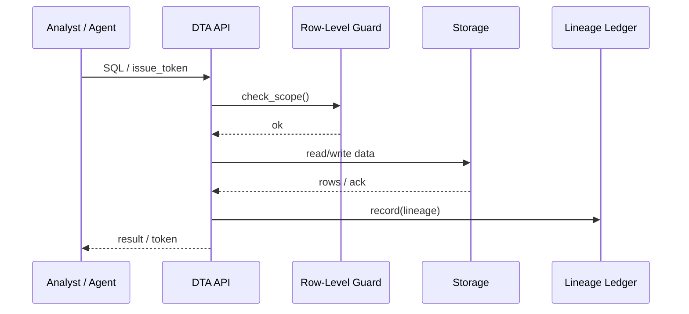

# Chapter 19: Central Data Repository (HMS-DTA)

*(coming from [Utility & Shared Library Layer (HMS-UTL)](18_utility___shared_library_layer__hms_utl__.md))*  

---

## 1 · Why Do We Need a “Library of Congress + Fort Knox” for Data?

> Use-Case — **Nation-Wide Disaster Voucher Payout**  
> 1. FEMA forms, Treasury payments, and Census maps land in three different formats.  
> 2. Analysts must join them *today* to see which ZIP codes still need help.  
> 3. The data touches **Privacy Act** (citizen addresses) and **HIPAA** (medical aid).  
> 4. Every query must be logged for audits; AI agents may see *some* rows, never all.

Trying to copy CSVs between ad-hoc S3 buckets will drown you in errors and subpoenas.  
**HMS-DTA** fixes this: **one** governed place where *raw feeds, cleaned tables, and even machine-learning models* live side-by-side—with row-level locks and full lineage.

---

## 2 · High-Level Mental Model

| HMS-DTA Part | Beginner Analogy | What Lives Here |
|--------------|------------------|-----------------|
| **Raw Zone** | Unopened mail room | Exact files from FEMA, Treasury, etc. |
| **Curated Zone** | Public library shelf | Clean tables: `households`, `payments`, … |
| **Model Zone** | Research lab | Saved notebooks & model weights |
| **Row-Level Guard** | Bouncer with ID scanner | Lets you see only *your* rows |
| **Lineage Ledger** | Package tracking number | Shows every hop: source → query → dashboards |
| **Scoped Token** | Visitor badge | Grants an AI agent 30-minute, read-only access |

---

## 3 · Quick-Start in 3 × 15 Lines

### 3.1  An Analyst Queries Curated Data

```python
# analyst_query.py   (< 15 lines)
from hms_dta import Session

s   = Session.login(user="jdavis@fema.gov", otp="123456")
sql = """
SELECT zip, SUM(amount) AS paid
FROM   curated.payments
WHERE  disaster_id = 'IAN2024'
GROUP  BY zip
ORDER  BY paid DESC
LIMIT  10
"""
rows = s.query(sql)
print(rows[:3])
```

Output (sample):

```
[('32904', 842000), ('32750', 790500), ('34134', 701200)]
```

The library shelf is queried like any cloud warehouse—but with extra safety:

* `Session` token enforces **row-level policy** on every query.  
* The query + result size is **hashed** into the lineage ledger.

---

### 3.2  An AI Agent Gets a Scoped Token

```python
# agent_token.py
from hms_dta import Token

tkn = Token.issue(
       agent_id   = "PermitBot",
       scope      = "SELECT zip, amount FROM curated.payments WHERE zip='32904'",
       ttl_sec    = 900            # 15 min
)
print(tkn[:30] + "…")
```

The returned JWT can only run the **exact** whitelisted SQL and expires in 15 minutes—perfect for [AI Agent Framework (HMS-AGT)](06_ai_agent_framework__hms_agt___hms_agx__.md).

---

### 3.3  Trace Lineage for an Audit

```python
# see_lineage.py
from hms_dta import Lineage

log = Lineage.of_object("dashboard://DisasterPayouts2024")
for hop in log.history():
    print(hop)
```

Console:

```
✔ 2024-05-11 10:02 ingest ➜ raw.fema_payments.csv (sha256:…)  
✔ 2024-05-11 10:05 transform ➜ curated.payments  
✔ 2024-05-11 10:07 query by jdavis@fema.gov (hash:…)  
✔ 2024-05-11 10:08 dashboard publish
```

Auditors instantly see *who did what when*—no hunting through logs.

---

## 4 · What Happens Behind the Curtain?



Five participants, all messages **TLS-encrypted**; if the guard says “no,” the query dies before it hits storage.

---

## 5 · Thin-Slice of Internals

### 5.1  Policy Check (≤ 14 lines)

```python
# dta/policy.py
def allowed(user, sql):
    # very naive example
    if "WHERE zip=" in sql:
        zip_code = sql.split("zip='")[1].split("'")[0]
        return zip_code in user.allowed_zips
    return False
```

Real engine uses a parsed AST + attribute-based access control, but the core idea is one **function** that says *yes / no*.

---

### 5.2  Lineage Append (≤ 10 lines)

```python
# dta/lineage.py
import hashlib, time, json, pathlib

LEDGER = pathlib.Path("/dta/ledger.log")

def record(action, payload):
    entry = {
        "ts": time.time(),
        "act": action,
        "payload": payload,
        "hash": hashlib.sha256(json.dumps(payload).encode()).hexdigest()
    }
    LEDGER.write_text(json.dumps(entry)+"\n", append=True)
```

One append-only file = immutable history.

---

## 6 · How Other HMS Layers Use DTA

| Layer | What It Stores in DTA | Why |
|-------|-----------------------|-----|
| [HMS-SVC](09_core_backend_service_layer__hms_svc__.md) | Clean service tables | Share across agencies |
| [HMS-ACH](12_financial_transaction_core__hms_ach__.md) | Immutable payment ledger | Reconciliation & FOIA |
| [HMS-ESR](17_simulation___behavior_lab__hms_esr__.md) | Simulation metrics | Compare test vs. prod |
| [HMS-OPS](20_monitoring___operations_center__hms_ops__.md) | Metrics & traces | One query surface |
| [HMS-MFE](04_micro_frontend_interface_layer__hms_mfe__.md) | Dashboard queries | Instant public charts |

Everything points to **one** source of truth—no CSV emailing.

---

## 7 · Frequently Asked Beginner Questions

**Q: Is HMS-DTA a single monolithic database?**  
A: Internally it shards across cloud object storage + columnar warehouse, but **you** always hit one endpoint.

**Q: Can I bring my own BI tool?**  
A: Yes—ODBC/JDBC drivers ship with the same row-level guard.

**Q: How big can a file be?**  
A: Tested to 5 TB uploads; auto-chunked on ingest.

**Q: What about GDPR “right to be forgotten”?**  
A: A delete flag marks rows; guard hides them instantly, and a background job purges chunks after policy delay.

---

## 8 · Hands-On Mini Exercise (2 min)

```bash
pip install hms-dta
python - <<'PY'
from hms_dta import Session
s = Session.login("analyst@fema.gov", "111111")
print(s.query("SELECT COUNT(*) FROM curated.payments")))
PY
```

If your role has access, you’ll see the total row count; otherwise a polite `AccessDenied` error appears.

---

## 9 · What You Learned

1. HMS-DTA is the **single, governed warehouse & lake**—“Library of Congress + Fort Knox.”  
2. Row-level guard + lineage ledger keep **Privacy Act & HIPAA** auditors happy.  
3. In < 20 lines you queried data, issued a scoped token for an AI agent, and traced lineage.  
4. Every other HMS layer plugs in, eliminating copy-paste silos.

Next the platform must **keep itself healthy**—latency, errors, disk, alerts.  
Time to visit the control room: [Monitoring & Operations Center (HMS-OPS)](20_monitoring___operations_center__hms_ops__.md).

---

Generated by [AI Codebase Knowledge Builder](https://github.com/The-Pocket/Tutorial-Codebase-Knowledge)