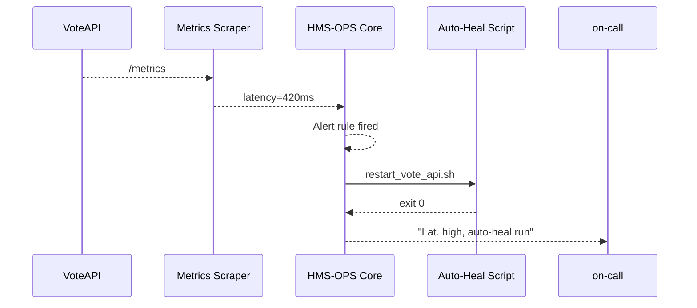

# Chapter 19: HMS-OPS (Observability & Platform Operations)
*[← Back to Chapter 18 – HMS-SYS (System Infrastructure)](18_hms_sys__system_infrastructure__.md)*  

---

## 1. Why Do We Need HMS-OPS?

Election night.  Every county site pours live vote counts through HMS-EHR.  
Traffic rockets from **2 000 req/s → 120 000 req/s** in thirty seconds.  
If servers stall, headlines read *“Government site crashes – results delayed.”*

HMS-SYS (previous chapter) already gave us auto-scaling containers, **but** we still need a **pair of watchful eyes** that:

1. Notices a pod’s error rate jump before citizens see a 500-error.  
2. Decides whether to **roll back** a bad release or **spin up** more pods.  
3. Pages the on-call engineer **only when truly necessary**.

Those eyes live in **HMS-OPS**—the 24 × 7 Operations Center: dashboards, alerts, canary checks, and tiny “self-healing” scripts that keep the lights on.

---

## 2. Key Concepts (Plain English)

| OPS Concept | Friendly Analogy | One-Sentence Definition |
|-------------|------------------|-------------------------|
| Metric      | Thermometer      | Numeric signal measured over time (CPU %, requests/sec). |
| Alert Rule  | Fire alarm       | “If X > Y for Z minutes, yell.” |
| Dashboard   | Control panel    | Live graphs for humans. |
| Canary      | Test pilot       | Sends fake requests every 30 s and checks the response. |
| SLO (Service Level Objective) | Pass/Fail exam | “99.9 % of responses < 300 ms over 30 days.” |
| Auto-Heal Script | First-aid kit | Script HMS-OPS can run automatically (e.g., restart a pod). |
| Runbook     | IKEA manual      | Step-by-step doc the on-call follows when the alarm rings. |

---

## 3. A 5-Minute “Hello-OPS”

We’ll monitor the **Vote-API** pod you deployed in Chapter 18.

### 3.1  Collect a Metric

```python
# vote_metric.py  (14 lines)
from hms_ops import Metric

Metric.define(
    name="vote_api_latency_ms",
    scrape="http://vote-api:8080/metrics",  # Prometheus style
    query="histogram_quantile(0.95, rate(http_request_duration_seconds_bucket[1m])) * 1000"
)
```

What it does  
– Points HMS-OPS at the service’s `/metrics` endpoint.  
– Calculates the **P95 latency** every minute.

### 3.2  Add an Alert Rule

```python
# alert_rule.py  (11 lines)
from hms_ops import Alert

Alert(
    name="vote_latency_high",
    expr="vote_api_latency_ms > 300",   # ms
    for_="5m",
    notify="oncall@sos.gov",
    auto_heal="scripts/restart_vote_api.sh"
).save()
```

What will happen?  
1. If P95 latency stays **> 300 ms for 5 min** HMS-OPS:  
    • Sends an e-mail / Slack ping.  
    • Runs `restart_vote_api.sh` (see 3.4).  

### 3.3  Canary Check

```python
# canary.py  (≤12 lines)
from hms_ops import Canary

Canary(
    name="vote_canary",
    every="30s",
    call="GET https://vote.gov/health",
    expect_status=200,
    expect_body_contains="OK"
).save()
```

A tiny robot visits `/health` every 30 seconds; failures feed the same alerting engine.

### 3.4  Auto-Heal Script

```bash
#!/usr/bin/env bash   # scripts/restart_vote_api.sh (5 lines)
echo "[OPS] Restarting Vote-API…" >&2
kubectl rollout restart deploy/vote-api
```

Under 5 lines—yes, that is often enough!

---

## 4. Step-by-Step: What Happens at Runtime?



1. Scraper pulls **latency=420 ms**.  
2. Alert rule evaluates true for 5 min.  
3. HMS-OPS triggers the shell script.  
4. A notification shows both the alarm **and** the remediation action.

---

## 5. Peeking Under the Hood

### 5.1  Tiny Alert Evaluator

```python
# hms_ops/eval.py  (≤16 lines)
def tick():
    for rule in Alert.all():
        val = Metric.latest(rule.expr.metric)
        if eval(rule.expr, {"x": val}):          # x > 300
            if rule.active_for() >= rule.for_:
                fire(rule)
        else:
            rule.clear()
```

`eval()` here is **safe** because we pre-parse expressions into `lambda x:` functions—no arbitrary code.

### 5.2  Firing & Healing

```python
# hms_ops/fire.py  (≤12 lines)
def fire(rule):
    notify(rule.name, rule.expr, rule.for_)
    if rule.auto_heal:
        rc = os.system(rule.auto_heal)
        log_heal(rule.name, rc)
```

Two lines: **notify** and optional **auto-heal**.

### 5.3  Metric Storage (Sketch)

```python
# hms_ops/store.py  (≤8 lines)
class TSDB:
    _data = {}          # metric → [(ts,value), …]

    def add(name, v):
        TSDB._data.setdefault(name, []).append((time.time(), v))

    def latest(name):
        return TSDB._data[name][-1][1]
```

A dictionary + list—good enough for demos; production uses Prometheus/Thanos.

---

## 6. Integration With Other HMS Layers

| Layer | What OPS Watches | Typical Auto-Heal |
|-------|------------------|-------------------|
| [HMS-SYS](18_hms_sys__system_infrastructure__.md) | Node CPU, pod restarts | `kubectl cordon node && drain` |
| [HMS-OMS](12_hms_oms__operational_workflow_manager__.md) | Ticket SLA breaches | `notify duty_officer@city.gov` |
| [HMS-ACH](08_hms_ach__financial_transaction_core__.md) | Failed payments/min | `rollback batch && page finance` |
| [HMS-A2A](05_hms_a2a__inter_agency_exchange__.md) | Envelope reject rate | `restart broker` |

OPS is the **central nervous system**; every other layer plugs its metrics/alerts here.

---

## 7. Frequently Asked Questions

| Symptom / Question | Likely Cause | Quick Fix |
|--------------------|--------------|-----------|
| Alert spams every minute | `for_` too short | Increase `for_` or add `silence_window="30m"`. |
| Auto-heal script failed | Non-zero exit | Check `ops_heal.log`, ensure proper kube-config. |
| Canary says “SSL error” | Cert about to expire | Trigger runbook: `renew_tls_cert.md`. |
| Dashboards blank | Browser blocked WebSocket | Allow `wss://ops.gov/live`. |
| Want SMS instead of e-mail | Add `notify="sms:+15551234"` in rule. |

---

## 8. What You Learned

* **Metrics** + **Alert Rules** let HMS-OPS detect trouble early.  
* **Canaries** offer outside-in health checks.  
* **Auto-Heal Scripts** can fix simple issues before humans wake up.  
* Dashboards & notifications keep staff **informed, not overwhelmed**.  
* OPS ties together signals from every other HMS layer into one calm command center.

---

👏 **Congratulations!**  
You have reached the final layer of the HMS-EHR architecture. From citizen-facing forms (Chapter 1) all the way down to 3 am pod restarts (this chapter), you now own the full stack.

Go build great public-sector software—HMS-OPS is on watch.

---

Generated by [AI Codebase Knowledge Builder](https://github.com/The-Pocket/Tutorial-Codebase-Knowledge)