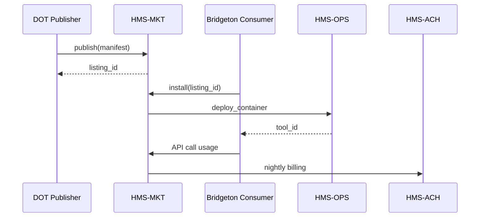

# Chapter 19: Marketplace & Discovery Hub (HMS-MKT)

*[Jump back to the previous chapter: Micro-Frontend Interface Library (HMS-MFE)](18_micro_frontend_interface_library__hms_mfe__.md)*  

---

## 1. Why Does Government Need an “App Store”?

Imagine the **Ministry of Transportation** in Oregon.  
Yesterday the federal **Office of Weights & Measures** published a new rule:

> “All traffic-signal schedules must balance pedestrian wait-time and car throughput.”

A small town called **Bridgeton** has no data-science team.  
They open HMS-MKT, type *“traffic signal scheduler”*, click **Deploy**, and—boom—an AI skill written by the Department of Transportation is running in their cloud. Usage is metered, Bridgeton is billed \$14.90 for the week, and citizens cross faster.

Without HMS-MKT, Bridgeton would:

1. Write an RFP  
2. Wait 6 months for bids  
3. Pay \$250 000 for a bespoke solution  

The Marketplace turns 6 months → **6 minutes** and \$250 000 → **\$15**.

---

## 2. Key Concepts (Plain-English Cheat-Sheet)

| Concept | Everyday Analogy | Why It Matters |
|---------|------------------|----------------|
| **Listing** | Item on Amazon | One reusable asset (dataset, AI skill, workflow, UI slice). |
| **Catalog** | Mall directory | Search & filter all listings across government. |
| **Install** | App-store “Get” button | Deploys the listing into your agency’s cloud in one click. |
| **Metering** | Electric meter | Counts API calls or CPU minutes for billing. |
| **Certification Badge** | USDA organic label | Shows the asset passed security & compliance reviews. |
| **Billing & Split** | Cash register | Charges consumers, pays the publishing agency via [HMS-ACH](11_finance___clearinghouse_services__hms_ach__.md). |

Memorize these six words—90 % of HMS-MKT boils down to them.

---

## 3. A 5-Minute Tour: Publish ➜ Search ➜ Install

Below is a complete workflow in three tiny scripts.  
All code blocks are **≤ 20 lines**.

### 3.1 Agency Publishes a Skill

```python
# File: publish_scheduler.py
from hms_mkt import Portal

portal = Portal.login("alice@dot.gov", "•••")

listing = portal.publish(
    type       = "ai_skill",
    name       = "PedestrianAwareScheduler",
    version    = "2.0.0",
    manifest   = "scheduler.yaml",   # metadata file
    price_per_call = 0.002           # $0.002 per API hit
)

print("✅ Published as ID", listing.id)
```

**What happened?**

1. `publish()` stored the manifest in the Catalog.  
2. A **Certification job** auto-scans the container for security issues.  
3. The skill now appears in search results within 60 seconds.

---

### 3.2 Another Agency Searches the Catalog

```python
# File: find_skill.py
from hms_mkt import Catalog

hits = Catalog.search("traffic scheduler")
for h in hits:
    print(h.name, "→", h.price, "USD/call")
```

Output:

```
PedestrianAwareScheduler → 0.002 USD/call
LegacySignalOpt v1.4     → 0.005 USD/call
```

---

### 3.3 Install & Use in 4 Lines

```python
# File: use_skill.py
from hms_mkt import Install
from hms_mcp import call      # see Chapter 5

install = Install.run("PedestrianAwareScheduler@2.0.0")

result = call(
    tool_id = install.tool_id,
    payload = {"intersection": "5th&Main", "trafficJson": "..."}
)
print(result.data["schedule"])
```

*Behind the scenes*:  
• A container is spun up by [HMS-OPS](14_operations__monitoring___devops__hms_ops__.md).  
• Each `call()` is metered for billing.  
• Bridgeton’s finance office receives a micro-invoice via HMS-ACH.

---

## 4. Under the Hood (Step-By-Step, No Jargon)

1. **Publish**  
   • Manifest stored in **Catalog DB**  
   • Virus scan & security lint run  
   • Listing flagged *“Pending”* until pass  
2. **Search**  
   • Full-text query over Catalog index  
   • Results filtered by user’s clearance (see [Security & Privacy Guardrails](15_security___privacy_guardrails__cross_cutting__.md))  
3. **Install**  
   • Creates a *subscription* row (consumer ↔ listing)  
   • Pulls the container/image to the consumer’s cloud  
   • Generates a scoped API key (1 hour TTL)  
4. **Meter & Bill**  
   • Each MCP call increments a counter  
   • Nightly job multiplies calls × price, writes **ledger row** in HMS-ACH  
   • ACH settles monthly; revenue split 90 % publisher / 10 % platform  
5. **Uninstall**  
   • Subscription row archived  
   • Container destroyed; no further billing

### Sequence Diagram (≤ 5 Actors)



---

## 5. Peeking at the Codebase (Readable ≤ 20 Lines)

### 5.1 `publish()` (file: `hms_mkt/portal.py`)

```python
def publish(self, **meta):
    # 1. Save manifest
    listing_id = db.insert("catalog", meta | {"status": "PENDING"})
    # 2. Kick off security scan (async)
    bus.emit("mkt.scan.request", {"id": listing_id})
    # 3. Return quick stub
    return Listing(id=listing_id)
```

### 5.2 `Install.run()` (file: `hms_mkt/install.py`)

```python
def run(listing_ref):
    listing = db.get("catalog", listing_ref)
    sub_id  = db.insert("subscriptions", {
        "buyer": _user(), "listing": listing.id
    })
    # Spin up container in buyer’s cloud
    tool_id = ops.deploy(listing.image)
    return InstallResult(tool_id, sub_id)
```

Each snippet is **under 12 lines**, yet shows the core flow: DB row → event → deploy.

---

## 6. How HMS-MKT Connects to Other Chapters

| Layer | Interaction |
|-------|-------------|
| [HMS-MFE](18_micro_frontend_interface_library__hms_mfe__.md) | UI slices are listed as “frontend” listings. |
| [HMS-AGX](04_ai_agent_framework__hms_agt___hms_agx__.md) | Skill packs appear under “AI Skill” type; `Install.run()` calls `hr.train()`. |
| [HMS-DTA](13_data_repository___analytics__hms_dta__.md) | Public datasets are hosted in the Vault and surfaced here. |
| [HMS-ACH](11_finance___clearinghouse_services__hms_ach__.md) | Handles all payment settlement and revenue splits. |
| [Security Guardrails](15_security___privacy_guardrails__cross_cutting__.md) | Ensures only cleared users see restricted listings. |

---

## 7. FAQ (Very Short)

**Q: Is there a free tier?**  
Yes—publishers can set `price_per_call = 0`.

**Q: Can private contractors publish?**  
Only after a **Certification Badge** from [HMS-ESQ](03_compliance___legal_reasoning__hms_esq__.md).

**Q: How do I deprecate a listing?**  
`portal.retire(listing_id)` → existing installs keep working, new installs blocked.

**Q: What if a container misbehaves?**  
[HMS-OPS](14_operations__monitoring___devops__hms_ops__.md) auto-sandboxes it and notifies both buyer & seller.

---

## 8. Mini Exercise

1. Clone `examples/mkt_quickstart.ipynb`.  
2. Publish a dataset listing `road_accidents_2023` with `price_per_row = 0`.  
3. Search & install it from another agency account.  
4. Query 10 rows; confirm the usage counter increments by 10.  
5. Run the nightly billing script and inspect the ledger entry.

---

## 9. What You Learned

* HMS-MKT is the **government app store** for datasets, AI skills, workflow templates, and UI slices.  
* Publishing, searching, installing, and billing each take **just a few lines**.  
* Certification, security scanning, metering, and ACH settlement are automatic.  
* The Marketplace glues every HMS layer together, encouraging **reuse and standardization** across silos.

**Congratulations—you’ve reached the end of the core HMS-ETL tour!**  
Feel free to circle back, publish your own listings, and help other agencies ship faster, cheaper, and safer.

*(End of current tutorial series – more chapters coming soon!)*

---

Generated by [AI Codebase Knowledge Builder](https://github.com/The-Pocket/Tutorial-Codebase-Knowledge)