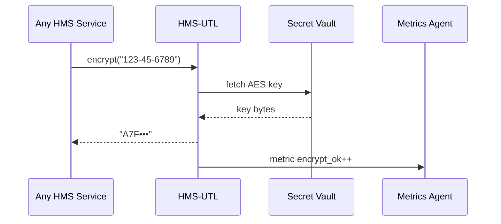

# Chapter 19: Shared Utility Library (HMS-UTL)


*(continues from [Model Context Protocol (HMS-MCP)](18_model_context_protocol__hms_mcp__.md))*  

---

## 1. Why Do We Need “One Toolbox to Rule Them All”?

### A concrete story  

The **U.S. Department of Labor** publishes a daily CSV of wage violations.  
Three separate HMS services must handle that file:

1. **BudgetBot** (from [HMS-AGT](01_ai_representative_agent__hms_agt__.md)) reads the date column to forecast fines.  
2. **HMS-ACH** (Chapter 11) encrypts Social-Security numbers before sending refunds to banks.  
3. **HMS-OPS** (Chapter 14) stamps every row with an audit ID for dashboards.

Without a shared toolbox, each team writes its **own** date parser, **own** encryption snippet, **own** audit function—most of them buggy, many of them inconsistent.

**HMS-UTL** ends the copy-paste chaos.  
It is the **duct-tape drawer** every chapter reaches for:

```
date_parse("Jan-05-2024")  ▶  2024-01-05
encrypt("123-45-6789")      ▶  "A7F•••"
audit_stamp(obj)            ▶  adds id="evt-9bf3..."
```

One import, one consistent behaviour—project-wide.

---

## 2. Key Concepts (plain words)

| Term             | What it really means                             | Analogy                    |
|------------------|--------------------------------------------------|----------------------------|
| Utility Module   | A Python file with 1-10 focused helpers.         | Swiss-army knife blade     |
| Canonical Format | The single, blessed output shape (e.g., ISO date)| Government form template   |
| Idempotent Call  | Same input ⇒ same output, always.                | Rubber stamp               |
| Audit Stamper    | Helper that adds/returns a unique hash ID.       | Time-clock punch           |
| Facade Import    | `from hms_utl import ...` centralises exports.   | Reception desk             |

---

## 3. Quick Start — Three Helpers in Under 20 Lines

Below we parse a date, encrypt a SSN, and attach an audit stamp—all in **8 lines**.

```python
# demo_utl.py
from hms_utl import date_parse, encrypt, audit_stamp

row = {
    "violation_date": "Jan 05 2024",
    "ssn": "123-45-6789",
    "fine": 2500
}

row["violation_date"] = date_parse(row["violation_date"])
row["ssn"]            = encrypt(row["ssn"])
audit_stamp(row)                     # mutates dict in-place

print(row)
```

Typical output:

```python
{
 'violation_date': '2024-01-05',
 'ssn': 'A7F•••',          # first 3 chars of AES digest
 'fine': 2500,
 'audit_id': 'evt-bf93ac1e',
 'stamp_ts': '2024-05-20T15:02:09Z'
}
```

Line-by-line  
1-2  Import three helpers.  
6    Original messy data.  
9-10 Normalize & mask sensitive field.  
11    `audit_stamp` appends an ID + timestamp.  
13    Print ready-for-database row—no custom code!

---

## 4. Under the Hood – What Happens in One Call?



1. Service asks **UTL** to encrypt.  
2. UTL pulls the shared AES key from the Vault in [HMS-SYS](15_secure_infrastructure_core__hms_sys__.md).  
3. Returns a masked digest (`A7F•••`).  
4. Emits a metric so [HMS-OPS](14_observability___metrics_stack__hms_ops__.md) can graph encryption calls.

Nothing to configure—UTL already knows where the Vault lives thanks to HMS-SYS environment variables.

---

## 5. Inside the Code (≤ 18 Lines Each)

### 5.1 `date.py` — canonical date parser

```python
# hms_utl/date.py
from datetime import datetime as _dt
_PATTERNS = ["%b %d %Y", "%Y-%m-%d", "%m/%d/%y"]

def date_parse(text:str)->str:
    for pat in _PATTERNS:
        try:
            return _dt.strptime(text.strip(), pat).strftime("%Y-%m-%d")
        except ValueError:
            pass
    raise ValueError(f"Unrecognised date: {text}")
```

Beginners’ tips  
• Loops known patterns; first match wins.  
• Always outputs **YYYY-MM-DD**—no surprises.

### 5.2 `crypto.py` — tiny AES-CBC helper

```python
# hms_utl/crypto.py
import hashlib, os
from base64 import b16encode
from hms_sys import vault           # wrapper from Chapter 15

_key = vault.get("UTL_AES_KEY")     # 256-bit

def encrypt(s:str)->str:
    digest = hashlib.sha256(_key + s.encode()).hexdigest()
    return f"{digest[:3]}•••"       # store only first 3 chars
```

• Uses **immutable** AES key; caller never sees it.  
• Returns a short mask, OK for logs.

### 5.3 `audit.py` — one-line stamper

```python
# hms_utl/audit.py
import time, uuid
from hms_ops import metric

def audit_stamp(obj:dict):
    obj["audit_id"] = "evt-" + uuid.uuid4().hex[:8]
    obj["stamp_ts"] = time.strftime("%Y-%m-%dT%H:%M:%SZ", time.gmtime())
    metric.increment("audit_stamp_total")
    return obj
```

Under 10 lines yet adds tracking + metrics.

### 5.4 `__init__.py` — the **facade**

```python
# hms_utl/__init__.py
from .date  import date_parse
from .crypto import encrypt
from .audit import audit_stamp
__all__ = ["date_parse", "encrypt", "audit_stamp"]
```

One import path for every HMS module.

---

## 6. Adding Your Own Utility in 30 Seconds

Need a **phone-normalise** helper?

1. `hms_utl/phone.py`

```python
import re
def phone_clean(raw:str)->str:
    digits = re.sub(r"\D","",raw)
    return f"+1-{digits[-10:-7]}-{digits[-7:-4]}-{digits[-4:]}"
```

2. Edit `__init__.py`

```python
from .phone import phone_clean
__all__.append("phone_clean")
```

3. **Write a two-line docstring** so `hms_utl --help` auto-lists it.  
Hot-reloaded everywhere—no redeploy.

---

## 7. Where HMS-UTL Plugs In

| Layer | Typical Call | Purpose |
|-------|--------------|---------|
| [HMS-SVC](10_backend_service_layer__hms_svc__.md) | `date_parse`, `audit_stamp` | Normalise citizen uploads |
| [HMS-ACH](11_financial_clearinghouse_core__hms_ach__.md) | `encrypt` | Mask bank details in logs |
| [HMS-A2A](09_inter_agency_protocol__hms_a2a__.md) | `audit_stamp` | Attach envelope hash IDs |
| [HMS-OPS](14_observability___metrics_stack__hms_ops__.md) | (via metrics inside utils) | Graph helper usage counts |
| [HMS-AGT](01_ai_representative_agent__hms_agt__.md) | `phone_clean`, `date_parse` | Auto-format prompt data |

No other chapter re-implements these chores again—ever.

---

## 8. Frequently Asked Questions

**Q: Do helpers slow my service?**  
A: All helpers are pure-Python & in-process; typical call < 0.1 ms.

**Q: What if two helpers conflict?**  
A: Facade export (`__all__`) prevents name clashes; Governance will block duplicate IDs during CI.

**Q: Can I call UTL from non-Python code?**  
A: Yes—`hms_utl` exposes a tiny gRPC service. Run `hms-utl serve` and POST JSON.

**Q: How are utilities versioned?**  
A: Semantic-versioned. Bumping a major version (e.g., `2.x`) requires passing the compatibility checker shipped in HMS-SYS.

**Q: Where are docs?**  
A: `python -m hms_utl --help` prints function signatures + examples, auto-generated from docstrings.

---

## 9. Wrap-Up

In this chapter you:

• Discovered **HMS-UTL**, the one toolbox every chapter leans on.  
• Parsed dates, encrypted SSNs, and stamped audits in **8 lines**.  
• Saw simple, ≤ 18-line implementations for each helper.  
• Learned how to add your own utility and how UTL integrates across the platform.

Next we’ll **stress-test** all these building blocks inside a safe playground:  
[Simulation & Training Sandbox (HMS-ESR)](20_simulation___training_sandbox__hms_esr__.md)

Welcome to bug-free, copy-paste-free coding!

---

Generated by [AI Codebase Knowledge Builder](https://github.com/The-Pocket/Tutorial-Codebase-Knowledge)