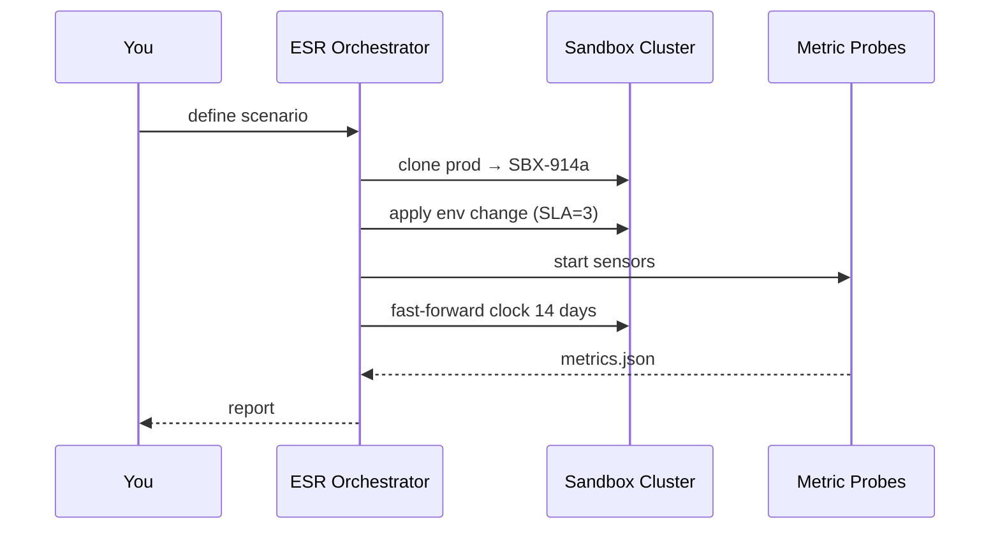

# Chapter 19: Simulation & Training Environment (HMS-ESR)

*(Follow-up to [Compliance & Auditing Framework (HMS-OPS + HMS-ESQ)](18_compliance___auditing_framework__hms_ops___hms_esq__.md))*  

---

## 1  Why Do We Need a “Sandbox City”?

Picture an ordinary morning in **Bureau of Building Safety** headquarters:

1. Congress asks:  
   *“If we cut building-permit review time from **10 days** to **3 days**, will the help-desk melt down?”*
2. We obviously cannot experiment on real citizens or real inspectors.
3. Instead, we spin up **HMS-ESR** – a **virtual city** packed with 70 000 synthetic citizens, 12 mock agencies, and full copies of our micro-services (but **zero** production data).

After a 15-minute run we see:

```
🏗️  Permits processed/day     : +240 %
☎️  Help-desk calls/day       : +35 %
⏱️  Avg. inspector workload   : 7h → 9h (⚠️ risk)
```

Decision-makers get hard numbers **before** touching real policy.

---

## 2  Key Concepts (Plain English)

| Term                     | Beginner Meaning |
|--------------------------|------------------|
| Sandbox City             | One isolated Kubernetes namespace that mirrors production services with fake data. |
| Synthetic Citizen        | JSON profile (age, address, habits) generated by ESR’s data generator. |
| Scenario                 | A *what-if* script (“shorten review SLA to 3 days”). |
| Metric Probe             | Lightweight sensor that counts errors, wait times, costs. |
| Time Warp                | ESR clock that moves 1 day every 10 seconds so week-long policies finish fast. |
| Roll-back Button         | One click that deletes every pod & DB in the sandbox. |

If you grasp “Sandbox → Scenario → Probes,” you already understand 80 % of ESR.

---

## 3  Quick-Start: Run Your First Scenario in 4 Calls

### 3.1 Create a Sandbox City

```bash
curl -X POST /api/esr/sandboxes \
  -d '{ "name":"permit-study" }'
```

Returns:

```json
{ "boxId":"SBX-914a", "status":"READY" }
```

### 3.2 Define Your “What-If” Scenario

```bash
curl -X POST /api/esr/scenarios \
  -d '{ "box":"SBX-914a",
        "name":"3-day-permits",
        "changes":[
          { "service":"permit-svc", "env":"REVIEW_SLA_DAYS", "value":"3" }
        ] }'
```

### 3.3 Pick the Probes You Care About

```bash
curl -X POST /api/esr/probes \
  -d '{ "box":"SBX-914a",
        "metrics":["permits.processed","helpdesk.calls","inspector.load"] }'
```

### 3.4 Run & Fetch the Report

```bash
curl -X POST /api/esr/run \
  -d '{ "box":"SBX-914a", "days":"14" }'

curl /api/esr/report/SBX-914a
```

Sample output:

```json
{
  "permits.processed" : { "baseline":180, "simulated":430 },
  "helpdesk.calls"    : { "baseline":40,  "simulated":54 },
  "inspector.load"    : { "baseline":7,   "simulated":9 }
}
```

You just answered the congressional question with **three tiny requests**.

---

## 4  What Happens Behind the Curtain?



No traffic touches production.  
Afterward ESR deletes the namespace unless you keep it for training.

---

## 5  Inside the Code — Bird’s Eye

```
hms-esr/
 ├─ api/            # REST endpoints above
 ├─ cloner/         # copies prod manifests
 ├─ timewarp/       # speeds up cron & timers
 ├─ generator/      # creates synthetic citizens
 ├─ probes/         # CPU-light Prometheus rules
 └─ cleanup/        # auto-teardown job
```

### 5.1 Sandbox Cloner (cloner/clone.js – 18 lines)

```javascript
export async function clone(ns){
  const prod = await k8s.list('deployments','prod')
  for(const d of prod){
     const copy = { ...d, metadata:{...d.metadata, namespace:ns}}
     delete copy.metadata.uid         // new object
     await k8s.apply(copy)            // create in sandbox
  }
}
```

*Copies every Deployment from `prod` to your sandbox namespace.*

### 5.2 Time Warp Tick (timewarp/warp.js – 10 lines)

```javascript
setInterval(()=>{
  k8s
    .pods('namespace=SBX-*')
    .exec('date -s "+1 hour"')   // warp clock
}, 250);                         // 1h sim = 0.25s real
```

### 5.3 Probe Skeleton (probes/counter.py – 15 lines)

```python
def permits_processed():
    return db.count('permits', last_24h=True)

probe_map = {
  'permits.processed': permits_processed,
  # …other probes
}

def run(box, metric):
    val = probe_map[metric]()
    store(box, metric, val)
```

---

## 6  Adding a Custom Probe in 3 Steps

1. **Write 10 lines**

```python
# probes/my_probe.py
def overdue_invoices():
    return db.count('invoice', status='OVERDUE')

register('finance.overdue', overdue_invoices)
```

2. **Declare It**

```bash
curl -X POST /api/esr/probes \
  -d '{ "box":"SBX-914a", "metrics":["finance.overdue"] }'
```

3. **Re-run** the scenario — the metric appears in the next report.

---

## 7  Training Mode for New Hires

```bash
curl -X POST /api/esr/train \
  -d '{ "box":"SBX-914a",
        "role":"permit_clerk",
        "script":"process 5 random applications" }'
```

ESR hands the trainee a private URL.  
Every click is tracked; mistakes are discarded with the sandbox.

---

## 8  Safety Rails (You Get Them “for Free”)

* **No Real Data** – Citizens are generated by `generator/`; GUID prefixes never overlap production IDs.  
* **Resource Caps** – Sandbox namespaces have CPU & DB quotas; can’t starve prod nodes.  
* **Audit Hooks** – All probe results pipe into [HMS-OPS](18_compliance___auditing_framework__hms_ops___hms_esq__.md) for replay.  
* **One-Click “Nuke”** – `DELETE /api/esr/sandboxes/SBX-914a` wipes everything in under 30 s.

---

## 9  Beginner FAQ

| Question | Short Answer |
|----------|--------------|
| *Can I simulate months in minutes?* | Yes—set `"days":90` and ESR speeds up internal clocks accordingly. |
| *Will e-mails actually send?* | No. Outbound SMTP is rerouted to a dummy mailbox UI. |
| *Can two teams share one sandbox?* | Better to create two; ESR quotas are cheap. |
| *Do I pay cloud fees twice?* | Sandboxes use minimal size pods & ephemeral volumes—few dollars/hour. |

---

## 10  What You Learned

• **HMS-ESR** spins up a zero-risk **Sandbox City** where you can experiment with new rules, code, or AI models.  
• Three REST calls (**create → scenario → run**) give you hard numbers in minutes.  
• Under the hood: *clone prod* → *time warp* → *collect probes* → *report*.  
• Adding custom probes or training scripts is a breeze.

Ready to share utility functions you wrote for those probes with the whole platform?  
Jump to the final chapter: [Shared Utilities Library (HMS-UTL)](20_shared_utilities_library__hms_utl__.md)

---

Generated by [AI Codebase Knowledge Builder](https://github.com/The-Pocket/Tutorial-Codebase-Knowledge)