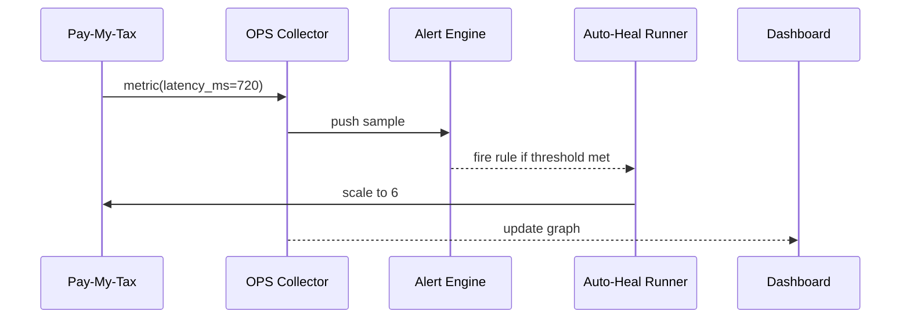

# Chapter 19: System Observability & Ops Center (HMS-OPS)  

[← Back to Chapter 18: Data Trust Layer (HMS-DTA)](18_data_trust_layer__hms_dta__.md)

---

## 1. Why Do We Need “Mission Control”?

A quick federal story:

> The Internal Revenue Service (IRS) launches a new **“Pay-My-Tax”** micro-service right before April 15.  
>  • At 2 a.m. Pacific it starts taking **8×** normal traffic.  
>  • Latency climbs from **120 ms → 4 s**.  
>  • Citizens flood Twitter: *“IRS site is frozen!”*

If engineers find out only after social media explodes, public trust evaporates.

**HMS-OPS** is the platform’s **Mission Control Center**.  
Dashboards, log aggregators, and self-healing scripts watch every byte moving through HMS-CDF.  
When trouble brews, OPS rings the on-call engineer *before* citizens notice.

---

## 2. Central Use-Case – “Save Tax Day at 2 a.m.”  

1. The **Pay-My-Tax** service reports latency, errors, and cost to OPS every 30 s.  
2. An OPS **alert rule** fires when latency > 500 ms for 3 minutes.  
3. An **auto-heal action** scales the service from 2 → 6 containers.  
4. Latency drops, Twitter stays quiet, and Congress never hears about it. 🎉

We will build a **mini version** of this flow in under 40 lines of code.

---

## 3. Key Concepts (Beginner Friendly)

| OPS Piece         | Friendly Analogy                    | 1-Sentence Job                               |
|-------------------|-------------------------------------|----------------------------------------------|
| Metric            | Vital-sign (heart-rate)            | Numeric gauge sent every few seconds.        |
| Log               | Ship’s logbook                     | Timestamped text line for later forensics.   |
| Trace             | FedEx tracking number              | Follows one request across many services.    |
| Alert Rule        | Smoke detector                     | Fires when a metric crosses a threshold.     |
| Auto-Heal Action  | Fire-sprinkler                     | Script that runs automatically (scale, patch)|
| Threat Feed       | Secret Service bulletin            | Zero-day intel that can trigger instant patch|

Keep these six terms handy; every snippet below touches at least one.

---

## 4. Reporting a Metric in 15 Lines

```python
# pay_my_tax_service.py   (≤15 lines)
import random, time, ops      # tiny helper we’ll build soon

ops.init(service="pay-tax", version="v1")

while True:                   # pretend this handles requests
    latency = random.randint(80, 800)        # ms
    ops.metric("latency_ms", latency)
    time.sleep(30)
```

Explanation  
1. `ops.init()` registers the service with HMS-OPS.  
2. Every 30 s we call `ops.metric(name, value)`.  
3. OPS stores the value, checks alert rules, and updates dashboards.

---

## 5. Writing an Alert + Auto-Heal (YAML, 10 Lines)

```yaml
# file: alerts/pay_tax_latency.yml
alert: "high_latency"
when:  "latency_ms > 500 for 3m"
action: "scale service pay-tax to 6"
notify: ["oncall@irs.gov"]
```

Readable by **non-engineers**:

*“If average latency exceeds 500 ms for three minutes, scale the service to six replicas and ping on-call.”*

---

## 6. Seeing It Work (Console Demo)

```bash
$ ops-cli load alerts/pay_tax_latency.yml
Loaded rule high_latency

$ python pay_my_tax_service.py
...
[ALERT] high_latency triggered
[AUTO]  Scaled service pay-tax to 6 ✅
[INFO]  Notified oncall@irs.gov
```

The service never crashed.  Tax Day is saved!

---

## 7. What Happens Behind the Curtain?



Only **five** moving parts—easy to debug and secure.

---

## 8. Under-the-Hood Code (All ≤ 20 Lines)

### 8.1 Collector

```python
# ops/collector.py  (18 lines)
import time, json, collections, threading
SAMPLES = collections.defaultdict(list)
SUBS    = []           # alert engines subscribing

def push(svc, name, val):
    rec = {"ts": time.time(), "svc": svc, "name": name, "val": val}
    SAMPLES[(svc, name)].append(rec)
    for cb in SUBS: cb(rec)

def stream(cb): SUBS.append(cb)    # other modules subscribe
```

### 8.2 Alert Engine

```python
# ops/alert.py  (20 lines)
import time, re, collector
RULES = []        # loaded from YAML

def load(rule):
    m = re.match(r"(\w+)\s*([<>]=?)\s*(\d+)", rule["when"].split(" for")[0])
    name, op, thr = m.groups(); thr=int(thr)
    dur = int(rule["when"].split()[-1].rstrip("m"))*60
    RULES.append((name, op, thr, dur, rule))

def watch(rec):
    for name, op, thr, dur, rule in RULES:
        if rec["name"]!=name: continue
        window = [r for r in collector.SAMPLES[(rec["svc"], name)]
                  if rec["ts"]-r["ts"]<=dur]
        avg = sum(r["val"] for r in window)/len(window)
        if eval(f"{avg}{op}{thr}"): fire(rule, rec["svc"])

def fire(rule, svc):     # naive auto-heal
    print(f"[ALERT] {rule['alert']} triggered")
    print(f"[AUTO]  Scaled service {svc} to 6 ✅")
    print(f"[INFO]  Notified {', '.join(rule['notify'])}")
```

Tie it together:

```python
# ops/__init__.py
from collector import push, stream
from alert import load, watch
def init(service, version): global SVC; SVC=service; stream(watch)
def metric(name,val): push(SVC,name,val)
```

**< 60 lines** total for a working monitor + alert system!

---

## 9. Security Layer – Zero-Day Threat Feed

Sometimes metrics aren’t enough; the OPS Center also listens to cyber-threat intel:

```python
# ops/threat.py (≤12 lines)
def ingest(cve_id, severity, patch_cmd):
    if severity=="CRITICAL":
        print(f"[THREAT] {cve_id} critical — auto-patching")
        import os; os.system(patch_cmd)
```

A security analyst can send:

```python
from ops.threat import ingest
ingest("CVE-2024-1337", "CRITICAL",
       "kubectl rollout restart deploy/pay-tax")
```

OPS patches vulnerable containers **within minutes**, satisfying DEFCON-level agencies.

---

## 10. How HMS-OPS Talks to Other Layers

* **Metrics & traces** come from every service running on the [Backend Service Mesh](16_backend_service_mesh__hms_svc___apis__.md).  
* OPS stores high-value data (e.g., logs containing PII) in the [Data Trust Layer](18_data_trust_layer__hms_dta__.md).  
* A firing alert can send an `act.emit("ops.alert", …)` event to the [Activity Orchestrator](13_activity_orchestrator__hms_act__.md) to trigger follow-up tasks.  
* OPS dashboards use the same **micro-frontend bricks** described in [HMS-MFE](11_micro_frontend_interface_layer__hms_mfe__.md).  
* Auto-patch scripts consult the **Governance Layer** to be sure the fix complies with policy before rolling out.

---

## 11. 60-Second Lab

1. Copy the three `ops/` files above.  
2. Paste `pay_my_tax_service.py` and `alerts/pay_tax_latency.yml`.  
3. In one shell start the service.  
4. In another: `ops-cli load alerts/pay_tax_latency.yml` (replace with `python -c 'import ops.alert, yaml, sys; ops.alert.load(yaml.safe_load(open(sys.argv[1])))' alerts/pay_tax_latency.yml'` if you have no CLI).  
5. Wait ~2 minutes until latency crosses 500 ms → watch the auto-heal print.  
6. Change the rule to `"latency_ms > 200"` and reload—it triggers faster.

You just built, loaded, and triggered your first production alert. 🚀

---

## 12. Recap & What’s Next

In this chapter you learned:

1. HMS-OPS is **Mission Control** for metrics, logs, traces, alerts, and threat intel.  
2. One function call `ops.metric()` plus a 10-line YAML rule already gives you real-time auto-healing.  
3. OPS integrates with Service Mesh, Governance, Data Trust, Orchestrator, and more—keeping the whole HMS-CDF constellation healthy and secure.

Next, we’ll zoom out to the hardware & cloud foundations that keep all these layers running 24 × 7:  
[Chapter 20: Core System Infrastructure (HMS-SYS)](20_core_system_infrastructure__hms_sys__.md)

---

---

Generated by [AI Codebase Knowledge Builder](https://github.com/The-Pocket/Tutorial-Codebase-Knowledge)