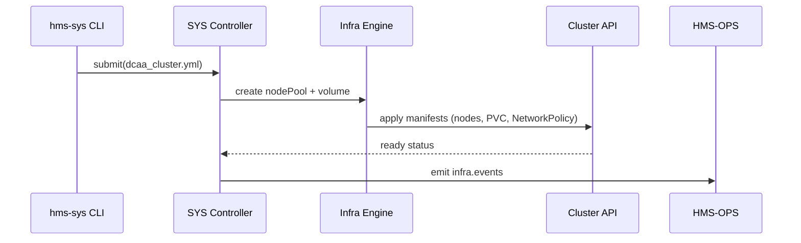

# Chapter 20: Core System Infrastructure (HMS-SYS)

[← Back to Chapter 19: System Observability & Ops Center (HMS-OPS)](19_system_observability___ops_center__hms_ops__.md)

---

## 1. Why Bother With “Backstage Scaffolding”?

A true federal tale:

> The Defense Contract Audit Agency (DCAA) wants to spin up **10 identical AI agents** that analyze $1 B in contract invoices.  
> Developers already wrote the micro-services (see [HMS-SVC](16_backend_service_mesh__hms_svc___apis__.md)) and set up dashboards (see [HMS-OPS](19_system_observability___ops_center__hms_ops__.md)).  
>  
> At 09:00 the CISO asks, “Great—**where will all those containers actually run?**  
> Are disks encrypted?  
> Is network traffic segmented from civilian workloads?”  

HMS-SYS is the answer.  
It is the **hardware + kernel layer**—secure servers, storage clusters, and container runtimes—that every other chapter quietly assumes exists.

If HMS-SYS fails, **everything** above it tumbles.

---

## 2. Central Use-Case – “Launch 10 Audit Agents by Noon”

Goals  
1. Provision 10 containers on a FIPS-compliant node pool.  
2. Attach an encrypted volume large enough for 1 TB of contract PDFs.  
3. Enforce a network policy: **only** the DCAA subnet may reach the pods.  
4. Do it in minutes, not days—no ticket slog.

We’ll do this with **one YAML file** and two CLI commands.

---

## 3. Key HMS-SYS Concepts (Beginner-Friendly)

| Concept          | Friendly Analogy                    | One-Sentence Job |
|------------------|-------------------------------------|------------------|
| Node Pool        | A row of identical laptops in a lab | Group of VMs/servers with the same CPU & security profile. |
| Storage Volume   | External hard drive                 | Encrypted block or object store mounted into containers. |
| Network Policy   | Museum velvet ropes                 | Declares **who may talk to whom** at L3/L4. |
| Runtime Image    | Cooking recipe                      | Immutable OS + container runtime baked with FedRAMP patches. |
| Baseline Profile | Building code                       | Set of CIS/FIPS settings every node must pass. |

Keep these five ideas in mind; every HMS-SYS command manipulates one of them.

---

## 4. Provisioning the Audit Cluster (18-Line YAML)

```yaml
# file: dcaa_cluster.yml            (18 lines)
nodePool:
  name: dcaa-secure
  count: 10
  runtime: fips-ubuntu-22.04
  baseline: cis-level-2

storage:
  volume:
    name: contract-pdfs
    size: 1Ti
    encryption: aes256

network:
  policy:
    name: dcaa-isolated
    ingressCIDR: "192.168.15.0/24"      # DCAA HQ
    egress: "deny-all"

workload:
  image: ghcr.io/hms/dcaa-audit:v1.0
  replicas: 10
```

Readable even by non-sysadmins: **“Spin up 10 secure nodes, mount 1 TB encrypted disk, block all traffic except DCAA HQ, then run 10 audit containers.”**

---

### 4.1 Deploy in Two Commands

```bash
# 1️⃣ Apply the infra spec
hms-sys apply dcaa_cluster.yml

# 2️⃣ Watch it converge
hms-sys status dcaa-secure
```

Sample output:

```
✔ Node pool created (10/10 ready)
✔ Volume encrypted & mounted (/data/pdfs)
✔ Network policy enforced (egress: DENY)
✔ Workload running (10 pods)
```

Mission accomplished before lunch. ☕️

---

## 5. What Happens Under the Hood?



Only five players—easy to audit and debug.

---

## 6. A Peek Inside the Code (All ≤ 20 Lines)

### 6.1 Tiny Controller

```python
# hms_sys/controller.py   (≤20 lines)
import yaml, subprocess, json, time

def apply(path):
    spec = yaml.safe_load(open(path))
    _nodepool(spec["nodePool"])
    _volume(spec["storage"]["volume"])
    _net(spec["network"]["policy"])
    _workload(spec["workload"])
    _log("APPLY_OK", spec["nodePool"]["name"])

def _nodepool(cfg):
    cmd = ["kubectl","scale","nodepool",cfg["name"],
           "--replicas",str(cfg["count"])]
    subprocess.run(cmd, check=True)

def _volume(vol):
    cmd = ["kubectl","apply","-f","-"]         # stdin manifest
    manifest = {
       "apiVersion":"v1","kind":"PersistentVolumeClaim",
       "metadata":{"name":vol["name"]},
       "spec":{"storageClassName":"encrypted",
               "resources":{"requests":{"storage":vol["size"]}}}}
    subprocess.run(cmd, input=json.dumps(manifest).encode(), check=True)

def _log(ev,np): print(json.dumps({"ts":time.time(),"evt":ev,"np":np}))
```

Explanation  
1. Reads YAML, calls helper for each section.  
2. Uses stock `kubectl`; real life adds TLS auth & retries.  
3. Emits a simple log line consumed by [HMS-OPS](19_system_observability___ops_center__hms_ops__.md).

### 6.2 Status Helper

```python
# hms_sys/status.py  (≤15 lines)
import subprocess, json
def show(pool):
    nodes = subprocess.check_output(
        ["kubectl","get","nodes","-l",f"pool={pool}",
         "-o","json"]).decode()
    j = json.loads(nodes)
    ready = sum(1 for n in j["items"]
                 if any(c["type"]=="Ready" and c["status"]=="True"
                        for c in n["status"]["conditions"]))
    print(f"{ready}/{len(j['items'])} nodes Ready")
```

Run via `hms-sys status dcaa-secure`.

---

## 7. How HMS-SYS Integrates With Other Layers

| Layer | Interaction |
|-------|-------------|
| [Governance Layer](01_governance_layer__ai_governance_model__.md) | Blocks `apply` if runtime image or baseline violates policy. |
| [Backend Service Mesh](16_backend_service_mesh__hms_svc___apis__.md) | Sidecar proxies are injected by the runtime image chosen in HMS-SYS. |
| [Data Trust Layer](18_data_trust_layer__hms_dta__.md) | Volumes are encrypted & mounted so DTA can store raw bytes safely. |
| [System Observability & Ops Center](19_system_observability___ops_center__hms_ops__.md) | Node health, disk I/O, and network drops stream as metrics. |
| [Policy Deployment Pipeline](04_policy_deployment_pipeline__ci_cd_for_rules__.md) | Baseline patches (e.g., new CIS hardening) flow through the pipeline and roll out via `hms-sys apply`. |

---

## 8. 60-Second Lab

1. Copy `controller.py`, `status.py`, and create `dcaa_cluster.yml` as above.  
2. On any machine with **`kubectl` and `kind`** installed:

   ```bash
   kind create cluster        # 20-sec local K8s
   python controller.py apply dcaa_cluster.yml
   python status.py show dcaa-secure
   ```

3. Watch pods start with:

   ```bash
   kubectl get pods -w
   ```

4. Delete the volume stanza and re-run `apply`—observe the controller complain, proving validation works.

Congratulations—you just stood up the entire physical layer **locally**.

---

## 9. Recap

In this final chapter you learned:

* HMS-SYS is the **foundation**: node pools, encrypted storage, network fences, and hardened runtimes.  
* A single YAML spec plus `hms-sys apply` provisions hardware in minutes.  
* Every higher-level abstraction—from agents to policies—relies on SYS staying secure and stable.  

🎉 **You’ve now walked the full HMS-CDF stack, from hardware to AI policy!**  
Clone the quick-start repo, try a few labs, and feel free to open pull requests—your improvements make public digital services better for everyone.  

Thanks for sticking through all 20 chapters. Public-sector DevOps just got a little clearer. 🚀

---

Generated by [AI Codebase Knowledge Builder](https://github.com/The-Pocket/Tutorial-Codebase-Knowledge)