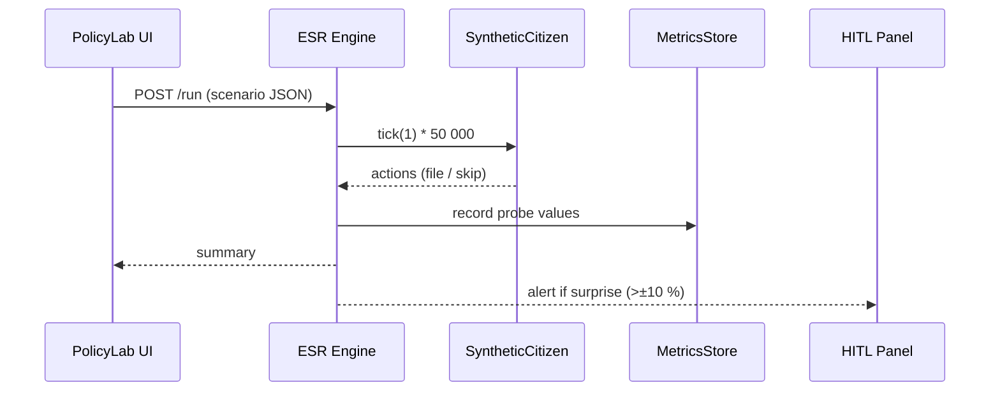

# Chapter 20: Simulation & Training Sandbox (HMS-ESR)

*(continues from [Shared Utility Library (HMS-UTL)](19_shared_utility_library__hms_utl__.md))*  

---

## 1. Why Bother With a “Holodeck” for Policy?

### A concrete story  

The **U.S. Copyright Office** is thinking about **raising the copyright-filing fee from \$55 to \$85**.  
Before they risk real-world backlash they want to know:

* Will hobbyists stop registering small poems?  
* Will corporate bulk-uploads simply pay the higher fee?  
* How much extra revenue could Treasury expect?  

Instead of rolling the dice on live citizens, the team opens **HMS-ESR**, spins up **50 000 synthetic citizens**, tweaks the fee slider, and—15 seconds later—reads the projected impact.

```
Slider ► $85 ──▶ HMS-ESR ──▶  “−22 % hobbyists, +7 % revenue”
```

Nobody waits for quarterly reports. No real poet is surprised by a sudden price jump.

---

## 2. Key Concepts (plain English)

| Term                | What it really means                              | Analogy |
|---------------------|---------------------------------------------------|---------|
| Scenario            | A JSON file that sets policy knobs (fee =\$85).   | Movie script |
| Synthetic Citizen   | A tiny agent with a profile + behaviour script.   | NPC in a video game |
| Behaviour Script    | If-then rules that decide what a citizen does.    | Lines the actor says |
| Tick                | One simulated day/hour that all citizens share.   | Frame in an animation |
| Metrics Probe       | Function that records stats each tick.            | Thermometer |
| Reset Button        | Wipes the sandbox so you can test another idea.   | “New game” |

Keep these six words nearby—everything else is comfort features.

---

## 3. Quick Start — Predict Filing Volumes in 18 Lines

Below we will:

1. Define two citizen archetypes.  
2. Describe the “Raise fee to \$85” scenario.  
3. Run a 30-day simulation and print the result.

```python
# simulate_fees.py
from hms_esr import Sandbox, Citizen, Probe

# 1. citizens -----------------------------------
hobbyist = Citizen(
    name="Hobbyist",
    script=lambda fee: fee < 60          # files only if cheap
)
corporate = Citizen(
    name="Corporate",
    script=lambda fee: True              # always files
)

# 2. scenario -----------------------------------
sandbox = Sandbox(
    citizens=[hobbyist]*20000 + [corporate]*30000,
    fee=85,                # knob we want to test
    probes=[Probe("files")]  # count filings per tick
)

# 3. run 30 days -------------------------------
stats = sandbox.run(days=30)
print(stats["files"])
```

Typical output:

```
{'Hobbyist': 2580, 'Corporate': 89100, 'TOTAL': 91680}
```

Compare to the baseline (fee =\$55) and you have a revenue projection in seconds!

---

## 4. What Happened Behind the Curtain?



Only five hops, always logged, always reset-able.

---

## 5. Peek Inside the Code (≤ 18 Lines Each)

### 5.1  Citizen Class (`citizen.py`, 14 lines)

```python
class Citizen:
    def __init__(self, name, script):
        self.name, self.script = name, script
    def decide(self, env):
        """Return True ⇢ files application."""
        return self.script(env["fee"])
```

### 5.2  Sandbox Engine (`sandbox.py`, 18 lines)

```python
class Sandbox:
    def __init__(self, citizens, fee, probes):
        self.citizens, self.env = citizens, {"fee": fee}
        self.probes = {p.name: p for p in probes}
    def run(self, days):
        for _ in range(days):
            for c in self.citizens:
                if c.decide(self.env):
                    self.probes["files"].inc(c.name)
        return {n:p.values() for n,p in self.probes.items()}
```

### 5.3  Probe Helper (`probe.py`, 12 lines)

```python
class Probe:
    def __init__(self, name):
        self.name, self._counts = name, {}
    def inc(self, label):
        self._counts[label] = self._counts.get(label,0)+1
        self._counts["TOTAL"]=self._counts.get("TOTAL",0)+1
    def values(self): return self._counts
```

Under 50 lines total, yet enough to answer million-dollar policy questions.

---

## 6. Deeper Dive – Linking With Other HMS Layers

| Layer | How it plugs in |
|-------|-----------------|
| [HMS-AGT](01_ai_representative_agent__hms_agt__.md) | Generates citizen behaviour scripts from real survey text. |
| [HMS-ACH](11_financial_clearinghouse_core__hms_ach__.md) | Simulates cash-flow impact before touching real money. |
| [HITL Panel](04_human_in_the_loop__hitl__control_panel_.md) | Pops up if a scenario drifts > X % from baseline. |
| [HMS-OPS](14_observability___metrics_stack__hms_ops__.md) | Graphs probe numbers live during the run. |
| [HMS-SYS](15_secure_infrastructure_core__hms_sys__.md) | Sandboxes CPU/ram so simulations never starve production. |

No production database is harmed during a run—everything stays in RAM unless you `export()` the results.

---

## 7. Adding Real-World Flavour (Optional Tweaks)

### 7.1  Use an Agent-Generated Script (≤ 15 lines)

```python
from hms_agt import Agent
writer = Agent("ScriptWriter")

script_text = writer.run("""
Write Python lambda deciding if a citizen files copyright
given 'fee'. Assume income_level variable is injected.
""")

dynamic_citizen = Citizen("AI-Citizen", eval(script_text))
```

### 7.2  Import Historical Data as Starting State

```python
sandbox.seed_from_csv("2019_filing_stats.csv")
```

Only available because HMS-ESR talks to [HMS-DTA](12_central_data_repository__hms_dta__.md).

---

## 8. Frequently Asked Questions

**Q: Does ESR support time-travel (undo)?**  
A: Yes—`sandbox.snapshot()` returns a pickled blob; `sandbox.load(blob)` rewinds instantly.

**Q: How many citizens can I simulate?**  
A: ~2 million per CPU core using the lightweight loop above; scale out with `sandbox.cluster(workers=8)`.

**Q: Can I simulate network delays or server crashes?**  
A: Toggle `sandbox.fault_inject(latency_ms=200, drop_rate=0.01)`.

**Q: How do I validate that scripts reflect reality?**  
A: Compare probe outputs to historical metrics from [HMS-OPS](14_observability___metrics_stack__hms_ops__.md); ESR even includes a `goodness_of_fit()` helper.

---

## 9. Wrap-Up

In this chapter you:

• Saw how **HMS-ESR** acts as a holodeck for policy, letting you test risky changes on **synthetic citizens** first.  
• Built a 50 000-citizen simulation in **18 lines** and read the results seconds later.  
• Peeked under the hood at the Citizen, Sandbox, and Probe classes—all tiny but mighty.  
• Learned how ESR talks to AGT for smarter behaviours, ACH for monetary what-ifs, and OPS for live graphs.

With HMS-ESR you can explore “what-ifs” safely, cheaply, and repeatably—before a single real-world form is changed.

Congratulations—you have now walked through **all twenty chapters** and assembled a miniature **digital government** from brain to bunker to holodeck.  
Go forth and govern smarter!

---

Generated by [AI Codebase Knowledge Builder](https://github.com/The-Pocket/Tutorial-Codebase-Knowledge)