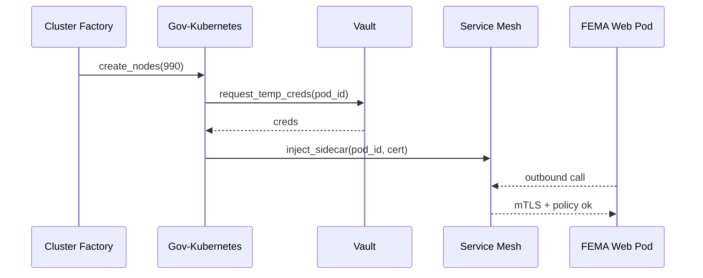

# Chapter 22: Low-Level System Infrastructure (HMS-SYS)

*(coming from [AI Governance Value Guardrails](21_ai_governance_value_guardrails_.md))*  

---

## 1 · Why Does HMS-NFO Need a “Hidden Foundation”?

> 3 am on a hurricane night—**FEMA** disaster site jumps from **200 → 90 000 users** in minutes.  
> Officers approve \$12 million in grants, AI agents draft letters, payments queue up.  
>  
> None of that matters if:  
> • containers can’t scale,  
> • network certificates expired, or  
> • keys from last year still unlock production.  
>
> **HMS-SYS** is the invisible **bedrock** that keeps every higher-level service **secure, elastic, and compliant** while you sleep.

---

## 2 · Beginner Mental Model

| Piece | Friendly Analogy | Why It Matters |
|-------|------------------|----------------|
| Container Fleet | Food-truck row | Each micro-service cooks in its own clean kitchen |
| Service Mesh | Waze for food trucks | Finds safe routes, encrypts every hop |
| Secrets Vault | Bank safe-deposit box | Keys & tokens rotate automatically |
| Cluster Factory | Pop-up kitchens | Spins new clusters in FedRAMP regions on demand |
| Zero-Trust Gate | ID check at every door | No “inside” network—every call proves itself |

Keep these five ideas in mind; everything else is just plumbing.

---

## 3 · A 5-Minute FEMA Scaling Story

Goal: burst from **10 → 1 000 web pods** in under two minutes **without** leaking a single key.

### 3.1  Declare a “Burst Plan”

```python
# burst_plan.py   (18 lines)
from hms_sys import Cluster, Burst

plan = Burst(
    service   = "fema-portal",
    from_pods = 10,
    to_pods   = 1000,
    max_cost  = "200USD/hr"
)

Cluster.schedule(plan)
print("🚀 Burst queued:", plan.id)
```

**What happens next?**

1. HMS-SYS allocates extra nodes in the **us-gov-east** FedRAMP region.  
2. A **zero-trust sidecar** injects new mTLS certificates into every pod.  
3. Secrets Vault issues **one-hour DB creds** (old ones auto-revoke).  
4. Monitoring rules (from [HMS-OPS](20_monitoring___operations_center__hms_ops__.md)) expand to cover new pods.

---

## 4 · Key Concepts in Plain Words

### 4.1 Containers vs. Pods  
*Each service lives in a box with its own utensils.*  
If one box catches fire, others stay safe.

### 4.2 Zero-Trust Mesh  
*Every courier shows a badge at **every** door—no “trusted LAN.”*  
Mesh proxies handle TLS and policy, so app code stays clean.

### 4.3 Secrets Rotation  
*Like hotel key-cards that stop working after checkout.*  
Tokens & DB passwords auto-rotate (default: every 24 h).

### 4.4 Cluster Factory  
*A vending machine that spits out whole Kubernetes clusters.*  
Choose region, size, compliance level—ready in ~7 min.

---

## 5 · Under the Hood — 10-Second Tour



Only five moving parts; each one is replaceable without breaking the others.

---

## 6 · Hands-On: “Hello, Secure World” Pod

Below we launch **one** demo pod that prints “hello” and **proves** it received credentials **at runtime**, not baked in.

```python
# hello_pod.py   (20 lines)
from hms_sys import Pod, Vault

pod = Pod(
    name     = "demo-hello",
    image    = "python:3.12-slim",
    command  = ["python","-c","import os, time, secrets;"
                         "print('hello');"
                         "print('DB=' + os.environ['DB_URL']);"
                         "time.sleep(3600)"]
)

Pod.deploy(pod)

# 🔍 read the live env var via Vault API
creds = Vault.inspect(pod_id=pod.id)
print("Live DB url:", creds["DB_URL"])
```

Expected output in pod logs:

```
hello
DB=postgres://vault-temp:***
```

You never stored the password in Git; Vault injected it seconds before start.

---

## 7 · A Peek at the Minimal APIs

### 7.1  Burst Scheduler (12 lines)

```python
# hms_sys/burst.py
def schedule(plan):
    nodes = plan.to_pods - plan.from_pods
    region = pick_region(cost=plan.max_cost)
    cf.request_nodes(nodes, region)
    mesh.add_policy(plan.service, new_nodes=nodes)
    vault.pre_issue_temp_creds(plan.service, ttl="1h")
```

### 7.2  Zero-Trust Sidecar Injector (14 lines)

```python
# hms_sys/mesh.py
def inject_sidecar(pod):
    cert = ca.issue(pod.id, ttl="25h")
    pod.add_container(
        name="zt-proxy",
        image="mesh-proxy:latest",
        env={"POD_CERT": cert}
    )
```

### 7.3  Key Rotation Cron (10 lines)

```python
# hms_sys/vault.py
def rotate_all():
    for secret in secrets.expiring(<6h):
        new = secrets.generate()
        vault.store(secret.name, new, ttl="24h")
```

*Takeaway*: real code uses cloud SDKs, but concept is **simple loops + API calls**.

---

## 8 · Common Beginner Questions

| Q | A |
|---|---|
| **Do I need to know Kubernetes?** | No. HMS-SYS exposes Python & CLI helpers; K8s details stay hidden. |
| **What if a pod keeps old creds cached?** | Mesh blocks traffic when certs expire—forcing pod restart or manual rotate. |
| **Can I pick AWS vs. Azure gov clouds?** | Yes—`Cluster.create(provider="azure-gov")` does the same dance. |
| **How are FedRAMP controls met?** | Factory templates bake in CIS hardening, FIPS crypto, audit shipping to [HMS-OPS](20_monitoring___operations_center__hms_ops__.md). |

---

## 9 · Putting It All Together

1. **Apps** containerise; HMS-SYS scales them (no YAML nightmares).  
2. **Mesh** encrypts every hop; no trust assumptions.  
3. **Vault** rotates secrets; keys live hours, not months.  
4. **OPS** watches health; **Burst** or **auto-heal** use the same infra calls.  
5. Everything stays inside **FedRAMP** boundaries.

---

## 10 · You Learned

• HMS-SYS is the unseen **bedrock**—containers, keys, clusters, mesh.  
• Launching, bursting, and securing services took **< 20 lines each**.  
• Internal magic is just loops + API calls—nothing mystical.

Next you’ll get a **developer sandbox** that speaks the *exact same* APIs so you can test locally **before** touching prod:  
[Development & Testing Toolkit (HMS-DEV)](23_development___testing_toolkit__hms_dev__.md) 🚀

---

Generated by [AI Codebase Knowledge Builder](https://github.com/The-Pocket/Tutorial-Codebase-Knowledge)