# United States African Development Foundation (USADF)

## Agency Overview

The USADF supports African-led development by providing seed capital and technical support to community enterprises, focusing on underserved and marginalized populations in Africa. It emphasizes participatory development, invests in local enterprises, and measures success in terms of jobs created, increased income levels, and improved social conditions.

**Core Function:** Direct capital allocation to underdeveloped areas

## First Principles Analysis

At its core, USADF exists to channel American resources directly to grassroots African enterprises. Its fundamental function is to catalyze economic development through local ownership rather than external direction. The agency operates on the principle that sustainable development emerges from community-driven initiatives, with success measured tangibly through economic metrics and social outcomes. This bottom-up approach recognizes that effective international development requires empowering local stakeholders with capital and technical knowledge, allowing solutions to emerge organically from within communities rather than being imposed from outside.

### Fundamental Principles

- Economic growth requires initial capital investment
- Local solutions are more sustainable than external ones
- Small-scale enterprise creates resilient economic networks
- Foreign policy interests align with economic development in strategic regions

### Key Mechanisms

- Bypass traditional aid bureaucracy through direct funding
- Measure success by economic outcomes rather than input metrics
- Create self-sustaining systems rather than dependency relationships

## Abundance-Based Economic Model Integration

USADF embodies the HMS abundance-based economic model through its focus on creating multi-party value networks across African communities and global markets. Rather than viewing development as a zero-sum allocation of scarce resources, USADF implements a collaborative approach that unlocks value chains through Nth-degree deal structures.

### Agency Role in Multi-Party Deals

USADF serves as a key node in the multi-party deal ecosystem by:

1. **Capital Provider**: Deploying strategic investments that enable local enterprises to participate in broader value chains
2. **Deal Facilitator**: Creating connections between African producers, regional markets, and global supply chains
3. **Network Enhancer**: Identifying opportunities where small, targeted investments can unlock disproportionate economic activity through multi-party deals
4. **Value Multiplier**: Implementing Moneyball-style analytics to identify undervalued economic sectors with high growth potential

### Multi-Party Deal Structures


In this 4th-degree deal structure, USADF's initial investment enables a local cooperative to produce at scale, which provides consistent supply to regional distributors, unlocking access to global exporters. This creates a value chain that returns multiple benefits:

1. The local cooperative gains stable market access and improved income
2. Regional distributors build business around reliable supply
3. Global exporters access unique products with verifiable sourcing
4. Multiple countries benefit from trade and development relationships

### Alternative Finance Models

USADF increasingly implements alternative finance mechanisms to maximize value creation:


### Moneyball Trade Analytics

USADF uses HMS-NFO Moneyball analytics to identify the most promising sectors for investment, measuring:

1. **Trade WAR Score**: Calculated value above replacement for each potential investment
2. **Chain Value Creation**: Total economic impact across all parties in multi-party deals
3. **Value Capture Distribution**: How economic value is distributed among participants
4. **Scaling Potential**: Ability to replicate successful models across regions

```mermaid
xychart-beta
    title "Trade Value Creation Metrics by Sector"
    x-axis [Agriculture, Textiles, Renewable Energy, Digital Services, Food Processing]
    y-axis "Value Multiplier (×)"
    bar [3.2, 2.5, 4.7, 5.8, 3.9]
```



### Economic Impact Visualization

The multi-party deal approach has demonstrated significant impact across African development projects:

```mermaid
sankey-beta
    USADF Investment $1M -> Agricultural Coops $400K
    USADF Investment $1M -> Tech Startups $350K
    USADF Investment $1M -> Women's Enterprises $250K
    Agricultural Coops $400K -> Local Employment $150K
    Agricultural Coops $400K -> Export Markets $800K
    Agricultural Coops $400K -> Regional Trade $450K
    Tech Startups $350K -> Digital Services $700K
    Tech Startups $350K -> Local Employment $200K
    Women's Enterprises $250K -> Local Markets $400K
    Women's Enterprises $250K -> Regional Trade $350K
    Local Employment $150K -> Community Development $600K
    Export Markets $800K -> Foreign Exchange $1.2M
    Regional Trade $450K -> Market Integration $900K
    Regional Trade $350K -> Market Integration $900K
    Foreign Exchange $1.2M -> Country Revenue $800K
    Country Revenue $800K -> Development Reinvestment $300K
    Development Reinvestment $300K -> USADF Investment $1M
```

This Sankey diagram demonstrates how USADF's initial $1M investment generates over $5M in economic activity through the multi-party deal structure, with value flowing back into development reinvestment.

## HMS-NFO Integration

The HMS-NFO system provides specialized data and analytics services tailored to USADF's mission. The following components are particularly relevant:

- **Learning System**: Continuously improves data accuracy and analysis
- **Moneyball Analytics Framework**: Identifies undervalued opportunities in trade and economic data
- **Knowledge Integration Engine**: Processes and integrates data into a unified knowledge framework

### Integration with Deal Process Engine


## Tutorial Examples

The following tutorials demonstrate how to use HMS-NFO with USADF:

1. [Using Learning System with USADF](../tutorials/adf_learning_system_tutorial.md)
2. [Using Moneyball Analytics Framework with USADF](../tutorials/adf_moneyball_analytics_framework_tutorial.md)
3. [Using Knowledge Integration Engine with USADF](../tutorials/adf_knowledge_integration_engine_tutorial.md)
4. [Implementing Multi-Party Deal Structures](../tutorials/adf_multi_party_deals_tutorial.md)
5. [Alternative Finance Models for Development](../tutorials/adf_alt_finance_tutorial.md)