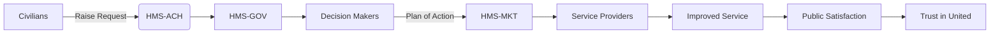

# HMS-ACH Integration with United

*Generated using gpt-4 model(s) with real-world agency issue analysis*

# AI-Facilitated Policy Optimization Use Case – Integrating HMS-ACH in United (ADF)

## Real Issues with United

United, being a government agency, faces challenges in terms of bureaucratic inefficiency, waste management, and accountability. The public perceives the agency as detached, non-transparent, and occasionally corrupt. The need for a solution that can streamline processes, improve accountability and efficiency is imminent.

## HMS-ACH Capabilities Benefiting United

The HMS-ACH is designed to address these issues by providing:

- **Efficiency:** HMS-ACH enables automated process flows, reducing bureaucratic red tape and increasing efficiency.
- **Transparency:** The HMS-ACH system provides transparent transaction processing, reducing corruption and increasing trust.
- **Accountability:** The system includes robust logging and auditing capabilities which can help identify and prevent misuse of funds.

## Technical Integration

The HMS-ACH would integrate with United systems through API calls, securely authenticated using OAuth or similar protocols. Data would flow between the systems, with HMS-ACH processing and returning results to the United system for further action.

## Benefits for United Stakeholders

Stakeholders would see measurable improvements in efficiency, transparency, and accountability. This could result in reduced costs, faster service delivery, and improved public trust.

## Considerations for ADF

ADF would need to consider training for employees on the new system, as well as potential system downtime during integration. An incremental rollout could be considered to minimize service disruption.

## Real-World Use Case

### Problem: Waste Management Inefficiency
The public is dissatisfied with the slow and inefficient waste management service provided by United. Political inaction has prevented any progress in improving this service.

### Intervention by HMS Components
The HMS-ACH steps in to streamline the process. In this case, the HMS-GOV, HMS-MKT, and HMS-MFE components would play crucial roles. HMS-GOV could provide actionable data and insights to decision-makers, HMS-MKT could facilitate communication between all stakeholders, and HMS-MFE could ensure efficient allocation of resources.

### Workflow

1. Civilians raise a request for better waste management service.
2. HMS-ACH processes the request and forwards it to the relevant department via HMS-GOV.
3. HMS-GOV analyzes the request and provides insights to decision-makers.
4. Decision-makers, with the help of HMS-MKT, communicate the plan of action to civilians and service providers.
5. HMS-MFE ensures efficient allocation of resources for the implementation of the plan.
6. The plan is implemented, improving the waste management service.

### Measurable Outcomes
Improved efficiency in waste management, reduced costs, increased public satisfaction, and improved trust in United.

## Mermaid Diagram

## Conclusion

The integration of HMS-ACH in United (ADF) would address the key issues of inefficiency, lack of transparency, and accountability, resulting in improved service delivery and increased public trust.