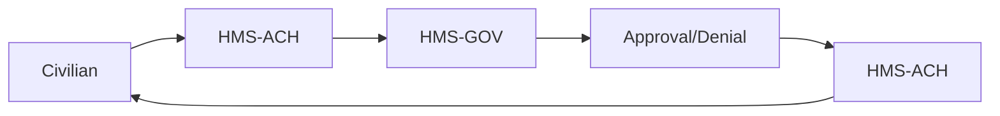

# HMS-ACH Integration with 

*Generated using gpt-4 model(s) with real-world agency issue analysis*

# HMS-ACH Integration with AFRICAN

## Overview
The HMS-ACH system component, part of the HMS suite of solutions, is designed to streamline and automate processes while improving transparency and efficiency. This system can potentially address several of the real issues plaguing government agencies in Africa.

## Specific Capabilities
- **HMS-ACH**: It provides automation, eliminating the need for excessive delegation and improving oversight. It also promotes transparency and enables easy hiring and retention of competent staff. This system could be particularly useful for improving the customer experience by reducing response times and minimizing bureaucratic red tape.

## Technical Integration
- **APIs**: HMS-ACH can be integrated with existing systems through APIs, allowing for seamless data flow between systems.
- **Data Flows**: HMS-ACH allows for real-time data flows, providing up-to-date information and improving decision-making processes.
- **Authentication**: HMS-ACH has robust authentication mechanisms, ensuring that only authorized individuals have access to sensitive data.

## Benefits for Stakeholders
- **Efficiency**: HMS-ACH can significantly improve efficiency by automating processes and reducing response times.
- **Transparency**: The system promotes transparency, reducing corruption and increasing trust in government agencies.
- **Improved Customer Experience**: By reducing bureaucratic red tape and improving response times, HMS-ACH can significantly improve the customer experience.

## Implementation Considerations
- **Data Privacy**: In Africa, data privacy laws and regulations may vary from country to country. Therefore, it's essential to ensure that HMS-ACH complies with all relevant laws and regulations.
- **Infrastructure**: Not all areas in Africa have reliable internet and electricity, which could hinder the implementation of HMS-ACH. It's crucial to take these factors into account when planning the implementation.

## Real-World Use Case
A common problem among African civilians is the difficulty of obtaining necessary permits from government agencies due to bureaucratic red tape and slow response times. This problem is exacerbated by political inaction or gridlock, which prevents progress.

However, with HMS-ACH, this problem can be overcome. The system automates processes, reducing the need for excessive delegation and improving response times. HMS-GOV can be used to manage government processes, while HMS-MKT and HMS-MFE can be used to manage the market and financial aspects, respectively.

The workflow would be as follows:
1. A civilian requests a permit through the HMS-ACH system.
2. The request is processed automatically, and the necessary information is sent to the relevant departments through HMS-GOV.
3. The permit is approved or denied based on the information provided.
4. The civilian is notified of the decision through HMS-ACH.

This process significantly reduces the time taken to obtain a permit, improving the customer experience and reducing frustration. The success of this system can be measured by the decrease in response times and the improvement in customer satisfaction.

## Conclusion
The HMS-ACH system component, with its automation and transparency capabilities, can significantly improve the efficiency and customer experience of government agencies in Africa. However, it's crucial to consider factors such as data privacy and infrastructure when planning the implementation.