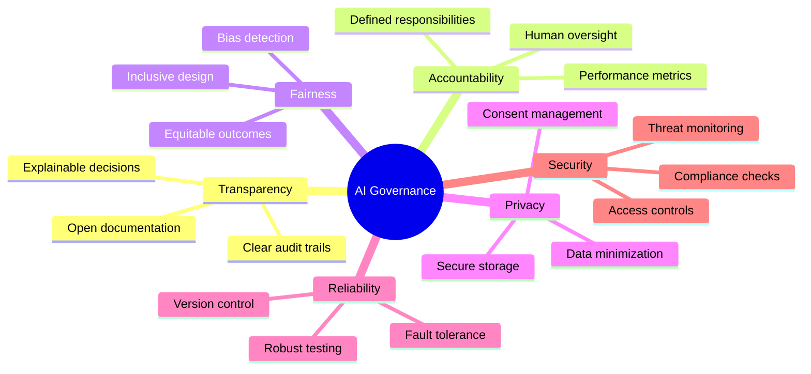
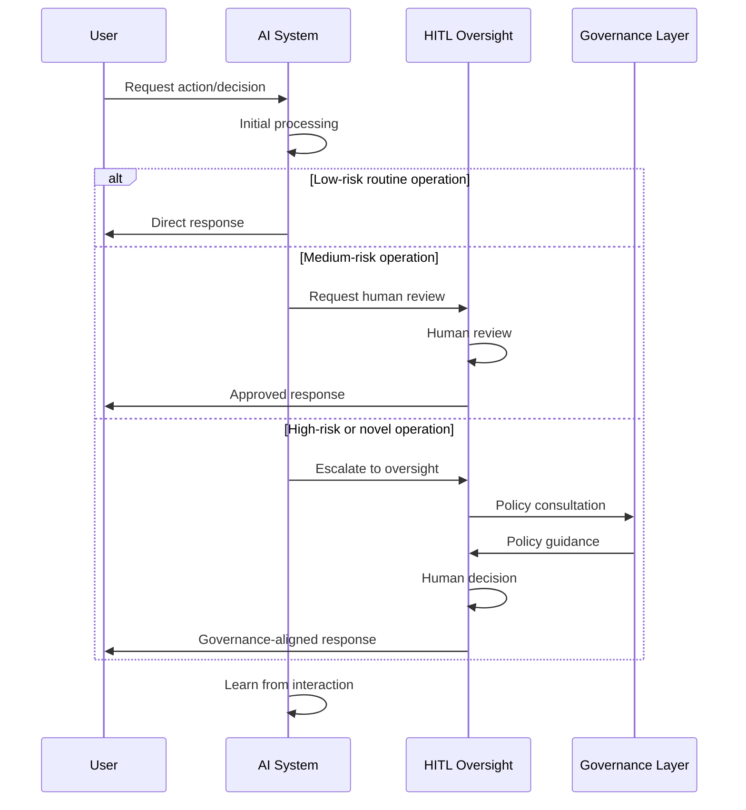
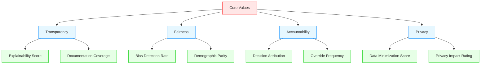
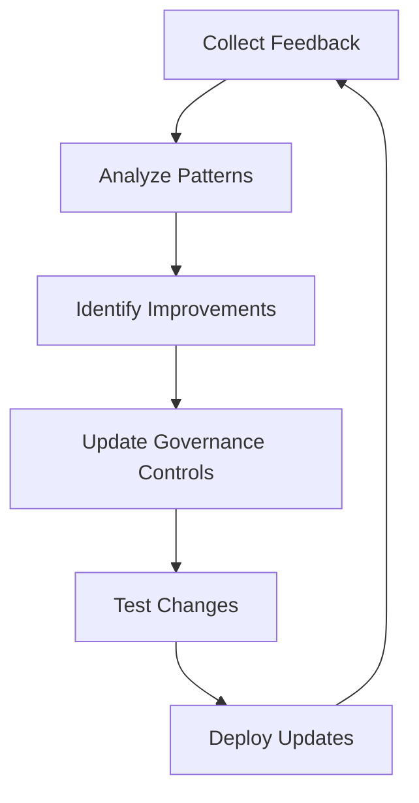

# AI Governance in HMS

This document outlines the AI governance principles and framework used throughout the HMS system for federal, state, and international agencies.

## Core AI Governance Principles

## Human-in-the-Loop (HITL) Framework

The HMS platform employs a comprehensive Human-in-the-Loop (HITL) framework to ensure that AI systems remain under appropriate human oversight:

The HITL system provides multiple levels of human oversight:

1. **Monitoring**: Continuous observation of AI system outputs
2. **Review**: Human assessment of specific decisions before implementation
3. **Override**: Ability to modify or cancel AI-recommended actions
4. **Learning**: Feedback mechanisms to improve future AI decisions

## Agency-Specific AI Governance

Different agency types have specific AI governance requirements:

### Federal Agencies

Federal agencies using HMS implement additional layers of governance:

- Compliance with federal AI regulations and executive orders
- Quarterly AI impact assessments
- Congressional oversight reporting
- Cross-agency AI review boards

### State Agencies

State agencies adapt the HMS AI governance framework to their needs:

- State-specific AI policy compliance
- Local oversight committees
- Regional data sharing agreements with governance controls
- State-level explainability requirements

### International Health Systems

International health systems using HMS implement:

- Country-specific AI medical regulations
- Cross-border data governance
- Cultural adaptation of AI decision frameworks
- International standards compliance

## AI Value Frameworks

HMS embeds a value framework into all AI components to ensure alignment with democratic principles:

## AI System Transparency

HMS implements a multi-layered transparency approach:

1. **Decision Explanations**: Plain-language explanations of AI-driven decisions
2. **Confidence Metrics**: Clear indicators of AI system confidence levels
3. **Methodology Documentation**: Accessible documentation of AI methodologies
4. **Audit Trails**: Comprehensive logging of AI system operations
5. **Public Disclosures**: Regular reporting on AI system performance

## Governance Implementation Components

The governance framework is implemented through several HMS components:

- **HMS-GOV**: Administrative portal for AI governance settings
- **HMS-ESQ**: Legal and compliance reasoning for AI systems
- **HMS-NFO**: Knowledge management for AI training and decisions
- **HMS-OPS**: Monitoring and operational oversight of AI systems
- **HMS-AGX**: Agent extension framework with governance controls

## Continuous Improvement

The AI governance framework includes mechanisms for continuous improvement:

This cycle ensures that the AI governance framework evolves with:

- New regulatory requirements
- Emerging ethical considerations
- Technological advancements
- Stakeholder feedback
- Real-world performance data

The HMS AI governance framework provides agencies with the tools and processes needed to implement responsible AI systems that align with their missions while maintaining public trust and regulatory compliance.