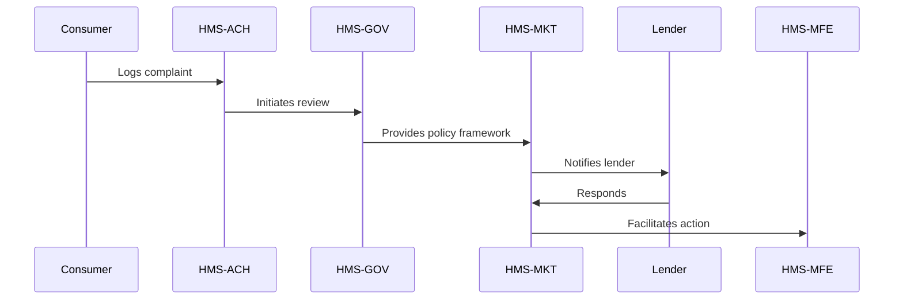

# HMS-ACH Integration with Consumer

*Generated using gpt-4 model(s) with real-world agency issue analysis*

# HMS-ACH Integration with Consumer Financial Protection Bureau (CFPB)

## Capabilities of HMS-ACH

The HMS-ACH (Automated Clearing House) module is a key component of the HMS system suite. It facilitates seamless and secure financial transactions, enabling transparency and accountability. 

1. **Transparency**: HMS-ACH can provide a transparent system for handling consumer complaints and issues related to financial transactions. It can help address the issue of the CFPB’s alleged lack of presence during crises.

2. **Accountability**: With HMS-ACH, all transactions are logged and auditable. This addresses the issue of inconsistent enforcement and alleged excessive power, as all activities are accountable and can be reviewed.

3. **Stability**: The HMS-ACH can ensure stable and consistent service regardless of political changes. It is designed to be impervious to political instability.

## Technical Integration

The HMS-ACH system can integrate with CFPB’s existing systems through secure APIs. These APIs will allow for real-time data flow, ensuring timely updates on all transactions. The system will use secure authentication methods to maintain data integrity and privacy.

## Benefits to Consumer Stakeholders

1. **Transparency**: Consumers can track their complaints and their resolutions in real time.
2. **Accountability**: The system ensures that all transactions are logged and auditable, ensuring that CFPB stands up to its mandate to protect consumers.
3. **Stability**: Service is consistent and reliable, irrespective of political changes.

## CFPB Specific Implementation Considerations

1. The CFPB will need to update their existing systems to accommodate the HMS-ACH APIs.
2. Staff training will be needed to ensure smooth operation and integration with the new system.
3. There may be resistance due to the perceived loss of control; clear communication regarding the benefits and the increased transparency and accountability will be essential.

## Real-World Use Case: AI-Facilitated Policy Optimization

### Problem

A consumer has been unfairly treated by a lender during the coronavirus crisis. The CFPB, due to political instability and lack of presence, has not been able to effectively address the issue.

### Political Inaction

Political instability and differing visions for the CFPB have hindered effective action. 

### HMS Component Intervention

The HMS-ACH system, with its emphasis on transparency and accountability, can facilitate resolution of the consumer’s issue. The complaint is logged into the system, the transaction details are reviewed, and appropriate action is taken.

### Roles of HMS Components

- **HMS-GOV**: Provides the policy and regulatory framework for the operation of the system.
- **HMS-MKT**: Facilitates the interaction between the consumer and the CFPB, and provides a marketplace for resolution.
- **HMS-MFE**: Provides the financial infrastructure for transactions.

### Workflow

1. The consumer logs a complaint about a lender into the HMS-ACH system.
2. HMS-ACH logs the complaint and initiates a review of the transaction details.
3. Based on the review, HMS-GOV provides the policy framework for resolution.
4. The lender is notified via HMS-MKT and given a chance to respond.
5. If the lender fails to respond or the response is inadequate, HMS-MFE facilitates a financial penalty or other appropriate action.

### Measurable Outcomes

1. Reduction in unresolved complaints.
2. Increase in consumer satisfaction.
3. Increased transparency and accountability in CFPB operations.

### Mermaid Diagram

## Conclusion

The integration of HMS-ACH with CFPB can significantly enhance the transparency, accountability, and stability of the bureau, providing measurable benefits to consumers and facilitating policy optimization in a politically unstable environment.
