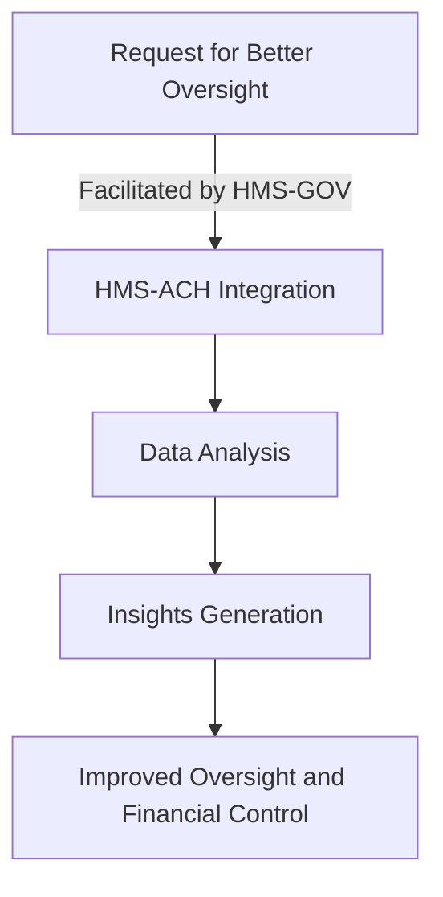

# HMS-ACH Integration with Commodity

*Generated using gpt-4 model(s) with real-world agency issue analysis*

# HMS-ACH Integration with Commodity (CFTC)

## 1. HMS-ACH Capabilities and Commodity's Mission Needs

The HMS-ACH, an advanced health management system, has several capabilities that can address Commodity's mission needs and the identified issues:

- **Data Analytics**: HMS-ACH can provide advanced data analytics capabilities, addressing issues with detecting market abuses by identifying anomalies and patterns in the data.
- **Talent Management**: HMS-ACH's personnel management features can help CFTC with hiring and retaining key staff.
- **Risk Management**: HMS-ACH can help manage commodity-related risks, including yield data accuracy and price volatility, using predictive analytics.

## 2. Technical Integration

The integration would involve:

- **APIs**: APIs would be used to connect HMS-ACH with CFTC's existing systems, allowing data to flow seamlessly between the two.
- **Data Flows**: Data would flow from CFTC's systems to HMS-ACH for analysis, and insights generated by HMS-ACH would flow back to CFTC.
- **Authentication**: Secure authentication mechanisms would be used to ensure that only authorized personnel can access the system.

## 3. Benefits for Commodity Stakeholders

- **Improved Detection of Market Abuses**: Advanced analytics capabilities of HMS-ACH could help improve detection of market abuses.
- **Better Staff Retention**: With better personnel management, CFTC could retain key staff more effectively.
- **Better Risk Management**: Enhanced risk management capabilities could help manage commodity-related risks more effectively.

## 4. Implementation Considerations

- **Data Privacy**: Appropriate measures would need to be taken to ensure data privacy during transfer and analysis.
- **System Compatibility**: The existing systems of CFTC should be compatible with HMS-ACH for smooth integration.
- **Training**: Staff would need to be trained to use HMS-ACH effectively.

## 5. Real-World Use Case: AI-Facilitated Policy Optimization

### Problem

Inadequate oversight of program participants due to outdated information systems and ineffective controls over financial reporting.

### Political Inaction

Despite the problem being identified, political gridlock delayed the necessary system updates.

### HMS-ACH Solution

The HMS-ACH system was integrated, providing advanced analytics capabilities to improve oversight and control over financial reporting.

### Roles of HMS Components

- **HMS-GOV**: Facilitated the integration process and ensured compliance with government regulations.
- **HMS-MKT**: Assisted in marketing the new system to stakeholders and managing their expectations.
- **HMS-MFE**: Provided financial expertise to ensure the effective use of the system for financial reporting.

### Workflow

1. Civilian request for better oversight and financial control.
2. HMS-GOV facilitates the integration of HMS-ACH.
3. Data flows from CFTC to HMS-ACH for analysis.
4. Insights are generated and flow back to CFTC.
5. Improved oversight and financial control are implemented.

### Outcomes

- Improved oversight of program participants.
- More effective controls over financial reporting.

### Mermaid Diagram

## Postconditions

- Improved oversight and control over financial reporting, leading to increased trust in the Commodity.