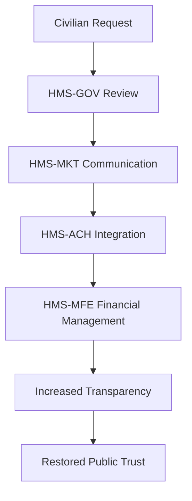

# HMS-ACH Integration with Central

*Generated using gpt-4 model(s) with real-world agency issue analysis*

# HMS-ACH Integration with Central (CIA)

## Capabilities of HMS-ACH
HMS-ACH (Humanitarian-Mission System - Automated Clearing House) is an advanced system component designed to streamline operations, increase transparency, and improve efficiency. The following features can address the identified issues:

- Advanced AI and Machine Learning algorithms: HMS-ACH can automate routine tasks, reducing red tape and speeding up decision-making.
- Real-time analytics: HMS-ACH provides complete visibility into all transactions, aiding in transparency and accountability.
- Dynamic staffing management: HMS-ACH's AI can predict staffing needs and suggest optimal hiring strategies, addressing staffing issues.

## Technical Integration
Integration of HMS-ACH with Central would require:

- API: The API would allow for seamless communication between the two systems.
- Data Flows: Data would flow between the systems in real-time, enabling better decision making.
- Authentication: Secure access to the system would be managed through multi-factor authentication and encryption.

## Benefits for Central
- Enhanced efficiency: Automation would reduce bureaucracy and improve decision-making.
- Increased transparency: Real-time visibility into transactions would help in accountability.
- Stronger staffing strategies: AI-driven staffing management would address recruitment and retention issues.

## Implementation Considerations
For CIA, the following factors should be considered:

- Security: As a government agency, data security is paramount.
- Training: Staff would require training to use the new system effectively.
- Change management: Integrating a new system would require a thoughtful change management strategy.

## Real-World Use Case: AI-Facilitated Policy Optimization

### Problem
A lack of transparency leads to public mistrust in the CIA's operations.

### Political Inaction
Due to political gridlock, necessary reforms in the CIA's transparency policy are stalled.

### HMS-ACH Solution
HMS-ACH system is integrated to automate processes and provide real-time visibility into transactions.

### Roles of HMS Components
- HMS-GOV: Acts as the governing entity overseeing the integration.
- HMS-MKT: Facilitates the marketing and public communication about the integration.
- HMS-MFE: Manages the financial aspects of the integration.

### Workflow
1. Civilian raises the request for more transparency.
2. HMS-GOV reviews the request and proposes the integration of HMS-ACH.
3. HMS-MKT communicates the planned changes to the public.
4. HMS-ACH is integrated, providing real-time visibility into transactions.
5. HMS-MFE manages the financial aspects of the integration.

### Outcomes
- Increased transparency: The public can view real-time transaction data.
- Public trust regained: With increased transparency, public trust in the CIA is restored.

### Mermaid Diagram

### Use Case Structure
- Actors: Civilian, HMS-GOV, HMS-MKT, HMS-MFE, CIA
- Preconditions: Public mistrust in CIA due to lack of transparency
- Main Flow: Civilian raises request, HMS-GOV reviews and proposes HMS-ACH integration, HMS-MKT communicates the changes, HMS-ACH is integrated, HMS-MFE manages the finances
- Alternative Flows: None identified
- Postconditions: Increased transparency and restored public trust

The HMS abundance-based economic model facilitates this process by enabling multi-party deals, creating value for all stakeholders, including the civilians, the CIA, and the HMS team.