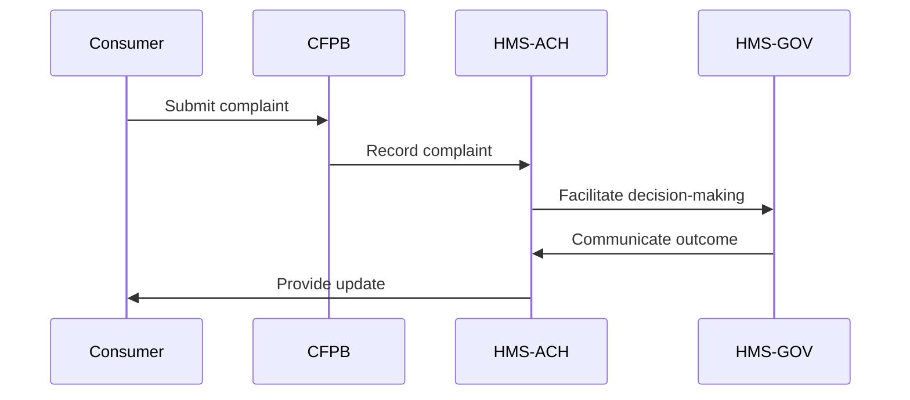

# HMS-ACH Integration with Consumer

*Generated using gpt-4 model(s) with real-world agency issue analysis*

# AI-Facilitated Policy Optimization Use Case: HMS-ACH and CPSC

## Specific Capabilities of HMS-ACH

The HMS-ACH (Abundance Clearing House) is designed to facilitate the movement of value between different stakeholders. In the context of the Consumer Financial Protection Bureau (CFPB), it could provide several benefits:

- **Transparency and Accountability**: HMS-ACH can record transactions and interactions, providing a clear record of enforcement actions and decisions made by the CFPB. This could address issues of inconsistent enforcement and lack of oversight.
- **Decentralized Governance**: By integrating with the HMS-GOV, the HMS-ACH could help to decentralize decision-making within the CFPB. This could reduce the impact of political tug-of-wars on the bureau's direction.

## Technical Integration

Integration with the HMS-ACH would involve several technical steps:

- **APIs**: The CFPB systems would need to integrate with the HMS-ACH APIs, allowing for data transfer between systems.
- **Data Flows**: Data would flow from the CFPB systems to the HMS-ACH, where it would be recorded and made available for analysis and transparency.
- **Authentication**: Secure authentication protocols would need to be implemented to ensure data privacy and security.

## Benefits for Consumer Stakeholders

There are several potential benefits for consumer stakeholders:

- **Increased Trust**: The transparency provided by the HMS-ACH could increase trust in the CFPB.
- **Improved Consistency**: The decentralized decision-making could lead to more consistent enforcement of consumer protection regulations.
- **Greater Oversight**: The record-keeping capabilities of the HMS-ACH could provide greater oversight of the CFPB.

## Implementation Considerations

Implementation within the CPSC would need to take into account several factors:

- **Data Privacy**: Consumer financial data is highly sensitive, and strict privacy protocols would need to be in place.
- **Political Resistance**: There could be resistance from political stakeholders to the decentralization of decision-making.

## Real-World Use Case: Overcoming Political Inaction

### The Civilian Problem

Consumers face inconsistent enforcement of financial protection regulations due to political tug-of-war over the direction of the CFPB.

### Political Inaction

Political gridlock has prevented consistent direction and oversight of the CFPB.

### HMS Components Overcoming Inaction

The HMS-ACH, working in unison with HMS-GOV, HMS-MKT, and HMS-MFE, could decentralize decision-making and improve transparency, reducing the impact of political gridlock.

### Roles of HMS Components

- **HMS-GOV**: Provides a platform for decentralized decision-making.
- **HMS-MKT**: Facilitates the exchange of value between stakeholders.
- **HMS-MFE**: Provides financial management functions.
- **HMS-ACH**: Records transactions and interactions, providing transparency and accountability.

### Workflow

1. A consumer submits a complaint through the CFPB system.
2. The complaint is recorded on the HMS-ACH and made visible to all stakeholders.
3. The HMS-GOV facilitates decision-making on how to handle the complaint.
4. The outcome is communicated to the consumer and recorded on the HMS-ACH.

### Measurable Outcomes

- Increase in consumer trust in the CFPB.
- Decrease in complaints about inconsistent enforcement.

### Mermaid Diagram

## Postconditions

Improved transparency and consistency in CFPB enforcement, leading to increased consumer trust.

## Conclusion

The HMS-ACH could significantly improve the functioning of the CFPB by providing transparency, accountability, and decentralized decision-making. However, careful implementation would be required to ensure data privacy and manage potential political resistance.