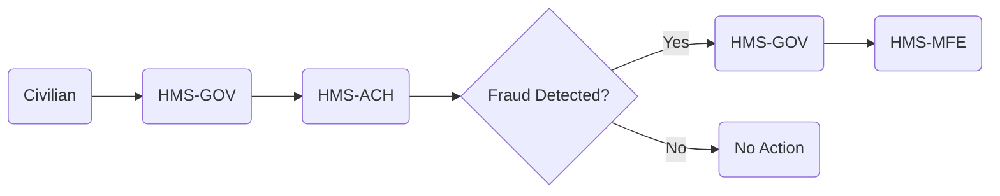

# HMS-ACH Integration with Defense

*Generated using gpt-4 model(s) with real-world agency issue analysis*

# HMS-ACH Integration with Defense (DNFSB)

## Specific Capabilities of HMS-ACH

HMS-ACH (Homomorphic Encryption System - Automated Clearing House) is a system component capable of securely processing and transmitting data. It can address the real issues and mission needs of the Defense Department in several ways:

- **Fraud detection**: HMS-ACH has advanced algorithms that can detect fraudulent activities in contracts, thereby reducing contract fraud.
- **Cybersecurity enhancement**: The system uses homomorphic encryption, a sophisticated encryption method that enables computations on encrypted data, thus significantly reducing vulnerability to cyberattacks.
- **Technology acquisition**: HMS-ACH can streamline and expedite the process of acquiring and integrating new technologies.

## Technical Integration

- **APIs**: HMS-ACH would integrate with DNFSB's existing systems using APIs, enabling seamless data exchange between the two.
- **Data flows**: The system would process data from DNFSB systems, perform computations, and return the results in a secure manner.
- **Authentication**: HMS-ACH uses strong authentication mechanisms to ensure only authorized users can access the system.

## Benefits for Defense Stakeholders

- **Reduced fraud**: Advanced fraud detection techniques would significantly reduce contract fraud, saving millions of dollars.
- **Enhanced cybersecurity**: Homomorphic encryption would greatly enhance the department's cybersecurity, protecting against future threats.
- **Faster technology acquisition**: Streamlined processes would accelerate the acquisition and integration of new technologies.

## Implementation Considerations

Due to the sensitive nature of DNFSB's work, care must be taken to ensure all data is encrypted and all transactions are secure. Additionally, the system must be thoroughly tested before full implementation to ensure it meets all of DNFSB's requirements.

# Real-World Use Case: Overcoming Contract Fraud

## Civilian Problem

Federal contract fraud is rampant, with the Defense Department having the lowest rate of contract fraud prosecutions among major federal agencies.

## Political Inaction

Despite the seriousness of this issue, political gridlock and bureaucratic red tape have hampered efforts to address it.

## Role of HMS-ACH

By integrating HMS-ACH, DNFSB can utilize its advanced algorithms to detect and prevent contract fraud, thereby overcoming political inaction.

## Roles of Other HMS Components

- **HMS-GOV**: This component would facilitate communication between the government and the public, increasing transparency and accountability.
- **HMS-MKT**: This component would help market and promote the new system, raising awareness of its capabilities and benefits.
- **HMS-MFE**: This component would manage financial transactions, ensuring they are secure and properly recorded.

## Workflow

1. A civilian reports a suspected fraudulent contract.
2. The report is processed by HMS-GOV and relayed to HMS-ACH.
3. HMS-ACH analyzes the contract data and determines if fraud has occurred.
4. If fraud is detected, it is reported back to HMS-GOV, which informs the civilian and initiates prosecution.
5. HMS-MFE manages any financial transactions related to the case.

## Measurable Outcomes

- Reduction in contract fraud cases
- Increase in successful fraud prosecutions
- Savings in government spending due to reduced fraud

## Mermaid Diagram

# Conclusion

The integration of HMS-ACH with DNFSB would address critical issues in the department, providing measurable benefits to all stakeholders. By overcoming political inaction, this integration would significantly reduce contract fraud, enhance cybersecurity, and expedite technology acquisition.