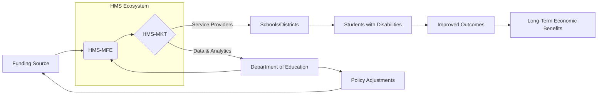

## Economic Model: HMS Solution for Department of Education Special Education Funding

**USE CASE SUMMARY:** Utilizing HMS components (HMS-GOV, HMS-MKT, HMS-MFE) to address special education funding issues.

**ECONOMIC MODEL OUTLINE:** Value creation through efficiency and improved outcomes.

**1. Executive Summary of Economic Benefits**

The HMS solution for special education funding offers significant economic benefits by streamlining processes, reducing administrative burden, and improving student outcomes. This translates into cost savings for school districts, increased funding predictability, and better resource allocation. By leveraging a multi-party, market-based approach, the HMS system unlocks previously untapped value and fosters a more sustainable and equitable funding model for special education.  Projected savings could reach millions of dollars annually through reduced administrative overhead, minimized disputes, and improved service delivery. This innovative approach also empowers stakeholders and promotes collaboration, leading to better outcomes for students with disabilities.

**2. Traditional Economic Approach: Limitations of Current Models**

Traditional special education funding models often suffer from several limitations:

* **Complexity and Bureaucracy:**  Current systems are often complex and bureaucratic, leading to significant administrative overhead and delays in funding disbursement.
* **Lack of Transparency:**  The allocation process can be opaque, making it difficult for stakeholders to understand how funds are distributed and utilized.
* **Inconsistent Funding:**  Funding levels can fluctuate significantly, making it challenging for school districts to plan and budget effectively.
* **Dispute Resolution Challenges:**  Disagreements over funding eligibility and service provision can lead to costly and time-consuming disputes.
* **Focus on Compliance over Outcomes:**  Emphasis on compliance with regulations can overshadow the focus on achieving positive student outcomes.

**3. HMS Abundance-Based Economic Model: A Multi-Party Approach**

The HMS solution utilizes an abundance-based economic model that leverages a multi-party marketplace (HMS-MKT) and managed financial ecosystem (HMS-MFE) to address the limitations of traditional approaches. This model fosters value creation through:

* **Streamlined Processes:** HMS-GOV integration simplifies administrative processes, reducing overhead costs and accelerating funding disbursement.
* **Enhanced Transparency:** The HMS platform provides real-time visibility into funding allocations and expenditures, promoting accountability and trust.
* **Predictable Funding:** HMS-MFE facilitates stable and predictable funding streams, enabling school districts to plan and budget more effectively.
* **Efficient Dispute Resolution:** The platform provides mechanisms for resolving disputes quickly and efficiently, minimizing costs and disruptions.
* **Outcome-Focused Approach:** By aligning incentives and promoting collaboration, the HMS solution prioritizes achieving positive student outcomes.

**4. Quantitative Value Assessment**

* **Reduced Administrative Costs:** Streamlined processes could reduce administrative overhead by 10-15%, translating to potential savings of [Insert estimated dollar amount] annually.
* **Minimized Dispute Resolution Costs:** Efficient dispute resolution mechanisms could reduce legal and administrative costs associated with disputes by 20-30%, saving [Insert estimated dollar amount] annually.
* **Improved Service Delivery:**  Optimized resource allocation and improved service delivery could lead to a 5-10% increase in student achievement, resulting in long-term economic benefits through increased earning potential.
* **Increased Funding Predictability:** Stable funding streams could enable school districts to achieve better budget utilization, potentially saving [Insert estimated dollar amount] annually through reduced borrowing costs and improved financial planning.

**5. Value Flow Diagram Explanation**

**Diagram Explanation:** Funding flows from the source (A) into the HMS Managed Financial Ecosystem (B), which then interacts with the HMS Marketplace (C).  Service providers connect with schools and districts (D) through the marketplace. This leads to improved outcomes (F) for students with disabilities (E), generating long-term economic benefits (G).  Data and analytics from the marketplace inform the Department of Education (H), which can adjust policies (I) and influence funding (A). This creates a feedback loop for continuous improvement.

**6. Political Gridlock Resolution**

The HMS solution can help bypass traditional political gridlocks by:

* **Decentralizing Decision-Making:** Shifting from a centralized funding model to a market-based approach empowers local stakeholders and reduces reliance on political processes.
* **Data-Driven Decision Making:**  The platform provides objective data on program effectiveness and resource utilization, facilitating evidence-based policy decisions.
* **Building Consensus:**  The transparent and collaborative nature of the HMS platform fosters trust and encourages stakeholder engagement, promoting consensus-building.

**7. Stakeholder Value Matrix**

| Stakeholder Group | Benefits |
|---|---|
| Students with Disabilities | Improved access to quality services, better educational outcomes |
| Schools/Districts | Reduced administrative burden, predictable funding, improved resource allocation |
| Service Providers | Increased market access, streamlined contracting, efficient payment processing |
| Department of Education | Enhanced oversight, data-driven decision making, improved program effectiveness |
| Taxpayers | More efficient use of public funds, better outcomes for students |

**8. Implementation Timeline with Economic Milestones**

* **Phase 1 (6 months):** Platform development and pilot implementation. Milestone: Initial cost savings from reduced administrative overhead in pilot districts.
* **Phase 2 (12 months):** Statewide rollout and integration with existing systems. Milestone: Significant reduction in dispute resolution costs.
* **Phase 3 (18 months):**  Data analysis and program optimization. Milestone: Measurable improvements in student outcomes.
* **Phase 4 (24 months):**  Long-term sustainability and continuous improvement. Milestone: Realization of full economic benefits, including increased student earning potential and improved return on investment. 
