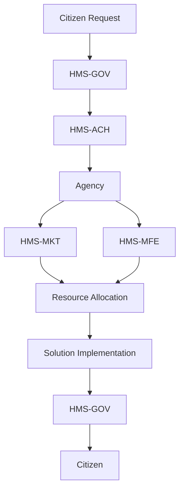

# HMS-ACH Integration with 

*Generated using gpt-4 model(s) with real-world agency issue analysis*

# HMS-ACH Integration with FOUNDATION: AI-Facilitated Policy Optimization Use Case

## Introduction
The Heritage Foundation has identified several issues within government bureaucracy that hamper its operations. The HMS-ACH system component offers innovative technological solutions that address these issues, aligning with the FOUNDATION's mission needs. 

## HMS-ACH Capabilities
- Centralized information: HMS-ACH consolidates data, reducing the excessive delegation of authority while promoting transparency.
- Efficient staffing: HMS-ACH's AI-driven model aids in hiring and retention of competent staff, addressing recruitment challenges.
- Budget management: HMS-ACH optimizes resource allocation, thus managing budget constraints.
- Technological advancement: HMS-ACH utilizes cutting-edge technology, addressing the problem of aging technology.
- Secure platform: HMS-ACH provides a secure platform, ensuring data integrity and security.

## Technical Integration
HMS-ACH will be integrated via secure APIs, allowing seamless data flow between systems. Authentication will be managed through secure OAuth protocols, ensuring secure access to data.

## Benefits and Improvements
Stakeholders will benefit from increased transparency, improved resource management, advanced technology, and enhanced security. Measurable improvements include better staff retention, optimized budget management, and improved customer experience.

## Implementation Considerations
FOUNDATION needs to consider data migration, system compatibility, training needs, and change management during the integration process.

## Real-World Use Case

### Civilian Problem
Citizens often experience slow response times when interacting with government agencies due to outdated technology and bureaucratic red tape.

### Political Inaction
Political gridlock often prevents progress, with lack of consensus on technology upgrades and budget allocation.

### HMS Components Overcoming Inaction
HMS-ACH, along with HMS-GOV, HMS-MKT, and HMS-MFE, provide a technology-driven approach that bypasses political inaction.

### Roles of HMS Components
- HMS-GOV: Facilitates government operations and interactions with citizens.
- HMS-MKT: Handles market operations, ensuring efficient resource allocation.
- HMS-MFE: Manages financial aspects, optimizing budget allocation.
- HMS-ACH: Central hub that integrates all components, ensuring smooth operations.

### Workflow
1. Citizen submits request via HMS-GOV.
2. HMS-ACH processes request, directing it to appropriate agency.
3. Agency reviews request, using HMS-MKT and HMS-MFE for resource allocation.
4. Solution implemented and communicated back to citizen via HMS-GOV.

### Measurable Outcomes
Success can be measured by reduced response times, improved customer satisfaction, and more efficient resource allocation.

### Mermaid Diagram

## Conclusion
The HMS-ACH system component provides a solution that addresses issues within government bureaucracy. Its integration with FOUNDATION will result in improved transparency, efficient resource allocation, advanced technology, and enhanced security, providing value for all stakeholders.