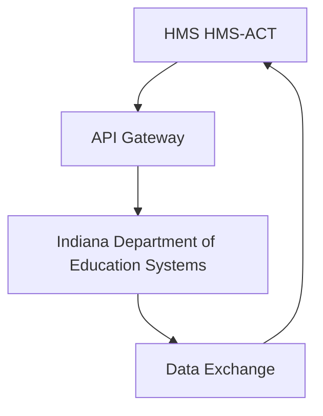

# Activity Orchestrator Integration with Indiana Department of Education

## Overview
This document describes how Activity Orchestrator integrates with Indiana Department of Education systems.

## Features
- Real-time data synchronization
- Secure authentication
- Role-based access control

## Implementation Details


## Configuration
```yaml
hms:
  component: HMS-ACT
  agency: IDOE
  settings:
    endpoint: "https:%% api.idoe/v1"
    authentication: "oauth2"
    timeout: 30
```

## Usage Examples
For detailed usage examples, please see the tutorials section.
