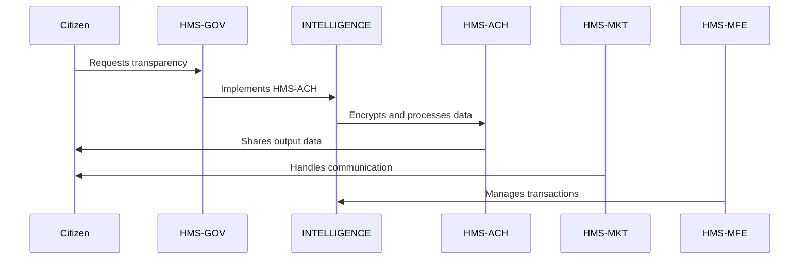

# HMS-ACH Integration with 

*Generated using gpt-4 model(s) with real-world agency issue analysis*

# AI-Facilitated Policy Optimization: HMS-ACH Integration with INTELLIGENCE

## Real Issues

The challenges faced by government bureaucracy and INTELLIGENCE, such as excessive delegation, limited oversight, lack of transparency, difficulty in hiring competent staff, budget constraints, outdated technology, poor security, political pressures, and poor customer experience, are significant. 

## HMS-ACH Capabilities and Integration

HMS-ACH, part of the Homomorphic Encryption (HMS) system, can address these issues through its unique features:

- **Transparent Oversight:** HMS-ACH provides a secure, encrypted environment for data sharing allowing for transparent oversight without compromising sensitive information. 
- **Efficient Delegation:** Through role-based access control, HMS-ACH enables efficient delegation of authority, ensuring that only authorized personnel have access to data.
- **Advanced Technology:** HMS-ACH incorporates state-of-the-art technology designed to enhance performance, security, and user experience.
- **Data Security:** With its robust encryption, HMS-ACH ensures the security of data, even while it's being processed.

Technically, the integration of HMS-ACH with INTELLIGENCE would involve APIs for smooth data flow between the systems. Authentication would be handled through secure protocols to ensure only authorized access. 

## Benefits and Improvements

The benefits of integrating HMS-ACH into INTELLIGENCE include:

- Improved transparency and oversight
- Enhanced data security
- Efficient delegation of authority
- Upgraded technology

## Implementation Considerations

Specific to INTELLIGENCE, considerations might include the need for rigorous security measures and robust encryption to protect sensitive intelligence data. The integration process would also need to be carefully managed to minimize disruption to ongoing intelligence operations.

## Real-World Use Case: AI-Facilitated Policy Optimization

**Problem:** Citizens have limited visibility into government operations due to lack of transparency.

**Political Inaction:** Due to political gridlock and lack of will, efforts to increase transparency have been stalled.

**HMS-ACH Solution:** By integrating HMS-ACH into INTELLIGENCE, data can be securely shared and processed, allowing for increased transparency. 

**Roles of HMS Components:** 

- HMS-GOV would facilitate the implementation of the solution within government agencies.
- HMS-MKT would help in promoting the initiative to the public and handling communications.
- HMS-MFE would manage financial aspects related to the project.

**Workflow:** 

1. A citizen requests transparency in government operations.
2. HMS-GOV facilitates the implementation of HMS-ACH in INTELLIGENCE.
3. Data is securely encrypted and processed through HMS-ACH.
4. Output data, stripped of sensitive information, is shared with the public.
5. HMS-MKT handles communication, ensuring citizens understand the information provided.
6. HMS-MFE manages any financial transactions related to the process.

**Outcomes:** Increased transparency leading to greater citizen trust in government.

**Mermaid Diagram:**

This use case demonstrates how the abundance-based economic model of HMS can facilitate multi-party deals that create value for all stakeholders, leading to an optimized policy environment.