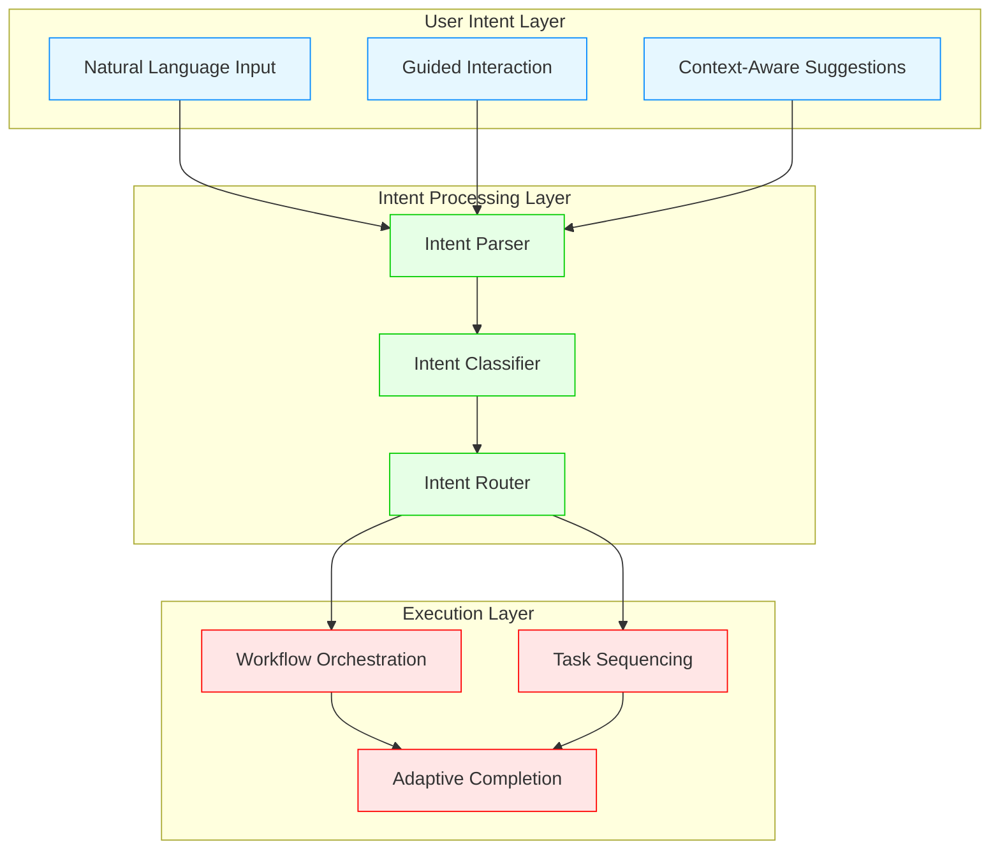
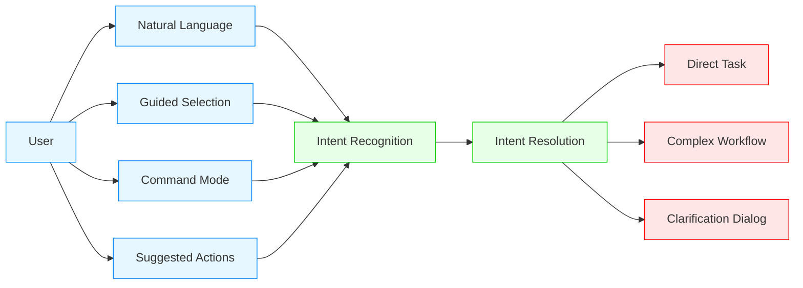
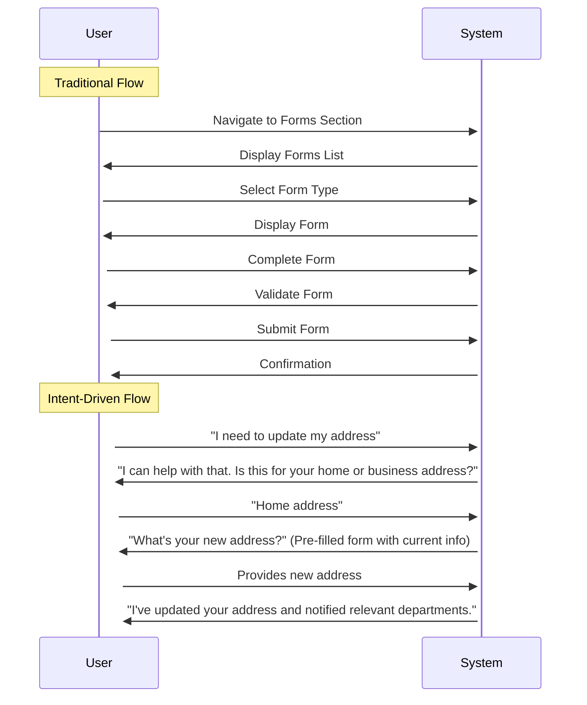
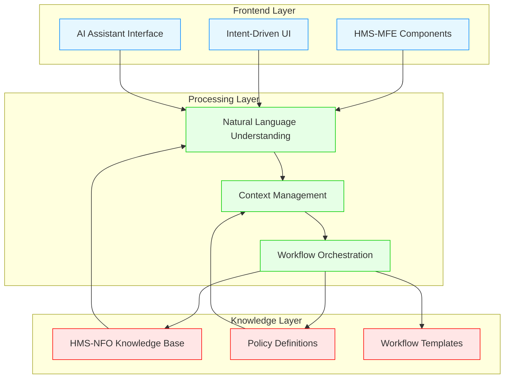
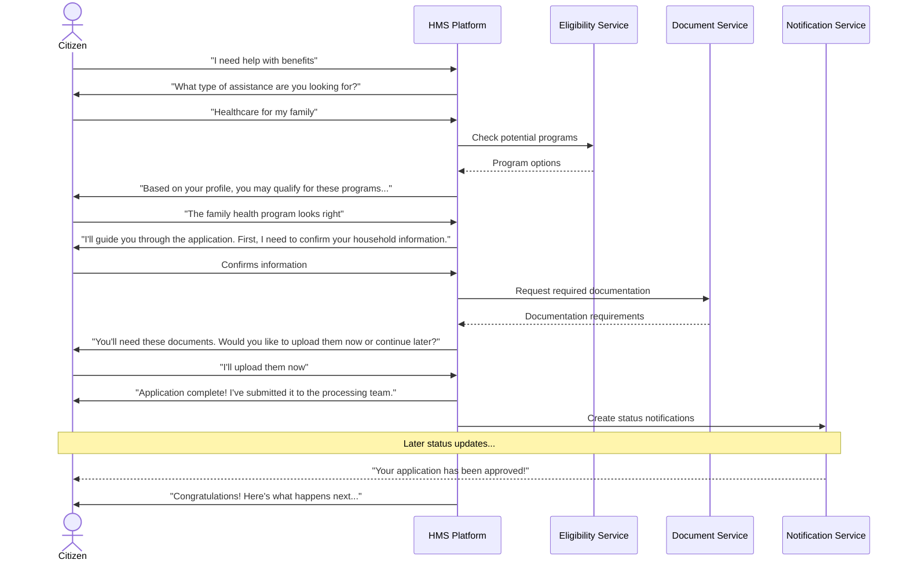

# Intent-Driven Navigation in HMS

This document explains the intent-driven navigation principles and implementation in the HMS platform across federal, state, and international agencies.

## What is Intent-Driven Navigation?

Intent-driven navigation is a user interaction paradigm that focuses on understanding and fulfilling the user's objective rather than forcing them to navigate predefined application flows. In the HMS platform, this approach enables users to express what they want to accomplish in natural language or through guided interactions, and the system dynamically determines the appropriate path to fulfill that intent.

## Core Principles

HMS intent-driven navigation is built on several core principles:

1. **User-Centric Design**: Focuses on user goals rather than system structure
2. **Contextual Awareness**: Considers user history, role, and current state
3. **Progressive Disclosure**: Reveals information and options as needed
4. **Adaptive Pathways**: Dynamically adjusts flows based on context
5. **Natural Interaction**: Supports communication in user's preferred format
6. **Continuous Learning**: Improves based on interaction patterns

## Implementation Components

The HMS intent-driven navigation system comprises several key components:

| Component | Description | Functionality |
|-----------|-------------|---------------|
| **HMS-MFE** | Micro Frontend Experience | Provides the user interface layer with dynamic interaction components |
| **HMS-AGT** | AI Representative | Interprets user intent and provides conversational guidance |
| **HMS-ACT** | Action Orchestrator | Coordinates the execution of multi-step workflows based on intent |
| **HMS-MCP** | Model Context Protocol | Maintains contextual awareness across user sessions |
| **HMS-NFO** | Knowledge Framework | Provides domain knowledge to support intent resolution |

## Intent Recognition Methods

HMS supports multiple methods for recognizing user intent:

1. **Natural Language Processing**: Users express intent in everyday language
2. **Guided Journey Selection**: Users choose from curated journey options
3. **Command Mode**: Power users can use specific commands or shortcuts
4. **Smart Suggestions**: The system proactively suggests relevant actions
5. **Form-Based Input**: Structured forms capture specific parameters

## User Journey Examples

Intent-driven navigation transforms traditional workflows into user-centric journeys:

### Traditional Flow vs. Intent-Driven Flow

## Agency-Specific Adaptations

Different agency types implement intent-driven navigation with specialized adaptations:

### Federal Agency Implementation

Federal agencies emphasize comprehensive service delivery across multiple programs:

- Integrated program eligibility determination
- Cross-agency service coordination
- Policy-aware navigation guidance
- Legislative compliance checks

### State Agency Implementation

State agencies focus on local service delivery and state-specific requirements:

- Local resource discovery and referral
- State program integration
- County and municipal service connections
- State-specific compliance guidance

### International Health System Implementation

International health systems adapt navigation to regional healthcare models:

- Multi-language support
- Cultural adaptation of health journeys
- Regional healthcare system integration
- Country-specific regulatory compliance

## Technical Implementation

The HMS intent-driven navigation system uses a multi-layered technical approach:

## Metrics and Continuous Improvement

HMS intent-driven navigation includes comprehensive metrics for ongoing improvement:

1. **Intent Recognition Rate**: Percentage of correctly identified user intents
2. **Task Completion Rate**: Percentage of successfully completed user journeys
3. **Navigation Efficiency**: Number of steps required to complete common tasks
4. **Time-to-Completion**: Average time to fulfill user intent
5. **User Satisfaction**: Feedback scores on navigation experience
6. **Learning Rate**: Improvement in intent recognition over time

## Integration with AI Governance

Intent-driven navigation operates within the HMS AI governance framework:

- **Transparency**: Clear explanation of system understanding and actions
- **User Control**: Ability to adjust or override system suggestions
- **Privacy**: Contextual data management with appropriate protections
- **Adaptability**: Personalization within governance boundaries
- **Oversight**: Human-in-the-loop intervention for complex scenarios

## Future Enhancements

The HMS intent-driven navigation roadmap includes:

1. **Proactive Intent Prediction**: Anticipating user needs before they're expressed
2. **Cross-Channel Continuity**: Seamless transitions between different interaction channels
3. **Intent Network Analysis**: Understanding relationships between different user intents
4. **Contextual Personalization**: Further tailoring experiences to individual users
5. **Collective Intelligence**: Learning from patterns across the user community

## Case Study: Benefits Application Journey

This case study demonstrates how intent-driven navigation transforms a common government service:

This intent-driven approach:
- Starts with the citizen's goal, not a form
- Provides personalized guidance
- Adapts to the citizen's situation
- Offers choices at appropriate points
- Maintains relationship throughout the process

Intent-driven navigation represents a fundamental shift from system-centered to human-centered government services, enabling agencies to fulfill their missions more effectively while providing a significantly improved citizen experience.