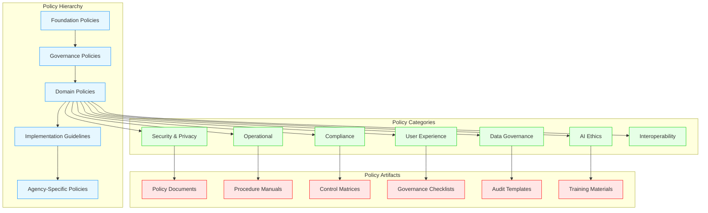
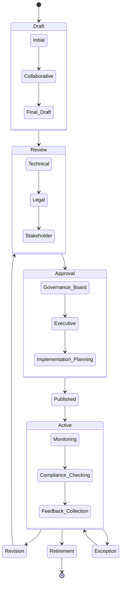
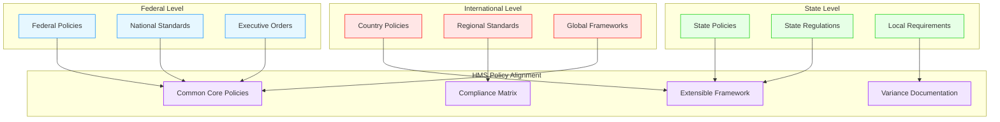
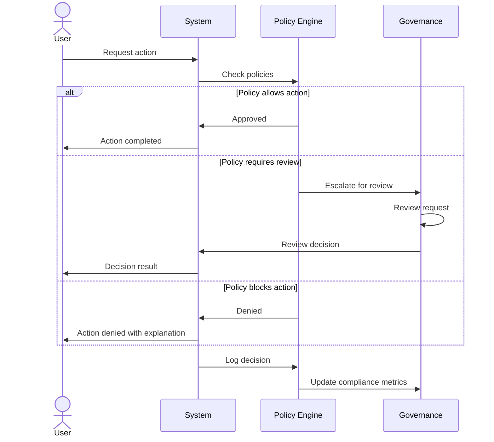
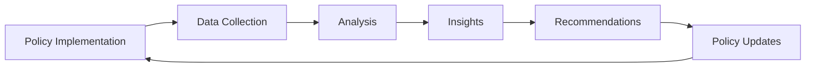

# HMS Policy Framework

This document outlines the comprehensive policy framework that governs HMS operations across federal, state, and international agencies.

## Policy Structure Overview

## Policy Lifecycle Management

The HMS policy framework implements a structured lifecycle approach to policy management:

## Policy Components and Implementation

The HMS policy framework is implemented across multiple system components:

| Component | Policy Role | Implementation Mechanism |
|-----------|-------------|--------------------------|
| **HMS-GOV** | Policy administration | Administrative portal for policy configuration, approval workflows, and governance oversight |
| **HMS-CDF** | Policy engine | Codified rules, legislative frameworks, and policy execution |
| **HMS-ESQ** | Compliance verification | Legal reasoning, regulatory checking, and compliance validation |
| **HMS-AGT** | Policy guidance | AI-driven policy assistance, explanation, and application |
| **HMS-OPS** | Policy monitoring | Operational oversight, compliance tracking, and violation detection |
| **HMS-NFO** | Policy knowledge | Documentation, training materials, and knowledge management |

## Cross-Agency Policy Alignment

## Policy-Driven Workflows

HMS uses policy-driven workflows to ensure consistent operations:

## Policy Enforcement Mechanisms

HMS employs multiple enforcement mechanisms:

1. **Preventive Controls**: Proactive measures that prevent policy violations
   - Access controls
   - Data validation
   - Workflow approvals
   - Configuration limits

2. **Detective Controls**: Mechanisms to identify policy violations
   - Audit logging
   - Compliance monitoring
   - Pattern detection
   - Periodic reviews

3. **Corrective Controls**: Actions taken when violations occur
   - Automated remediation
   - Incident response
   - Exception handling
   - Learning mechanisms

## Policy Templates

HMS provides standardized policy templates for common governance needs:

| Policy Type | Purpose | Key Elements |
|-------------|---------|--------------|
| **Security Policy** | Define security requirements | Access controls, data protection, incident response |
| **Privacy Policy** | Protect personal information | Data collection, consent, sharing limitations |
| **Operational Policy** | Guide day-to-day operations | Standard procedures, service levels, support models |
| **Compliance Policy** | Ensure regulatory adherence | Regulatory mappings, control objectives, evidence collection |
| **Data Governance Policy** | Manage data assets | Classification, lifecycle, quality standards |
| **AI Ethics Policy** | Guide AI system behavior | Fairness, transparency, human oversight |

## Agency-Specific Policy Considerations

### Federal Agency Policy Considerations

Federal agencies implement HMS policies with emphasis on:

- Alignment with federal regulations (FISMA, FedRAMP, etc.)
- Congressional oversight and reporting
- Cross-agency policy standardization
- National security considerations

### State Agency Policy Considerations

State agencies adapt HMS policies to address:

- State-specific regulatory requirements
- Local governance structures
- Regional collaboration frameworks
- State-federal policy harmonization

### International Health System Policy Considerations

International health systems customize HMS policies for:

- Country-specific healthcare regulations
- Regional health standards
- Cultural and ethical considerations
- Cross-border data governance

## Policy Evaluation and Improvement

HMS includes mechanisms for continuous policy evaluation and improvement:

Key metrics tracked for policy effectiveness include:

- Policy compliance rates
- Exception frequency and patterns
- User feedback on policy clarity
- Incident metrics related to policy areas
- Operational impact of policy changes

## Policy Integration with External Systems

HMS policies integrate with external systems through:

1. **Policy APIs**: Programmatic interfaces for policy checking and enforcement
2. **Compliance Reporting**: Automated generation of compliance documentation
3. **Audit Interfaces**: Standardized interfaces for external auditors
4. **Regulatory Updates**: Mechanisms to incorporate regulatory changes

This comprehensive policy framework ensures that HMS deployments maintain consistent governance while accommodating the unique requirements of different agency types and regulatory environments.